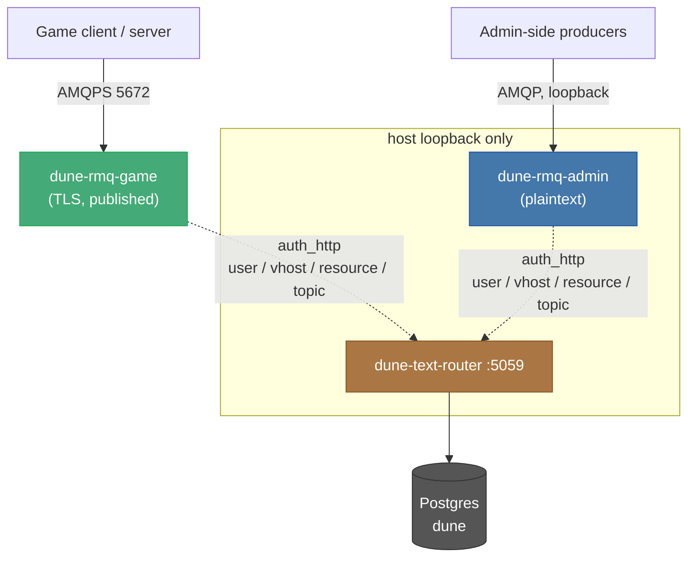

# Services Reference

**Status:** Observed — verified against game build 2117304-0-shipping (September 2026). Re-verify after a game update.

A running deployment is a dozen-plus containers. Some are defined by this
repo; most are the closed-source Funcom server image under different command
lines. [`SYSTEM-OVERVIEW.md`](SYSTEM-OVERVIEW.md) covers the ones this repo
owns — the orchestrator, the console, the metrics stack, the public probe.
This document covers the rest: the closed-source services, what each is
responsible for, and the trust boundaries between them.

**Out of scope:** the game servers themselves (Survival, Deep Desert,
Overmap, sietches) and how they are spawned, despawned and autoscaled. Those
are a moving population, not fixed infrastructure — see the autoscaler
material in [`SYSTEM-OVERVIEW.md` §1.5](SYSTEM-OVERVIEW.md#15-the-gameplay-containers-raw-docker-run-not-compose). This document is
about the services that are *always* there and hold the others up.

Related: [`DATABASE.md`](DATABASE.md) for the database every service shares,
[`WORLD-MODEL.md`](WORLD-MODEL.md) for the maps and partitions those game
servers host,
[`MULTI-SERVER-SINGLE-PUBLIC-IP.md`](../runtime/MULTI-SERVER-SINGLE-PUBLIC-IP.md)
for the authoritative host-port matrix (not repeated here).

---

## 1. Ours versus Funcom's

Two origins, and the distinction matters when something breaks — you can read
and change ours, but a closed-source service can only be configured and
observed.

| Container | Image origin | Documented in |
|---|---|---|
| `dune-orchestrator` | this repo | [SYSTEM-OVERVIEW.md §1.1](SYSTEM-OVERVIEW.md#11-the-orchestrator-container) |
| `dune-coriolis-coordinator` | this repo (orchestrator image) | [§4](#4-coriolis-coordinator-dune-coriolis-coordinator) below |
| `dune-autoscaler` | this repo (orchestrator image) | [SYSTEM-OVERVIEW.md §1.5](SYSTEM-OVERVIEW.md#15-the-gameplay-containers-raw-docker-run-not-compose) |
| `redblink-dune-docker-console` | this repo | [SYSTEM-OVERVIEW.md §1.2](SYSTEM-OVERVIEW.md#12-the-console-redblink-dune-docker-console) |
| `dune-public-probe` | this repo | [SYSTEM-OVERVIEW.md §1.4](SYSTEM-OVERVIEW.md#14-the-public-probe-opt-in) |
| `dune-postgres` | Funcom (`igw-postgres`) | [DATABASE.md](DATABASE.md) |
| `dune-rmq-game`, `dune-rmq-admin` | Funcom (`seabass-server-rabbitmq`) | [§2](#2-the-closed-source-services), [§3](#3-messaging-authorization-topology) |
| `dune-text-router` | Funcom (`seabass-server-text-router`) | [§2](#2-the-closed-source-services) |
| `dune-director` | Funcom (`seabass-server-bg-director`) | [§2](#2-the-closed-source-services) |
| `dune-server-gateway` | Funcom (`seabass-server-gateway`) | [§2](#2-the-closed-source-services) |
| game servers | Funcom (`seabass-server`) | out of scope |

Everything but Postgres and the game servers runs on the `dune-net` bridge
network; the Overmap game server and the orchestrator use host networking.

---

## 2. The closed-source services

### TextRouter (`dune-text-router`)

A .NET service on `dune-net`, listening on `:5059`. It is the **authorization
authority for the entire messaging layer** — see [§3](#3-messaging-authorization-topology). It also holds battlegroup
identity (region, language, display name) and its own database connection. It
is configured with the hostnames of both RabbitMQ brokers.

Because both message brokers delegate every authentication and authorization
decision to it, **TextRouter is a hard dependency for all messaging.** If it
is down or wedged, RabbitMQ rejects every login — game and admin alike — even
though the brokers themselves are healthy. A "RabbitMQ auth failing across the
board" symptom points here first, not at RabbitMQ.

### The Director (`dune-server-bg-director` → `dune-director`)

A .NET service on loopback (`127.0.0.1:11717`). Its configuration is dominated
by backend-login settings — server login secrets, username secrets, a
login-password skew tolerance — so it is the battlegroup's login/session
coordination point. It is passed the hostnames of both brokers. Loopback-only:
it is not reachable from outside the host.

### The Gateway (`dune-server-gateway`)

A Python service (`python -m service`). It holds a direct Postgres connection
and a Funcom live-services auth token, and is configured with the game
broker's *published* address and a battlegroup authorization preset. It is the
edge between connecting clients and the battlegroup's internal services. No
management port of its own.

### RabbitMQ, split in two (`dune-rmq-game`, `dune-rmq-admin`)

There are two brokers on purpose, and the split is a security boundary, not
redundancy:

| | Listener | Exposure |
|---|---|---|
| `dune-rmq-game` | **TLS only** (`listeners.tcp = none`, `listeners.ssl.default`), self-signed cert | AMQPS and management published off-host |
| `dune-rmq-admin` | plaintext AMQP | **loopback only** |

Game traffic is encrypted and internet-facing; administrative traffic is
plaintext but never leaves the host. The two are not interchangeable — a
service is pointed at one or the other deliberately.

The published game-broker management endpoint is expected and documented (see
[`MULTI-SERVER-SINGLE-PUBLIC-IP.md`](../runtime/MULTI-SERVER-SINGLE-PUBLIC-IP.md));
its HTTP API enforces authentication.

Both broker configs are generated by `runtime/scripts/start-rabbitmq.sh`.

---

## 3. Messaging authorization topology

The single most load-bearing fact about the services: **neither broker
authenticates against its own user database.** Each config sets exactly one
auth backend — a 5-second cache in front of an HTTP backend pointed at
TextRouter — with no `internal` fallback. Every decision (user, vhost,
resource, topic) is TextRouter's.

Two consequences fall out of this design:

- **The image's default `guest` user is inert.** It still appears in
  `rabbitmqctl list_users`, but because the internal database is never a
  configured backend, `guest` cannot authenticate — a login attempt is
  "Denied by the backing HTTP service." Its presence is cosmetic, not a
  standing credential.
- **There is no static broker username/password in this repo.** The scripts
  pass neither `RABBITMQ_DEFAULT_USER` nor `RABBITMQ_DEFAULT_PASS`; the
  credentials services actually use are minted and validated at TextRouter
  against the database.

---

## 4. Coriolis coordinator (`dune-coriolis-coordinator`)

Ours, built from the orchestrator image. It tails the game log for the signal
`LogCoriolis: Display: Coriolis Restart Farm` (polling every 2s by default)
and, on seeing it, drives the Deep Desert reset: it runs
`restart-game-farm.sh` and `coriolis-data-cleanup.sh`, holding a lock file so
two resets cannot overlap. It is the bridge between an in-game reset event and
the host-side restart it requires.

---

## 5. Startup order

`runtime/scripts/start-all.sh` is the source of truth, and the real sequence
is longer than a simple dependency chain — roughly sixteen steps, not the
handful the dependency order implies. The infrastructure-bringup portion, in
order:

1. Postgres
2. schema update (`update-db.sh`)
3. map-catalog refresh and world-partition reconciliation
4. spice-field overrides, public-IP sync, network-advertisement reconciliation
5. sietch-state sync, stale-world-server recycling
6. RabbitMQ (both brokers)
7. TextRouter
8. Director
9. the always-on world servers (Survival, Overmap) — out of scope here

The ordering constraint that matters: **RabbitMQ starts before TextRouter,
but neither can authenticate a client until TextRouter is up** ([§3](#3-messaging-authorization-topology)), and the
Director starts after both brokers because it connects to them.

`runtime/scripts/stop-all.sh` tears the stack down; each service also has its
own `start-*.sh`.

---

## 6. Failure-to-symptom map

| Symptom | Look first at |
|---|---|
| RabbitMQ auth failing for everything, brokers otherwise healthy | TextRouter down/wedged ([§3](#3-messaging-authorization-topology)) |
| Clients cannot connect but internal services are fine | Gateway, or the game broker's TLS/published port |
| Login/session problems specific to a battlegroup | Director |
| A Deep Desert reset event fires in-game but the host never restarts | Coriolis coordinator ([§4](#4-coriolis-coordinator-dune-coriolis-coordinator)) |
| A published game-broker management port is unreachable | host firewall / port mapping — see [MULTI-SERVER-SINGLE-PUBLIC-IP.md](../runtime/MULTI-SERVER-SINGLE-PUBLIC-IP.md) |
