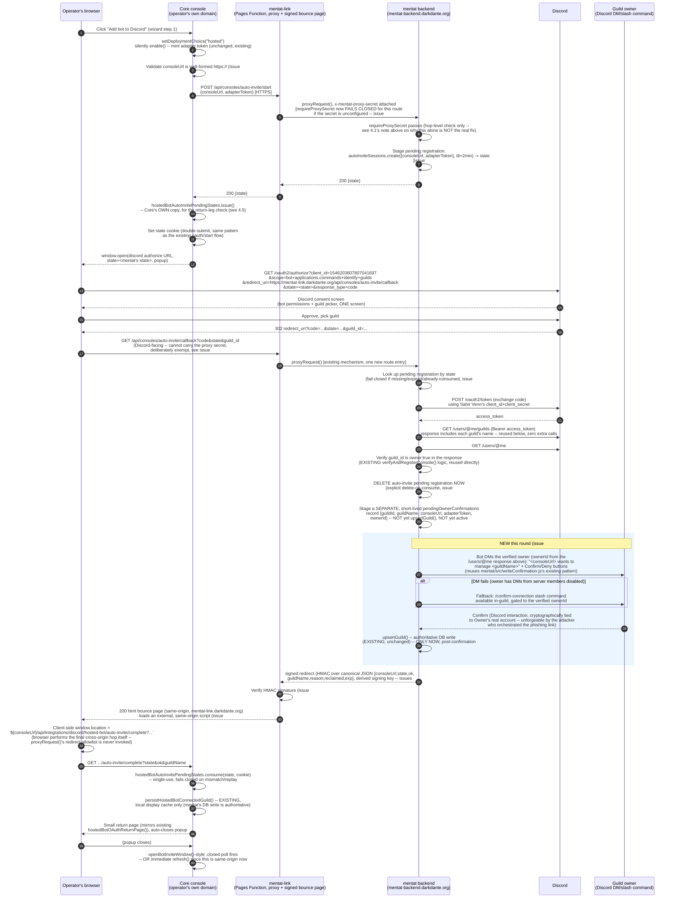
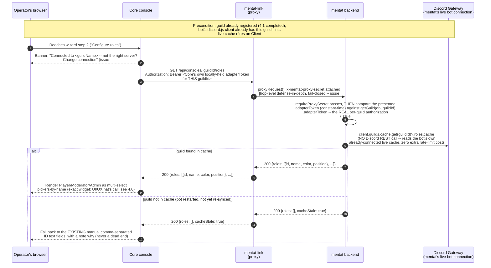

# Hosted Bot Auto-Invite, Combined Registration & Role-Name Picker — L1 Design

**Status:** Draft — Layer 1 Eight-Hats audit **complete, two rounds** (2026-09-10), all CRITICAL/HIGH findings from both rounds resolved in this revision. Not yet implemented.
**Repos touched:** `dune-awakening-selfhost-docker` (Core), `mentat`, `mentat-link`
**Tracking issue:** `dune-awakening-selfhost-docker#832`. Findings filed as issues #833-#852 — see §12 for the full register and STRIDE table.
**Supersedes/extends:** `docs/design/hosted-bot-oauth-registration-l1-design-2026-09-09.md` (this doc does not change that one's scope — self-hosted path, role-ID text fields for self-hosted, the independent OAuth-app mechanism — it extends the **hosted** path specifically) — **corrected 2026-09-10, issue #851**: an earlier draft of this line cited a non-existent filename (`discord-bot-adapter-settings-automation-l1-design-2026-09-09.md`).
**Author's note:** Ground-truthed against the real, current implementation of all three repos (see §2, every claim cited to file:line) before any architecture was proposed. Not written from memory or assumption.

---

## 1. Problem statement

The operator's own words, verbatim, from live UAT of the already-shipped hosted-bot wizard (`feat/739-hosted-bot-oauth-registration-core`, PR #801):

> "why are we asking for Redirect URI during the Hosted Bot setup? We are hosting the bot, we know the redirect URL."

> "To be clear, the desired deliverable is 1) Fully Automated add the bot to a guild, then a manual form to fill out for optional roles."

> "If roles can be automated that would be a huge win, maybe list roles once bot has been added to guild? each ID field would be a drop down to select the role?"

The currently-shipped flow (as of PR #801, commit `7dbf8987`) requires, for the hosted path:

1. Operator creates their **own** Discord Application in the Discord Developer Portal (Discord provides no API to automate this — see §10).
2. Operator manually pastes that application's Client ID, Client Secret, and Redirect URI into Core's console (Redirect URI is now pre-filled from `window.location.origin`, per the immediately-preceding fix, but Client ID/Secret are still fully manual).
3. Operator clicks "Add to Discord" (a popup, invites the bot — `client_id=1546203607807041697`, Sahir Venn's shared, org-owned Discord Application).
4. Operator **separately** clicks "Connect to hosted bot" (a second, independent OAuth round trip, using the operator's own app from step 1-2, `scope=identify guilds`) — verifies guild ownership.
5. Operator picks a guild from a list and clicks "Register."
6. Operator manually types comma-separated Discord role snowflake IDs into three text fields (Player/Moderator/Admin), which requires them to separately go find those numeric IDs in Discord's own UI (Developer Mode → right-click role → Copy ID).

Steps 1-2 exist only because "Connect to hosted bot" (step 4) needs *some* Discord Application's OAuth credentials to run an `identify guilds` authorization — and per the operator's own prior, explicit direction ("we have OAuth without bot and bot without OAuth," addressed in commit `c47b5483`), it must not reuse Core's console-sign-in Discord Application. Steps 3 and 4 are two separate Discord consent screens for what is, from the operator's perspective, one action ("connect my server"). Step 6 requires manual, error-prone data entry for information Discord already has and the bot can already see once it's a guild member.

## 2. Current state (ground truth, cited)

### 2.1 Core (`dune-awakening-selfhost-docker`)

Already shipped this session (commits `c47b5483`, `da08f90c`, `5148a773`, `7dbf8987` on `feat/739-hosted-bot-oauth-registration-core`):

- `console/api/src/config.js` — `discordHostedBotOAuthClientId`/`discordHostedBotOAuthClientSecret`/`discordHostedBotOAuthRedirectUri`, fully independent of the console-sign-in OAuth config.
- `console/api/src/server.js` — `POST /api/settings/discord-bot/oauth-config`, `POST /api/settings/discord-bot/oauth-secret` (operator-supplied app credentials); `GET /api/integrations/discord/hosted-bot/oauth/start` and `GET .../oauth/callback` (the operator's own app's `identify guilds` round trip); `POST /api/integrations/discord/hosted-bot/register` is **not** in Core at all — Core's `/register` handler forwards to mentat (see `console/api/src/integrations/discord/hostedBotOAuth.js`, `discordHostedBotApi.register()` in the frontend calling `POST /api/integrations/discord/hosted-bot/register`, which Core's `server.js` proxies server-to-server to `config.mentatBackendRegisterUrl` = `https://mentat-backend.darkdante.org/api/consoles/register`).
- `console/web/src/features/settings/DiscordBotSection.tsx` — the 3-step wizard (Add bot to Discord / Configure roles / Restart), `openBotInviteWindow()` (popup + `.closed` polling, no postMessage), `renderHostedBotConnection()` (shared OAuth-config form + Add to Discord + Connect to hosted bot + guild picker).
- Existing CSRF/replay defense pattern already in this codebase for a redirect-based OAuth flow: `hostedBotOAuthPendingStates` (a `createPendingStateStore()` instance — capacity-capped, TTL-bound, single-use-on-read Map) + `hostedBotOAuthStateCookie()` (a double-submit cookie) + PKCE (`challenge`/`codeVerifier`). This is the pattern §4.5 below reuses for the new flow's own state correlation.

### 2.2 `mentat-link` (Cloudflare Pages Functions, `mentat-link.darkdante.org`)

**Confirmed: holds zero OAuth logic for any of Core's flows.** Every relevant route is a pure reverse proxy:

- `functions/oauth/callback.js:8-10` — `/oauth/callback` → `proxyRequest(context.request, context.env, "/oauth/callback")`, verbatim passthrough.
- `functions/setup/[[path]].js`, `functions/steam-link/[[path]].js` — same pattern via `createProxyHandler()` (`functions/_lib/reverseProxy.js:280-290`).
- `functions/_lib/reverseProxy.js:69-72` — `resolveBackendBase()` resolves to `https://mentat-backend.darkdante.org` (the bot VM's internal-only Tunnel hostname, never advertised to users directly).
- `functions/_lib/reverseProxy.js:92-104` — server-to-server calls **from mentat-link to mentat** carry a shared-secret header, `x-mentat-proxy-secret` (`env.MENTAT_PROXY_SHARED_SECRET`), deliberately a no-op when unset. **This header is irrelevant to the new flow** — it authenticates mentat-link's own proxy hop, not anything Discord-facing, and (per §2.3) `/api/consoles/register`-family routes are explicitly exempted from requiring it, since Core already calls mentat directly, server-to-server, bypassing mentat-link entirely for that specific call.
- `functions/atrium.js:20,38,45` — the **one** genuine precedent for mentat-link independently running a Discord OAuth code exchange in a Function (`DISCORD_CLIENT_SECRET`/`DISCORD_CLIENT_ID` env bindings, `scope=identify guilds`) — but this is a **separate, single-tenant Discord Application** for a fixed admin tool ("Atrium"), hardcoded to one allowed user ID and one allowed guild ID. It is not, and must not become, Sahir Venn's app's secret-holder. Cited only to confirm mentat-link *can* technically hold and use a Discord client secret in a Function if a future design ever needed it to — this design does not need it to, per §4.

**Conclusion for this design — corrected 2026-09-10, issue #852 (Security Architect hat):** this line originally claimed mentat-link needs "exactly one new entry... and nothing else, no new logic." That's now stale — §4.4 lists several new proxied route entries plus one genuinely new piece of logic, the signed bounce-page Function (`functions/api/consoles/auto-invite/return.js`, issue #834/#845), which independently verifies an HMAC signature rather than purely forwarding. mentat-link still gains no new *secrets* (the bounce page's signature check reuses the existing `MENTAT_PROXY_SHARED_SECRET`), but "nothing else" was never accurate once the redirect-allowlist problem (§4.1) required a real Function instead of a route-table entry.

### 2.3 `mentat` (bot backend, Express, `mentat-backend.darkdante.org`)

- `mentat/src/setupServer.js:1,151` — Express (`import express from "express"`, `const app = express()`). Middleware order: `requireProxySecret` (line 175, exempt paths include `/api/consoles/register`), then `express.json()`, then static, then a hardcoded CORS-origin allowlist.
- `mentat/src/index.js:139-140` — `createSetupServer(config)` receives `discordClientId: config.discord.clientId, discordClientSecret: config.discord.clientSecret` — **`mentat` already holds Sahir Venn's OAuth client credentials.** Traced to source (GRC hat finding H3, resolved): `mentat/src/config.js:184-199` — `discord.clientId` = `requiredEnv(env, "DISCORD_CLIENT_ID")`; `discord.clientSecret` = `readSecret(env, "DISCORD_CLIENT_SECRET", "DISCORD_CLIENT_SECRET_FILE")` (required) in multi-tenant mode, or the same env-var-or-file pair but optional in single-tenant mode (comment at `config.js:187-196` explains why: single-tenant only started needing this secret once the Steam-link feature shipped, and per `docs/steam-link-security-review.md`'s FINDING-STEAM-5, it must stay optional there — the bot must run fine with it unset). The new `/auto-invite/callback` handler reads the identical `config.discord.clientSecret` value already wired into `createSetupServer()` — no new secret-provisioning step, no new env var.
- `mentat/src/setupServer.js:711-742` — `POST /api/consoles/register` → `verifyAndRegisterConsole()`.
- `mentat/src/consoleRegistration.js:64-131` — `verifyAndRegisterConsole({guildId, discordAccessToken, consoleUrl, adapterToken})`:
  - `:38-48` — independently calls `GET https://discord.com/api/v10/users/@me/guilds` using the **forwarded** `discordAccessToken` (never trusts the caller's own claim about which guilds they own).
  - `:50-57` — independently calls `GET .../users/@me`.
  - `:108-112` — `ownedGuilds.find(g => g.id === guildId)` — the actual ownership check, against Discord's own live response, not the caller's assertion.
  - `:103-104,65-66` — global + per-user rate limiting (`consoleRegistrationRateLimit.js`), already in place.
  - On success: `upsertGuild()` — the authoritative registration write.
- `mentat/src/database.js:559-629` — `oauthSessions` (in-memory Map, 1000-entry cap, 30-minute TTL sweep, already Layer-3-audited per `mentat#277`, cited at `database.js:545-557`). **This is real, working precedent for exactly the kind of pending-state store this design needs (§4.5)** — but it currently backs a **different, older** flow (`setupServer.js:278-436`, the standalone `/setup` web portal) with a materially weaker token-custody posture: `setupServer.js:334` embeds the raw Discord access token in a hidden HTML form field, resubmitted via `POST /setup/register`. **This design must not replicate that pattern** — see §4.5 for why the new flow keeps the access token server-side only, never round-tripping it through the browser at all.
- **No role-list fetch exists anywhere in `mentat` today** (confirmed absent, not just unfound, via direct search). What exists is *member*-role extraction (`mentat/src/commands.js:870-877`, `extractRoleIds()`, reads `interaction.member.roles.cache` — a specific member's roles, not the guild's full role list) and a DB-backed `guild_roles` table (`database.js:41`, consumed by `setupServer.js`'s tier-conflict checks — **corrected 2026-09-10, Architect hat finding, issue #835:** an earlier draft of this document misattributed `findRoleTierConflict()` to `rbac.js`; it actually lives in `mentat/src/setupServer.js`, inside the old `/setup` portal's own registration handler. This matters directly for §4.7 below — the new role-picker's write path cannot "reuse existing shared logic" without first extracting that function into an importable module, since today it's private to that one handler).
- `mentat/src/rbac.js:94-98` — `resolveGuildOwnerId()`: `interaction.client.guilds.cache.get(guildId)?.ownerId` — **real, existing precedent for reading guild-level state from the bot's own live gateway cache (discord.js), not a REST call.** §4.6 uses the identical pattern for the role list.
- `mentat/src/index.js:137-143` vs `:159` — **`createSetupServer()` does not currently receive the live discord.js `client` object; `createSteamLinkServer()` does** (same file, one function call apart). This is the one concrete wiring gap the role-picker feature needs to close.

## 3. Goals / Non-goals

**Goals:**

- **G1 — One consent screen.** Inviting the bot and verifying guild ownership happen in a single Discord OAuth authorization (`scope=bot applications.commands identify guilds`), one popup, instead of today's two separate flows.
- **G2 — Zero manual Discord Application for the hosted path.** The operator never creates their own Discord Application, never sees Client ID/Secret/Redirect URI fields, for the *new* auto-invite flow. Sahir Venn's existing, shared, org-owned application (`client_id=1546203607807041697`) is reused — the same one "Add to Discord" already uses today.
- **G3 — Role-name picker.** Once the bot is confirmed in the guild, Core's console shows the guild's real Discord role names in a picker per tier, instead of asking the operator to hand-type snowflake IDs.

**Non-goals (explicitly out of scope for this design):**

- The **self-hosted** path is entirely unaffected. It structurally requires the operator's own Discord Application (it's *their* bot, not Sahir Venn) — the existing independent-OAuth-app UI and manual role-ID fields stay exactly as shipped for that path.
- Does not change `verifyAndRegisterConsole()`'s security model (independent server-side re-verification stays; this design *adds* a caller, it doesn't loosen the callee).
- Does not touch the `guild_roles` DB table's schema or the existing tier-conflict logic in `rbac.js`.
- Does not remove the already-shipped independent-OAuth-app mechanism from Core's codebase outright — see §9 for the deprecation-not-deletion recommendation and why.
- Does not attempt to also automate the **self-hosted** role-ID entry (that path has no bot-in-the-guild to query yet at setup time by construction — a self-hosted operator's own bot process isn't running until *after* they deploy it).

## 4. Proposed architecture

### 4.1 Sequence diagram — happy path (G1 + G2: auto-invite and registration)

**Revised 2026-09-10, Round 2 of the Layer 1 Eight-Hats audit (§12).** Round 1's fix (require `requireProxySecret` on `/auto-invite/start`) was found by four independent hats (Security Architect, Network, Cloud Security, QA) to NOT actually close the vulnerability — `mentat-link`'s proxy is a blind, unauthenticated forwarder with no caller-identity check, so `requireProxySecret` only proves a request passed through mentat-link's infrastructure, not that the original caller was a legitimate Core install (issue #844). A rigorous re-analysis (documented in #844) established this is a genuine structural bootstrapping problem: no purely cryptographic state/cookie-binding scheme can distinguish a legitimate operator's click-through from a phished victim's, because anything `/auto-invite/start` returns is fully representable as a URL an attacker can hand to an unrelated victim. A fully airtight fix via domain verification or a manual pairing code would contradict this design's explicit G2 goal (fully automated, no manual step).

**The actual fix (issue #844, replacing the round-1 approach): an out-of-band Discord-native owner-confirmation gate**, the same structural pattern used by "confirm this login" push-notification MFA and by real bot/SaaS installation flows elsewhere (Slack app installs notify workspace admins; GitHub Apps require an explicit owner-approval step separate from the OAuth redirect). By the time mentat's callback runs, the bot has *already* joined the real guild (the `bot` scope is part of the same one-screen consent) — so it's a genuine, existing member that can message the verified owner (the same Discord user ID `verifyAndRegisterConsole()`-equivalent logic already independently confirmed owns the guild via Discord's own `/users/@me/guilds`, not attacker-spoofable). Concretely:

1. Mentat's callback verifies Discord ownership as before, but does **not** immediately call `upsertGuild()` — it stages the registration as **pending owner confirmation** (no `guild_roles` grants, no adapter traffic routed).
2. The bot DMs the verified owner with the real `consoleUrl` visible and Confirm/Deny buttons (Discord message components), reusing the exact, already-shipped pattern in `mentat/src/writeConfirmation.js` (`ActionRowBuilder`/`ButtonBuilder`, a `customId`-prefixed pending-map with a timeout, routed via `Events.InteractionCreate`'s existing `interaction.isButton?.()` branch in `mentat/src/index.js:263`) — **revised round 3 (issue #864, Legal-lens finding from the comprehensive wizard audit)**: the DM copy now includes a one-line privacy notice with a link to mentat's operative privacy policy (`mentat-link.darkdante.org/privacy` — the current, accurate document; see `mentat#334` for the separate, already-tracked fix reconciling it against a stale duplicate elsewhere in that repo), since this DM is mentat's own operator soliciting consent from a Discord user who has no prior relationship with this specific registration — a materially different data-processing context than every other DM this bot already sends, and one the round-1/round-2 security-only analysis didn't surface. This is a privacy-basis disclosure, not a security control — it doesn't change whether Confirm/Deny is forgeable (it isn't), only what the recipient is told.
3. If the DM fails (Discord privacy settings block bot DMs from non-friends — a real, detectable failure mode), fall back to a slash command, `/confirm-connection`, runnable by any guild member but only actionable by the verified owner's own Discord user ID (checked server-side against the interaction's `user.id`).
4. Only a **Confirm** interaction — cryptographically tied by Discord itself to that exact account, unforgeable by anyone else, including the attacker who orchestrated the phishing link — flips the registration to active and calls `upsertGuild()`. **Deny or a timeout (matching `writeConfirmation.js`'s existing `DEFAULT_CONFIRMATION_TIMEOUT_MS` pattern, extended for this longer-lived flow) discards the pending registration entirely** and, if the bot has permission, leaves the guild. **Revised round 3 (issue #864, a TOCTOU gap the comprehensive wizard audit found):** `pendingOwnerConfirmations.ownerId` was fixed at OAuth-verification time with no re-check at the moment Confirm actually arrives (up to 15 minutes later per §4.5's TTL) — if a genuine Discord guild-ownership transfer happens inside that window, the *former* owner could still complete registration via their still-valid pending DM. Mentat now re-verifies ownership (a lightweight `GET /guilds/{id}` call against its own bot token, not a user-token call — no new OAuth round trip needed) immediately before committing on Confirm, not just at the original OAuth-verification step; a mismatch is treated identically to Deny.

This does not reintroduce manual friction in the way a pairing code would — it's still fully click-through from the operator's perspective, just two Discord-native prompts (the OAuth consent screen, then the DM/command confirmation) instead of one. It converts "an attacker can silently bind an unrelated victim's guild" into "an attacker can get a victim through Discord's consent screen, but activation requires that same real owner to take a second, explicit, attacker-unreachable action with the actual destination visible to them" — a materially different, and now acceptable, risk posture.

Two further structural changes from round 1, unchanged in substance but revised in detail this round:

1. **The final redirect back to `consoleUrl` is now a *signed*, same-origin mentat-link bounce page** (`200 html` + an external, same-origin script reading `location.search`, not an inline `<script>`), not a `302 Location:` header (issue #834, refined by issue #845 — Network + Cloud Security hats). The original bounce-page fix closed the `TRUSTED_CROSS_ORIGIN_REDIRECTS` allowlist problem but was itself found to be a new, unauthenticated open redirect (#845) — anyone could hit `/return` directly with an arbitrary `consoleUrl`. Fixed: mentat signs the redirect it issues toward `/return`, and `/return` verifies that signature before rendering, not just the URL scheme. **Revised round 3 (issues #862, #863, #864 — comprehensive wizard security audit, found *after* #845's fix already shipped in this doc, the design's own worst finding having now been wrong three times in a row; treat every "Resolved" status in this section as a claim to independently re-verify, not settled fact):**
   - **#862 — canonicalization.** The original construction (`HMAC over consoleUrl|state|ok|guildName|exp`, `|`-joined) is delimiter-ambiguous: `consoleUrl` and `guildName` are both attacker-influenceable strings that can plausibly contain `|`, meaning two different field tuples can hash identically — and an attacker can legitimately drive the entire flow themselves (own guild, own consoleUrl, self-approve their own DM per #844's analysis), giving them a practical chosen-plaintext oracle against this exact construction. Fixed: the signed payload is now `JSON.stringify({consoleUrl, state, ok, guildName, reason, reclaimed, exp})` — a fixed-key-order JSON object (JavaScript's `JSON.stringify` on a plain object with string keys preserves insertion order deterministically; both the signer and verifier construct the object literal with this exact key order, never a dynamically-built string), which eliminates the delimiter-collision class entirely rather than trying to escape `|` within it.
   - **#863 — key separation.** `MENTAT_PROXY_SHARED_SECRET` is no longer used directly as the HMAC key for this signature — reusing the same value that also authenticates `requireProxySecret` hop-auth headers meant a leak of one capability's exposure surface (the header, sent on every proxied request, a more exposure-prone channel per issue #863's own analysis) would let an attacker forge the other (a valid signed redirect to *any* destination through the real, trusted `mentat-link.darkdante.org` domain — a materially more dangerous primitive than what existed before this design). Mentat now derives a distinct signing key via `SHA-256(MENTAT_PROXY_SHARED_SECRET + ":auto-invite-redirect-signing-v1")` before use — the identical key-derivation pattern (distinct-context digest, not a new required secret needing separate operator provisioning) already implemented for the equivalent finding on `mentat-link`'s own Atrium admin tool (`mentat-link#163`, `functions/_lib/atriumAuth.js`'s `deriveSigningKey()` — real, shipped precedent, not just a proposed pattern).
   - **#864 — `exp` window.** Previously unspecified, unlike every other TTL in §4.5. Set explicitly: **2 minutes**, with a 30-second clock-skew tolerance (mentat and the Cloudflare Pages Function verifying the signature run on independent clocks, not a synchronized shared one) — this redirect is consumed essentially immediately by the browser executing the bounce page's own script, so a short window bounds replay without being tight enough to cause real-world clock-drift false rejections. A corresponding test (`exp` exactly at the boundary, and just past it with/without skew tolerance) is added to §11.
   - `guildName` (and, new this round, `reason` and `reclaimed`) is HTML-escaped at every interpolation site (issue #846 — this codebase already learned this exact lesson once, in `hostedBotOAuthReturnPage()`), and loading the redirect logic as an external `.js` file (rather than inline, templated script text) also resolves the CSP conflict `script-src 'self'` (no `unsafe-inline`) would otherwise cause.
2. **`requireProxySecret` fails closed, not open, for these specific new security-critical routes** (issue #844) — unlike the historical fail-open default built for lower-stakes routes (`/health`, `/api/alerts/relay`), and §8's rollout plan (below) adds an explicit, verified gate confirming `MENTAT_PROXY_SHARED_SECRET` is actually live on both sides before this flow ships, since it's currently NOT live in production per `mentat/CHANGELOG.md:27`.

**Note on the two-stage pending state (`autoInviteSessions` → `pendingOwnerConfirmations`):** the browser round trip through Core's `/auto-invite/complete` (steps after `upsertGuild()`) now happens strictly *after* owner confirmation, not concurrently with it — the operator's browser is still sitting in the popup, waiting, while the DM/slash-command round trip happens server-side on Discord's own infrastructure. §6's failure-mode table adds an explicit "waiting for owner confirmation" state and a timeout outcome for this wait.

### 4.2 Sequence diagram — failure paths

**Revised 2026-09-10 (round 2):** every mentat→Core hop below now goes through the *signed* mentat-link bounce page from §4.1 (issue #845), not a raw `302`. **Path E** (issue #838, UI/UX hat — the realistic multi-tenant collision case of a guild already claimed by a different console) now also routes through §4.1's owner-confirmation gate before committing, and resets `guild_roles` on reclaim (issue #848, Architect hat — the round-1 version of Path E left the *previous* operator's role/tier grants live and enforced against the new operator's server, a real elevation-of-privilege gap). **Path F is new this round** (issue #844) — the owner denies or never responds to the confirmation gate.

```mermaid
sequenceDiagram
    autonumber
    participant Op as Operator's browser
    participant Core as Core console
    participant M as mentat backend
    participant D as Discord
    participant Owner as Guild owner

    rect rgb(255,235,235)
    Note over Op,D: Path A -- operator cancels on Discord's consent screen
    Op->>D: GET /oauth2/authorize (as above)
    Op->>D: Click "Cancel"
    D-->>Op: 302 redirect_uri?error=access_denied&state=...
    Op->>M: GET /api/consoles/auto-invite/callback?error=access_denied&state
    M->>M: No code to exchange -- DELETE pending registration<br/>for this state now (issue #836 -- explicit, not implicit)
    M-->>Op: bounce page -> {consoleUrl}/.../auto-invite/complete?state&ok=false&reason=denied
    Core-->>Op: Return page: "You cancelled -- try again from Settings."<br/>Wizard step 1 remains reachable -- not a dead end.
    end

    rect rgb(255,235,235)
    Note over Op,D: Path B -- ownership verification fails<br/>(picked a guild they don't own -- should be structurally<br/>impossible via Discord's own picker, but never trust that)
    Op->>D: Approve, but guild_id ends up NOT owner:true<br/>(e.g. a race: ownership transferred mid-flow)
    D-->>Op: 302 redirect_uri?code&state&guild_id
    Op->>M: GET /api/consoles/auto-invite/callback
    M->>M: Exchange succeeds, but ownership check FAILS<br/>(verifyAndRegisterConsole()'s existing 403 path)<br/>DELETE pending registration now
    M-->>Op: bounce page -> {consoleUrl}/.../auto-invite/complete?state&ok=false&reason=not_owner
    Core-->>Op: Return page: explicit "you don't own this server" message,<br/>NOT a silent failure (Requirement: no dead ends)
    end

    rect rgb(255,235,235)
    Note over Op,D: Path C -- pending registration expired or already consumed<br/>(operator re-used an old popup/bookmark, or a replay attempt)
    Op->>M: GET /api/consoles/auto-invite/callback?code&state=<stale>
    M->>M: autoInviteSessions.get(state) -> null (expired,<br/>or already explicitly deleted by a prior consume -- issue #836)
    M-->>Op: bounce page -> {consoleUrl}/.../auto-invite/complete?state&ok=false&reason=expired
    Note right of M: Fails CLOSED -- never falls through to a<br/>"trust it anyway" path.
    end

    rect rgb(255,235,235)
    Note over Op,Core: Path D -- Core's own return-leg state/cookie mismatch<br/>(CSRF attempt: a malicious page tricks the operator's<br/>browser into hitting Core's return URL directly)
    Op->>Core: GET .../auto-invite/complete?state=<guessed-or-leaked>&ok=true&guildName=EvilCorp
    Core->>Core: hostedBotAutoInvitePendingStates.consume(state, cookie)<br/>-- cookie doesn't match this state (double-submit fails)
    Core-->>Op: 400, generic error, NOTHING persisted
    end

    rect rgb(255,235,235)
    Note over Op,D: Path E (NEW, issue #838) -- guild already registered to a different console
    Op->>D: Approve, pick a guild that upsertGuild() already has<br/>on file under a DIFFERENT console's consoleUrl
    D-->>Op: 302 redirect_uri?code&state&guild_id
    Op->>M: GET /api/consoles/auto-invite/callback
    M->>M: Exchange + ownership check succeed (Discord confirms<br/>THIS operator genuinely owns the guild -- the prior<br/>registration may simply be stale, e.g. a Core reinstall)
    M->>M: Look up existing guild_roles/console row for guild_id.<br/>Decision (this design's explicit choice, not left implicit):<br/>ALLOW re-registration -- Discord ownership is the authoritative<br/>signal, not "who registered first."
    M->>M: Stage pendingOwnerConfirmations (§4.1's gate --<br/>reclaim goes through the SAME owner-confirmation step,<br/>same attack surface as a fresh registration)
    M->>Op: (owner-confirmation round trip, as in §4.1)
    M->>M: upsertGuild() -- overwrites the prior consoleUrl<br/>RESET guild_roles for this guild_id to empty (issue #848 --<br/>the previous operator's role/tier grants do NOT carry over;<br/>the new operator must explicitly reconfigure via the role picker)
    M-->>Op: bounce page -> {consoleUrl}/.../auto-invite/complete?state&ok=true&guildName=...&reclaimed=true
    Core-->>Op: Return page includes an explicit notice when<br/>reclaimed=true: "This server was previously connected to a<br/>different console -- that connection has been replaced, and<br/>role configuration was reset. Please reconfigure roles."<br/>Never silent -- an operator whose install actually gets<br/>bumped this way has independent visibility (their own console<br/>would start failing adapter calls) and a real audit trail<br/>via mentat's existing upsertGuild()/registration logging.
    end

    rect rgb(255,235,235)
    Note over Op,Owner: Path F (NEW, issue #844) -- guild owner denies or never<br/>responds to the confirmation gate
    M->>Owner: DM/slash-command confirmation request (§4.1)
    alt Owner clicks Deny
        Owner-->>M: Deny interaction
        M->>M: DELETE pendingOwnerConfirmations immediately.<br/>No upsertGuild() call ever happens. Bot leaves the guild<br/>if it has permission to. Logged as a real, reviewable<br/>abuse/security signal (consoleUrl, timestamp, denying ownerId).
    else Owner never responds (timeout)
        M->>M: Confirmation window expires (matching<br/>writeConfirmation.js's existing timeout pattern, extended<br/>for this longer-lived flow) -- same cleanup as Deny.
    end
    Note right of M: The operator's browser popup (still open from<br/>§4.1, waiting) times out client-side and shows an explicit<br/>"waiting for the server owner to confirm -- this can take a<br/>few minutes, check back or try again" message, not a silent hang.
    end
```

### 4.3 Sequence diagram — role-name picker (G3)

**Revised 2026-09-10, round 2:** round 1's fix (drop `adapterToken` entirely, rely on the mentat-link proxy secret alone) was found by the Security Architect hat to be a regression, not a fix (issue #844/#839 re-opened) — the proxy secret carries no per-caller or per-guild identity at all, so `/roles` ended up with **zero** authorization binding a caller to the specific guild they're asking about: any internet caller who knows a `guildId` (not secret — visible via bot presence, widgets, member lists) could read, and (the new POST endpoint) overwrite, that guild's tier→role mapping. The real fix reuses `adapterToken` in the **correct direction this time**: mentat already holds this exact value, encrypted at rest, in `getGuild(db, guildId).adapterToken` (written by `upsertGuild()`). Core, which locally holds its own `adapterToken` for this guild, now presents it as a header; mentat compares (constant-time) against the stored value for that specific `:guildId`. The proxy secret is kept as an additional, hop-level defense-in-depth layer (now fail-closed, issue #844), not the sole authorization mechanism. Step 2 now opens with an explicit guild-confirmation banner (issue #838 point 2, UI/UX hat — mitigates an operator mis-clicking the wrong guild in Discord's own picker during §4.1).

**Why `/roles`' auth is `adapterToken`, used correctly this time (issue #839, re-resolved after a round-1 regression):** the round-1 fix's stated reasoning (`adapterToken`'s established role is mentat presenting itself *to* Core, so reusing it here would double a leak's blast radius) was directionally right but led to the wrong fix — dropping the credential rather than using it in the *matching* direction. Core already independently holds this exact value locally (it minted it); presenting it back to mentat for a guild-scoped read/write, compared against the SAME value mentat already stores per-guild, does not expand `adapterToken`'s blast radius at all — it's the identical credential, used for the direction Core already legitimately possesses it for (proving "I am the console that registered this specific guild"), which is exactly the missing per-guild binding #839 H2 originally asked for.

### 4.4 New / modified API contracts

**Revised 2026-09-10, round 2 (issues #839, #842, #844, #845, #846).** Every row's Auth column states *why*, not just what — per issue #842 (Network hat), an unstated auth requirement is how #833's original exemption bug happened in the first place. Round 2 additionally corrects: `/auto-invite/start` no longer claims `requireProxySecret` alone is sufficient (it isn't — issue #844); `/roles`' auth reverts to `adapterToken`, used in the correct direction this time (issue #839 re-fix); the mentat-link bounce page is now signed, not just scheme-validated (issue #845).

**Core (`console/api/src/server.js`):**

| Method | Path | Purpose | Request | Response | Auth |
|---|---|---|---|---|---|
| POST | `/api/integrations/discord/hosted-bot/auto-invite/start` | Kick off the combined flow: validate `consoleUrl` (https-only, issue #843 M1), stage the pending registration on mentat via the proxy, return the Discord authorize URL to open in a popup | none (uses the already-authenticated console session) | `200 {authorizeUrl}` | existing console session, `updates:apply` — this is Core's own operator-facing endpoint, standard console auth applies |
| GET | `/api/integrations/discord/hosted-bot/auto-invite/complete` | Return leg from mentat-link's signed bounce page, reached only after owner confirmation (§4.1). Single-use state consumption, persists the local display cache, surfaces `reclaimed=true` explicitly (§4.2 Path E) | query: `state, ok, guildName?, reason?, reclaimed?` | `200 html` (return page, mirrors `hostedBotOAuthReturnPage()`) | state+cookie double-submit (no console session required — this is a top-level browser navigation arriving from the mentat-link bounce page, not an XHR from the SPA) |

**mentat (`mentat/src/setupServer.js` or a new sibling module, e.g. `mentat/src/autoInvite.js` matching the existing `consoleRegistration.js` file-per-concern convention):**

| Method | Path | Purpose | Request | Response | Auth |
|---|---|---|---|---|---|
| POST | `/api/consoles/auto-invite/start` | Stage a pending registration (2-minute TTL, issues #840/#844), return an opaque state | `{consoleUrl, adapterToken}` | `200 {state}` | **requires `requireProxySecret`, fails CLOSED (403) if the secret is unconfigured** (issue #844 — a stricter posture than the historical fail-open default other, lower-stakes routes use). **This alone does NOT authenticate the caller as a legitimate Core install** — mentat-link's proxy blindly forwards any request it receives, attaching the secret regardless of origin (issue #844's full analysis). The real defense against this route's own abuse is downstream: the owner-confirmation gate (§4.1) means a pending session created here can never be silently finalized without the verified guild owner's own, unforgeable, out-of-band confirmation. Rate-limited (reuse `consoleRegistrationRateLimit.js`) as additional defense-in-depth. |
| GET | `/api/consoles/auto-invite/callback` | Discord's redirect target (reached via mentat-link's proxy) | query: `code?, state, guild_id?, error?` | signed `302` to mentat-link's bounce-page route (issue #845) | **deliberately exempt** from `requireProxySecret` — Discord's own browser-mediated redirect lands here and cannot carry the shared secret. Safety no longer rests solely on "only an authenticated `/start` call can mint `state`" (that claim was #844's disproven round-1 premise) — it rests on the owner-confirmation gate downstream, which this route stages but does not itself finalize. |
| POST (internal, Discord interaction webhook) | Confirm/Deny button + `/confirm-connection` slash command | **New, issue #844.** The owner-confirmation gate itself — routed through the existing `Events.InteractionCreate` handler (`mentat/src/index.js:263`), reusing `writeConfirmation.js`'s `customId`-prefixed pending-map/timeout pattern with a new prefix (e.g. `autoinvite:confirm:<id>`/`autoinvite:deny:<id>`) | Discord interaction payload | Discord interaction response | Discord's own interaction signature verification (already required for all slash-command/component traffic) — the interacting user's ID must match the verified `ownerId` for `/confirm-connection`; button interactions are implicitly scoped since only the DM recipient can click them |
| GET | `/api/consoles/:guildId/roles` | Role-name list for a registered guild, scoped per-guild | `Authorization: Bearer <adapterToken>` | `200 {roles: [{id, name, color, position}], cacheStale?: boolean}` | **`adapterToken`, compared (constant-time) against `getGuild(db, guildId).adapterToken`** (issue #839, re-fixed after a round-1 regression — see §4.3's rationale) **plus `requireProxySecret`** as hop-level defense-in-depth |
| POST | `/api/consoles/:guildId/roles` | **New, issue #835/#847.** Persist an operator's tier→role-id selections (N roles per tier, matching `guild_roles`' real schema) into the real, authoritative table, through the same conflict-checked write path the old `/setup` portal uses, wrapped in a transaction (issue #847) | `{playerRoleIds: [...], moderatorRoleIds: [...], adminRoleIds: [...]}` (UI-facing `player` label maps to the DB's `observer` role_type, per `rbac.js`'s existing `ROLE_TYPE_LABELS`) | `200 {applied: [...]}` or `409 {conflict: {...}}` on a tier conflict | same as the GET above — `adapterToken` + proxy secret |

**mentat-link (`functions/_lib/reverseProxy.js` route table, plus a new non-proxying bounce-page function):**

- `POST /api/consoles/auto-invite/start` → **proxied**, `requireProxySecret`-carrying hop to mentat (fail-closed, issue #844). Same mechanism as the three routes already proxied today (§2.2), now including the shared secret for this specific route.
- `GET /api/consoles/auto-invite/callback` → **proxied** through to mentat unchanged (Discord's redirect target).
- **New: `functions/api/consoles/auto-invite/return.js`** (not a proxy — a real, small Function with its own logic, the first of its kind in mentat-link for this feature). Receives mentat's **signed** internal redirect from the callback handler (§4.1), **verifies the HMAC signature over the canonical `{consoleUrl, state, ok, guildName, reason, reclaimed, exp}` JSON payload, using the distinct signing key derived from `MENTAT_PROXY_SHARED_SECRET` (not the raw shared secret itself — issue #863)**, before doing anything else (issue #845 — a scheme-only check was itself a new, trivially-reachable open redirect; issue #862 — the original `|`-joined construction was itself delimiter-ambiguous, see §4.1's full revision history for both), and renders a minimal `200 html` page that loads an external, same-origin script (`return.js`'s companion static asset, not an inline `<script>` — issue #846, avoids the `script-src 'self'` CSP conflict) reading `location.search` client-side to perform `window.location = "${consoleUrl}/api/integrations/discord/hosted-bot/auto-invite/complete?" + params`. `guildName`, `reason`, and `reclaimed` are all HTML-escaped at every interpolation site (issue #846) and all three are now part of the signed payload (issue #864 — previously `reason`/`reclaimed` were unsigned, letting an attacker in possession of any validly-signed `/return` URL freely alter them to suppress a reclaim warning or reframe a Deny as a retryable error). This is the fix for issue #834 (never triggers `proxyRequest()`'s `TRUSTED_CROSS_ORIGIN_REDIRECTS` allowlist) made safe against its own round-2 regression (#845, an unauthenticated caller could otherwise hit this route directly) and round-3 refinements (#862, #863, #864).
- `GET`/`POST /api/consoles/:guildId/roles` → **proxied**, `requireProxySecret`-carrying hop to mentat, same pattern as `/auto-invite/start`. This route requires Cloudflare Pages' dynamic-segment convention (`functions/api/consoles/[guildId]/roles.js`) — the first use of this pattern in this repo (existing routes are all static-path or catch-all `[[path]]`), noted explicitly so Layer 2 doesn't assume it's a drop-in extension of an existing catch-all.

### 4.5 State management and CSRF/replay defense

**Revised 2026-09-10, round 2 (issues #836, #839, #840, #841, #844).**

**Three** pending-state stores now (round 1 had two) — a new `pendingOwnerConfirmations` store backs the owner-confirmation gate (§4.1, issue #844), which is the layer that actually closes the session-fixation/guild-hijack attack, not `requireProxySecret` (see the correction below).

- **mentat side, stage 1:** `autoInviteSessions`, structurally similar to the existing `oauthSessions` (`database.js:559-629` — capacity-capped, TTL-bound). **Correction (issue #836):** an earlier draft of this document described `oauthSessions` as "single-use-on-read" — that is false, verified directly: `deleteOauthSession()` (`database.js:628`) is never imported or called anywhere in `setupServer.js` today — it's dead code, and the existing `/setup` portal handler does NOT delete-on-consume in production, contrary to what round 1 claimed as precedent. `autoInviteSessions` must implement its own **explicit delete-on-consume**, correctly this time: the `/auto-invite/callback` handler deletes the session synchronously on **every** terminal path — success, operator-cancelled (Path A), ownership-check-failed (Path B), **and `discord_unreachable`** (§6 — round 1 left this path's deletion behavior unspecified; fixed here) — and Path E (reclaim) restates the same step rather than leaving it implicit. This is a real, testable requirement (§11's replay-after-consume test).
  - **Lookup also performs an inline expiry recheck on read** (issue #852 — DBA hat), matching `oauthSessions`' real `getOauthSession()` pattern (`database.js:610-619`, which re-checks `createdAtMs` against the TTL on every read, not just relying on the create-time lazy sweep) — without this, a low-traffic period could let a stale entry linger past its nominal TTL, which matters more here than for `oauthSessions` given the deliberately short TTL below.
  - **TTL: 2 minutes**, shortened further from round 1's 10 minutes (issue #844) — since the owner-confirmation gate is the real defense against the attack, `autoInviteSessions`' own TTL now only needs to bound (a) the plaintext-`adapterToken` in-memory exposure window and (b) the phishing-link viability window for the FIRST leg of the flow (before Discord ownership is even verified) as tightly as practical while staying generous for a real operator's popup click-through.
  - Holds `{consoleUrl, adapterToken}` keyed by the opaque `state`. Never holds the Discord access token past the callback handler's own synchronous verification (unchanged from round 1).
- **mentat side, stage 2 (NEW, issue #844):** `pendingOwnerConfirmations` — capacity-capped, TTL-bound (matching `writeConfirmation.js`'s existing `DEFAULT_CONFIRMATION_TIMEOUT_MS` pattern, extended to a longer window appropriate for a human checking Discord, e.g. 15 minutes rather than write-confirmation's 60 seconds). Holds `{guildId, guildName, consoleUrl, adapterToken, ownerId}`, keyed by a fresh opaque confirmation ID embedded in the DM's button `customId`s / the slash command's lookup. This is the record that actually gates `upsertGuild()` — deleted on Confirm (after committing), Deny (discarding), or timeout (discarding), never left to linger.
- **Core side:** `hostedBotAutoInvitePendingStates`, structurally identical to the existing `hostedBotOAuthPendingStates` (`createPendingStateStore()`). Holds a marker for "this state was issued by this console, still pending" — consumed exactly once by the `/auto-invite/complete` return leg. Paired with a double-submit cookie set at the same time the popup is opened, matching `hostedBotOAuthStateCookie()`'s existing pattern exactly. **Given the popup now waits through an owner-confirmation round trip (§4.1) before this leg is ever reached, this store's own TTL must be generous enough to survive that wait** — set to match `pendingOwnerConfirmations`' own window (15 minutes) plus slack for Core's own return-leg processing, not the shorter 2-minute `autoInviteSessions` TTL from stage 1.

**Why three stores instead of fewer:** each stage of the flow (stage a request, verify Discord ownership, get owner sign-off, land back on Core) has a genuinely different lifetime and a different party responsible for advancing it — collapsing them would mean a single TTL has to simultaneously be "short enough to bound credential exposure" and "long enough for a human to check a Discord DM," which are in tension. Splitting them lets each store's TTL be tuned to what it's actually protecting.

**Signed redirect `exp` window (issue #864, round 3):** the mentat→mentat-link bounce-page redirect's own signature (§4.1, §4.4) carries a separate, much shorter `exp`: **2 minutes**, with a 30-second clock-skew tolerance between mentat's host and the Cloudflare Pages Function verifying it. This is not one of the three pending-state stores above — it's a signed, stateless value (no server-side record to look up or delete), consumed within milliseconds of being issued by the browser executing the bounce page's own script, so a short, tightly-bound window is both sufficient and correct here, distinct from the multi-minute windows the human-facing stores above need.

**`ownerId` re-verification at Confirm time (issue #864, round 3):** `pendingOwnerConfirmations.ownerId` is fixed once, at the original OAuth-verification step, and the pending record can legitimately live up to 15 minutes. If a real Discord guild-ownership transfer happens inside that window, the *former* owner's still-valid pending DM could otherwise complete a registration they no longer have standing for. Mentat re-verifies ownership (a bot-token `GET /guilds/{id}` call, no new user-token OAuth round trip needed) immediately before the Confirm interaction actually commits `upsertGuild()`, not just at original verification — a mismatch is treated identically to an explicit Deny (§4.2 Path F).

**Correction (issue #844, superseding round 1's #833 correction):** round 1 already corrected an even earlier draft's claim that the two pending-state stores alone were sufficient CSRF/replay defense — but round 1's own replacement claim (that authenticating `/auto-invite/start` via the mentat-link proxy secret closes the gap) was *itself* wrong, confirmed by four independent hats in round 2 (#844): mentat-link's proxy has no caller-identity check, so `requireProxySecret` only proves a request passed through mentat-link's infrastructure, not that it came from a legitimate Core install. **The actual layer that closes this is the owner-confirmation gate** (`pendingOwnerConfirmations`, above) — `upsertGuild()` is now unreachable without a real, unforgeable, out-of-band confirmation from the Discord-verified guild owner, regardless of how the pending session was originally seeded. This document has now been wrong about "what actually stops this attack" twice; the STRIDE/findings register in §12 treats this as a load-bearing lesson, not just a fixed bug.

**Why `state` alone (no PKCE) on the mentat leg:** PKCE defends against an authorization *code* being intercepted and replayed by a party other than whoever initiated the request — relevant when the code-exchange happens in a context that could leak the code (e.g., a public client). Here, the code is exchanged entirely server-side, inside mentat's own callback handler, using a client_secret only mentat holds — there is no point in the flow where an intercepted code is independently exploitable without also having mentat's own client_secret. Core's *existing* `oauth/start` flow (§2.1) does use PKCE, because in *that* flow Core itself (a distributed, self-hosted, lower-trust environment) is the one exchanging the code with credentials the *operator* controls — a meaningfully different trust level than mentat's own centrally-operated backend. This asymmetry is deliberate, not an oversight — it was explicitly re-examined by the Security Architect hat during the real Layer 1 audit (§12) and confirmed sound (the real gap the audit found was #833, not this).

**`consoleUrl` validation (issue #843 M1):** validated as well-formed `https://` at two points, independently: once by Core itself before ever sending it to `/auto-invite/start` (§4.1), and again by the new mentat-link bounce-page Function (§4.4) before rendering it into the page — defense in depth, since the bounce page is the component actually putting this value into a `window.location` assignment.

### 4.6 Role-picker frontend design (open question for the UI/UX hat)

Backend contract is fixed (§4.3, §4.4) regardless of the frontend widget chosen. Three real options, not yet decided — **explicitly deferred to a dispatched UI/UX hat pass**, matching the operator's own framing ("maybe UI/UX has a better solution"):

1. **Per-tier multi-select** (three `<select multiple>` or a checkbox-list-in-a-popover per tier) — closest to the current three-field layout, easy to reuse existing labels/validation.
2. **Single role-to-tier assignment table** — one row per Discord role the guild actually has, with a Player/Moderator/Admin/None selector per row. Prevents the *existing*, real conflict class `rbac.js`'s `findRoleTierConflict()` already guards against (a role manually typed into two tiers at once) by construction, rather than catching it after the fact.
3. **Autocomplete/typeahead free-text**, backed by the fetched role list, falling back to raw ID entry if the operator types something not in the list (handles the `cacheStale` fallback path from §4.3 gracefully, without a jarring UI switch between "picker" and "text field" modes).

Whichever is chosen, the manual comma-separated-ID fields must remain reachable as a fallback (self-hosted path still needs them structurally; the `cacheStale` case in §4.3 needs them too) — this is additive UI, not a replacement that removes a working path.

### 4.7 Role-picker write path (new, issue #835)

The original draft of this document specified only the **read** side of the role-picker (§4.3) and left the **write** side — what actually happens when the operator submits their Player/Moderator/Admin selections — unspecified. The Architect hat's Layer 1 finding (#835) is that the obvious default implementation (writing selections only into Core's own `.env`/role-ID config, the same mechanism the self-hosted path already uses) would be functionally disconnected from mentat's real authorization enforcement: mentat's actual RBAC decisions are driven by the `guild_roles` DB table and `findRoleTierConflict()` (`mentat/src/setupServer.js`, corrected citation per §2.3), neither of which Core's own `.env` write would ever touch.

**Design:**

**Revised 2026-09-10, round 2 (issues #841, #847).** Round 1's framing of this as "a refactor of existing, already-tested behavior — not new logic" was found by the Architect and DBA hats to understate the real scope: `findRoleTierConflict()` and its write loop (`mentat/src/setupServer.js:71-96`, `:497-509`) operate on ONE role ID per tier today (`observerRoleId`/`moderatorRoleId`/`adminRoleId`), but this design's own array-shaped API contract (§4.4) and multi-select UI options (§4.6) both need N roles per tier — `guild_roles`' schema already supports this, but the conflict-detection algorithm and write loop do not, and need genuinely new logic, not relocation.

1. `findRoleTierConflict()` and the DB-write logic currently private to the old `/setup` portal's registration handler (`setupServer.js`, already a module-level `export`, not encapsulated — corrected citation, issue #852) are extracted into an importable module (e.g. `mentat/src/guildRoles.js`) **and rewritten to accept and validate an array of role IDs per tier**, not just one — the old `/setup` portal's own single-role usage becomes the degenerate one-element-array case of the same function, so it keeps working unchanged. This is genuinely new logic requiring genuinely new test coverage for the array path (§11), not just a relocation-verification pass against the old portal's existing tests (though that pass is still required too, unchanged).
2. The new `POST /api/consoles/:guildId/roles` endpoint (§4.4) calls this extracted module directly, **wrapped in a single database transaction spanning the read (current `guild_roles` state) → conflict-check → write sequence** (issue #847 — DBA hat found no transaction boundary existed around this sequence even in the original single-caller portal handler, and this design adds a SECOND, structurally independent live caller reachable via a different auth mechanism, turning a latent race into a real one that could defeat the tier-conflict separation-of-duties control entirely). A tier conflict (a role assigned to two tiers at once) returns `409` with the conflict details, surfaced by Core's UI as an inline validation error — not a generic failure.
3. Core's own wizard step 2 ("Configure roles") calls this new endpoint on submit. Core's local `.env`/role-ID fields (if kept at all per §9's disposition of the old form) become a **display cache only**, written from the same response mentat returns — matching the exact "mentat's DB write is authoritative" principle §4.1 already establishes for guild registration itself. Core's own local copy is never the system of record for role/tier assignments in the hosted path, the same way it already isn't for guild registration.
4. **Tier-name vocabulary (issue #841/#847, corrected, not just deferred to implementation as round 1 left it):** the real, canonical mapping already exists — `mentat/src/rbac.js:36-46`'s `ROLE_TYPE_LABELS` maps DB `role_type` value `observer` → UI label `"player"` (also `moderator`→`"moderator"`, `admin`→`"admin"`), already live in the old portal's own HTML and matching Core's own existing self-hosted-path field naming (`playerRoleIds`, per the already-shipped `discordAdapterSettingsApi.enable()` contract). §4.4's `POST /api/consoles/:guildId/roles` wire contract keeps `playerRoleIds`/`moderatorRoleIds`/`adminRoleIds` at the Core↔mentat boundary, consistent with that existing convention — the extracted module (step 1) is what translates `player`→`observer` internally before touching `guild_roles`, using `ROLE_TYPE_LABELS`' existing mapping rather than inventing a new one.
5. On a Path E reclaim (§4.2), `guild_roles` for that `guild_id` is reset to empty as part of the same transaction, not left carrying the previous operator's grants forward (issue #848).

## 5. Security design (final — post-Layer-1-audit; STRIDE register in §12)

**Revised 2026-09-10, round 2** after a second dispatched Layer 1 Eight-Hats audit (§12) re-verified round 1's fixes against real code rather than trusting this document's own claims — and found two of round 1's "Resolved" CRITICALs (#833, #839) were not actually resolved, plus a new CRITICAL the round-1 fix itself introduced (#845). This document has now been visibly wrong twice about "what actually closes the session-fixation/guild-hijack attack" (§4.5's correction spells out both); the fix that finally holds up under independent re-verification is the owner-confirmation gate (§4.1, issue #844), not any form of caller authentication on `/auto-invite/start` alone.

**Revised again, round 3**, after a comprehensive, wider-scope Security Architect + GRC + Legal audit (dispatched at the operator's explicit request, deeper than the standard Eight-Hats pass) found that round 2's own fix for #845 (the signed bounce-page redirect) had a real construction flaw of its own — a delimiter-ambiguous HMAC input (#862) and a key-reuse blast-radius escalation (#863) — plus a genuine TOCTOU gap in the owner-confirmation gate's `ownerId` binding and three unsigned fields in the redirect payload (#864). This is the third round this specific redirect/signing mechanism has needed correction. See §12's findings register for the full round-3 disposition.

- **Spoofing:** Three distinct spoofing risks:
  - Could an attacker seed a pending registration and get an unrelated victim's real, Discord-verified guild bound to the attacker's own `consoleUrl`/`adapterToken`? Round 1's fix (require `requireProxySecret`) was **NOT actually sufficient** — mentat-link's proxy is a blind, unauthenticated forwarder, so the secret alone doesn't verify caller legitimacy (issue #844). **Now genuinely closed** by the owner-confirmation gate (§4.1): even a successfully-seeded pending registration cannot reach `upsertGuild()` without the verified guild owner's own, unforgeable, out-of-band Discord confirmation.
  - Could a malicious site trigger Core's `/auto-invite/complete` directly, claiming a fake successful registration? Addressed by the state+cookie double-submit (§4.5, Path D in §4.2) — confirmed sound across both audit rounds, unchanged.
  - **New this round:** the mentat-link bounce page that fixes #834 was itself found to be a new, unauthenticated open redirect (issue #845 — anyone could hit `/return` directly with an arbitrary `consoleUrl`). Fixed by having mentat sign the redirect (HMAC) and `/return` verify it before rendering.
  - **Round 3, resolved:** #845's own fix used a key (`MENTAT_PROXY_SHARED_SECRET`, directly) shared with hop-auth header verification — a leak via the more exposure-prone header channel would have let an attacker forge a valid signed redirect to any destination through the trusted `mentat-link.darkdante.org` domain (issue #863). Mentat now signs with a distinct key derived from the shared secret (§4.1, §4.5), matching the identical, already-shipped pattern on `mentat-link`'s own Atrium tool (`mentat-link#163`).
- **Tampering:** `guildName` in the return-leg is cosmetic display text only; the authoritative `guildId`-to-owner binding happens server-side before any redirect is issued. The return-leg mechanism no longer relies on a `302 Location:` header crossing mentat-link's `TRUSTED_CROSS_ORIGIN_REDIRECTS` allowlist (issue #834). **New this round, resolved:** `guildName` (attacker-controlled Discord guild-name text) was found flowing into the bounce page and Core's return page with no stated escaping discipline (issue #846) — this codebase already learned this exact lesson once, in `hostedBotOAuthReturnPage()`; the bounce page now escapes every interpolation site and loads its logic as an external script rather than templating values into inline script text (also resolves a CSP `script-src 'self'` conflict the inline-script design would have hit). **New this round, resolved:** the role-picker write path (§4.7) had no transaction boundary around its read-check-write sequence, letting the new second caller race the old `/setup` portal handler and potentially defeat the tier-conflict separation-of-duties control entirely (issue #847) — fixed via an explicit transaction. **Round 3, resolved:** the signed redirect's own HMAC input was delimiter-ambiguous (`|`-joined `consoleUrl`/`guildName`, both attacker-influenceable, giving a self-driving attacker a practical chosen-plaintext oracle against the construction — issue #862) and `reason`/`reclaimed` were carried in the redirect but not part of the signed payload at all, letting anyone holding a validly-signed URL freely alter them (issue #864). Fixed: the signed payload is now a fixed-key-order canonical JSON object covering all five fields plus `reason`/`reclaimed`, not a delimiter-joined string.
- **Repudiation:** mentat's existing audit-relevant logging (rate-limit records, `upsertGuild()`) is unchanged/reused. Core's own `audit()` call convention gets a new `settings.discord-bot.auto-invite-*` entry set. §4.2 Path E's `reclaimed=true` case, and the new Path F (owner denies/times out, issue #844), each get their own explicit audit-log entry — a denied/abandoned registration attempt is exactly the kind of security-relevant signal this org's DevSecOps model expects to be reviewable, not just silently discarded.
- **Information disclosure:** The Discord access token never leaves mentat's own process (§4.5) — unchanged, confirmed sound across both audit rounds. `adapterToken` held in `autoInviteSessions` in plaintext, shortened to a 2-minute TTL (down from round 1's 10 minutes, issue #844) plus explicit delete-on-consume — confirmed adequate by the Cloud Security hat's round-2 re-verification. `/roles`' auth reverts to `adapterToken`, used in the *correct* direction this time (issue #839, re-fixed after round 1's fix regressed it to zero authorization — see §4.3).
- **Denial of service:** All three pending-state stores (§4.5) are capacity-capped + TTL-bound, mirroring existing precedent. `/auto-invite/start` reuses `consoleRegistrationRateLimit.js`. `requireProxySecret` now fails closed for these routes specifically (issue #844) rather than inheriting the historical fail-open default — reducing, though (per the finding above) not eliminating on its own, this endpoint's unauthenticated reachability.
- **Elevation of privilege:** `verifyAndRegisterConsole()`'s reuse (§4.1) is unchanged — ownership verification is still independently re-checked server-side by mentat. The role-picker's write path now genuinely reaches `guild_roles`/`findRoleTierConflict()` (issue #835/#847), with real array support matching the schema and a transaction boundary preventing the race noted above. **New this round, resolved:** Path E's guild-reclaim was found to silently carry forward the *previous* console operator's role/tier grants to the new operator — real Discord-role-based admin power persisting across an ownership change with no reset (issue #848). Fixed: `guild_roles` is reset to empty on every reclaim, requiring explicit reconfiguration. **Round 3, resolved:** `pendingOwnerConfirmations.ownerId` was fixed at initial OAuth-verification time with no re-check at Confirm time, up to 15 minutes later — a genuine Discord guild-ownership transfer inside that window would have let the *former* owner still complete registration (issue #864). Fixed: mentat re-verifies ownership via its own bot token immediately before committing on Confirm, treating a mismatch identically to Deny.

**Legal/privacy note (issue #864, not a STRIDE-mappable finding):** the owner-confirmation DM (§4.1) processes a Discord user's identity and DM inbox on the strength of the bot's own decision, not that user's prior relationship with the console being registered — a materially different data-processing context than this bot's other DMs. The DM copy now includes a privacy-policy link (§4.1); whether that disclosure is legally sufficient is a question for the operator/counsel, not something this technical design resolves on its own. Flagged, not silently assumed adequate.

## 6. Failure modes & error handling

Covered structurally in §4.2's diagrams. Summary table:

| Failure | Where detected | Operator-visible outcome |
|---|---|---|
| Operator cancels Discord consent | mentat callback (`error=access_denied`) | Explicit "you cancelled" message on Core's return page, wizard step 1 remains reachable (not a dead end — same principle as the CRITICAL C1 fix already shipped for the current flow) |
| Guild ownership check fails | mentat callback (`verifyAndRegisterConsole()`'s existing 403 path) | Explicit "you don't own this server" message, never silent |
| Pending state expired/already consumed/replayed | mentat (`autoInviteSessions` miss) or Core (`hostedBotAutoInvitePendingStates` miss/cookie mismatch) | Explicit "this link expired, try again" message |
| Discord API unreachable during code exchange | mentat callback (network error) | `ok=false&reason=discord_unreachable`, explicit retry prompt |
| Role cache stale (bot not yet reconnected to this guild) | mentat's `/roles` endpoint (`cacheStale: true`) | Automatic, explained fallback to manual ID entry — never a blank/broken picker |
| Popup blocked by the browser | Core frontend (`window.open()` returns null) | Already-handled today (`openBotInviteWindow()`'s existing `if (!popup) return` — the plain link still works as click-through); same handling applies here |
| Operator closes the popup mid-flow, before Discord redirects back | Core frontend (`.closed` poll, existing mechanism) | Wizard step 1 remains on screen, nothing registered, no error (this is a normal abandonment, not a failure) |
| Guild already registered to a different console (issue #838) | mentat callback, `upsertGuild()` overwrite | Explicit "previously connected to a different console, that connection has been replaced" notice (§4.2 Path E) — never a silent reassignment |
| Operator picked the wrong guild in Discord's own picker (issue #838) | N/A — mitigated pre-emptively | Wizard step 2 opens with an explicit "Connected to `<guildName>` — not the right server? Change connection" confirmation banner (§4.3), so a mis-click is caught before role configuration proceeds, not discovered later |
| Role-tier conflict on save (issue #835) | mentat's new `POST /roles` (`findRoleTierConflict()`) | `409` with conflict details, surfaced as an inline validation error on the role-picker UI, matching the existing self-hosted-path conflict UX |
| Owner denies the confirmation DM/slash command, or never responds (issue #844) | mentat's `pendingOwnerConfirmations` (Deny interaction, or timeout) | §4.2 Path F: pending registration discarded, bot leaves the guild if permitted. Operator's popup (still open, waiting) shows an explicit "waiting for the server owner to confirm — this can take a few minutes" message before timing out client-side, not a silent hang |
| Owner's Discord DMs are disabled for server members (issue #844) | Discord API's DM-send failure, detectable | Falls back to the `/confirm-connection` slash command, gated to the verified owner's Discord user ID — never a dead end |
| Guild reclaimed via Path E carries no automatic role/tier grants forward (issue #848) | mentat, at the reclaim `upsertGuild()` write | `reclaimed=true` return-page copy explicitly states role configuration was reset, directing the operator to the role picker |

## 7. Requirement 0 / blast radius

- **Existing operators who already completed the old flow** (own Discord Application already configured, guild already registered via the old two-popup path): entirely unaffected. `verifyAndRegisterConsole()`'s DB state and `hostedBotConnectedGuildId/Name` are untouched by this design — it's a new *path* to the same end state, not a migration of existing data.
- **Existing operators mid-setup on the old flow** when this ships: per §9's Option B decision, the old UI is removed, not kept as a permanent fallback — but not in the same release the new flow ships in. §8 phase 10 gates removal on the new flow being confirmed working, and the removal PR itself must call out the cutover explicitly in release notes (Requirement 14), giving anyone mid-setup on the old flow a real window to finish or restart under the new one before it's gone.
- **mentat's own existing `/setup` portal flow** (the older, separate web-portal-based registration path, §2.3): its routes, session store, and token-custody model remain untouched by this design's *new* endpoints. **Correction (issue #835):** its `findRoleTierConflict()`/DB-write logic is **not** zero-shared-code-path as an earlier draft claimed — §4.7 explicitly extracts and reuses that logic from a new, shared module, with the portal's own handler updated to call it too. This is a refactor of the *same* logic into a shared location, not a new dependency the portal didn't already have; its own behavior and tests are unaffected.
- **No schema changes** to `guild_roles`. `upsertGuild()`'s own contract is unchanged. **Correction (issue #837):** an earlier draft claimed "no changes to `verifyAndRegisterConsole()`'s signature (only a new caller)" — false, and directly contradicted by this same design's own need for `guildName` in the return-leg redirect. Resolved: `guildName` is sourced from the `ownedGuilds` array `verifyAndRegisterConsole()` (via its internal Discord `/users/@me/guilds` call) already fetches — a real, additive change to its return value, added in §4.1/§4.4, not "only a new caller." The function's *security-relevant* behavior (independent ownership re-verification) is genuinely unchanged; only its return shape gains a field.

## 8. Rollout plan

**Revised 2026-09-10, round 2 (issues #835, #840, #843 M2, #844, #845, #847)** — phases renumbered to add the owner-confirmation infrastructure and an explicit, verified proxy-secret-live gate before any of this is exposed to real operators.

Phased, with explicit repo ownership per phase — each phase should land as its own PR, independently tested, per this org's Requirement 21 (branch-per-change discipline):

1. **`mentat`:** `autoInviteSessions` store (2-minute TTL, explicit delete-on-consume including the `discord_unreachable` path — issues #836, #840, #844) + `POST /api/consoles/auto-invite/start` (`requireProxySecret`-gated, fails closed — issue #844) + `GET /api/consoles/auto-invite/callback` (reusing `verifyAndRegisterConsole()` directly, plus the additive `guildName` return-value change — issue #837) — **but does NOT call `upsertGuild()` yet**, stages `pendingOwnerConfirmations` instead. Independently testable: a real HTTP integration test spawning mentat's server, **plus a replay-after-consume test** (issue #836), **plus an unauthenticated-caller-rejected test for `/auto-invite/start`** (403 without the proxy secret, issue #844).
2. **`mentat`:** the owner-confirmation gate itself (issue #844) — `pendingOwnerConfirmations` store, the DM-send path (reusing `writeConfirmation.js`'s button/timeout pattern with a new `customId` prefix), the `/confirm-connection` slash-command fallback, and the `Events.InteractionCreate` routing for both. `upsertGuild()` is only called from here, on Confirm. Independently testable against a mocked discord.js client (DM send success/failure, button interaction, slash-command interaction, timeout).
3. **`mentat-link`:** the proxy route entry for `/auto-invite/start` (now carrying the shared secret, fail-closed — issue #844) and `/auto-invite/callback`, **plus the new signed bounce-page Function** (`functions/api/consoles/auto-invite/return.js`, issues #834/#845/#846) — HMAC-signature verification, HTML-escaped `guildName`, external (not inline) script, needing real test coverage for a bad/missing signature being rejected, not just a `consoleUrl`-scheme check.
4. **`mentat`:** extract `findRoleTierConflict()` and the DB-write logic out of the `/setup` portal handler into a shared module, **rewritten for N roles per tier** (issue #835/#847 step 1) — ships alone, verified against the *existing* `/setup` portal's own test suite (must still pass unchanged) **plus new array-path test coverage**, before phase 5 builds on it.
5. **`mentat`:** `client` object wiring into `createSetupServer()` (matching `createSteamLinkServer()`'s existing pattern) + `GET`/`POST /api/consoles/:guildId/roles` (`adapterToken`-authenticated, used in the correct direction, plus proxy secret — issue #839; write side calls phase 4's extracted module inside a transaction — issue #847; resets `guild_roles` on Path E reclaim — issue #848).
6. **Core:** `hostedBotAutoInvitePendingStates` (TTL sized to survive the owner-confirmation wait, §4.5) + `/auto-invite/start` + `/auto-invite/complete` (including the `consoleUrl` https-scheme validation, issue #843 M1, and `reclaimed=true` handling, issue #838) + the new wizard step 1 UI, shipped **alongside** the existing OAuth-app-config form + two-button flow (not yet replacing it — removal is phase 9, gated) + the role-picker UI (widget TBD per §4.6, guild-confirmation banner and a concretely-designed "Change connection" action per §4.3/issue #849) + an explicit "waiting for owner confirmation" popup state (issue #844).
7. **Operator action (blocking, cannot be automated — see §10):** register the new `redirect_uri` on Sahir Venn's Discord Application in the Developer Portal, *before* phase 6 can be tested end-to-end.
8. **Verified precondition, blocking (issue #844) — confirm `MENTAT_PROXY_SHARED_SECRET` is actually live and matching on both `mentat` and the `mentat-link` Pages project before phase 6 is exposed to any real operator.** Per `mentat/CHANGELOG.md:27`, this secret is not yet live in production today (`requireProxySecret` fails open when unset) — ship a real, automated check (e.g. a deploy-time smoke test confirming an unauthenticated direct call to the new routes gets `403`, not `200`), not just a manual confirmation.
9. **Operator action, post-rollout (issue #843 M2):** rotate existing deployments' adapter tokens once this flow ships — `adapterToken`'s trust boundary materially expands with this design (§4.3/§4.4), and existing tokens were minted before that expansion existed. Not blocking for the rollout itself, but should be called out in the release notes as a recommended follow-up, per Requirement 27.
10. **Core — removal, gated on real confirmation the new flow works (§9, Option B).** Not in the same release as phase 5. Ships at least one release later, once the new auto-invite flow has been used successfully end-to-end against a real deployment — a genuine post-ship confirmation, not just this design's own test plan (§11), matching Requirement 0's "test the actual upgrade, not just the new state" discipline. Removes, **for the hosted path only**: the independent-OAuth-app config form (Client ID/Secret/Redirect URI fields), the two-separate-popup ("Add to Discord" / "Connect to hosted bot") flow, and the manual comma-separated role-ID text fields. The self-hosted path's identical-looking fields are untouched (§3 non-goals — self-hosted structurally still needs its own Discord Application). Release notes must call out the cutover explicitly per Requirement 14.

Phases 1-5 can be built and tested independently of Core; phase 6 is the only phase that depends on all prior phases plus the operator's own Discord Developer Portal action; phase 8's verified secret-live check gates phase 6 being exposed to real operators. Phase 10 depends on phase 6 having shipped and been confirmed working — it is not bundled into the same PR or release.

## 9. Decision: deprecate or keep the independent-OAuth-app path?

**Resolved 2026-09-10 — Option B, operator's explicit decision.** Three options were considered:

- **Option A — deprecate, keep as fallback.** New wizard step 1 defaults to the auto-invite flow; the old "configure your own Discord Application" form moves behind a collapsed "advanced / manual setup" disclosure.
- **Option B — remove outright** once the new flow ships and is confirmed working, simplifying the codebase (less surface, fewer states to test).
- **Option C — keep both, permanently, operator's explicit choice at step 1** ("Use the shared hosted bot" vs. "Use my own Discord Application").

**Decision: Option B.** The old independent-OAuth-app path (own Discord Application, manual Client ID/Secret/Redirect URI entry, the two-separate-popup flow, and the manual comma-separated role-ID fields — **for the hosted path only**; the self-hosted path's own identical-looking fields are untouched, §3) is removed once the new auto-invite + role-picker flow is confirmed working — not kept indefinitely behind a fallback disclosure, and not kept permanently as a parallel choice. This is a deliberate simplification: less surface area, fewer states to test, and no permanent maintenance burden for a path with no confirmed use case (white-labeling, a different Discord Application than Sahir Venn's). If such a need is ever identified later, it's a new, separately-scoped feature request against the then-current codebase, not a reason to keep unused code live now.

Removal is not bundled into the same release as the new flow — see §8 phase 10 for the explicit gating (new flow must be confirmed working end-to-end against a real deployment first) and §7 for the mid-setup-operator grace-window implication.

## 10. External dependencies (cannot be automated by an agent session)

- **Discord Developer Portal action, required before phase 4 (§8) can be tested end-to-end:** register `https://mentat-link.darkdante.org/api/consoles/auto-invite/callback` as an allowed OAuth2 redirect URI on Sahir Venn's existing Discord Application (`client_id=1546203607807041697`). This requires Developer Portal access to that specific application — not something achievable via any Discord API, and not something this session has credentials for.
- ~~Confirming exactly where `config.discord.clientSecret` is sourced from~~ — **resolved, see §2.3**: `mentat/src/config.js:184-199`, `DISCORD_CLIENT_SECRET`/`DISCORD_CLIENT_SECRET_FILE`, already required in multi-tenant mode. No new secret-provisioning step needed.
- **Discord itself provides no API to programmatically create a Discord Application** — this is why G2 is specifically "reuse Sahir Venn's existing shared application," not "eliminate the concept of a Discord Application entirely." There is no way to fully remove the *existence* of a Discord Application from this flow, only the need for the *operator* to create and manage their own.

## 11. Testing plan

- **mentat (`autoInviteSessions`, `/auto-invite/start`, `/auto-invite/callback`):** real HTTP integration tests spawning the server, mirroring `consoleRegistration.js`'s own existing test file's conventions (fake Discord API server, real rate-limiter, real TTL/capacity-cap assertions on the new session store — matching how `oauthSessions`/`hostedBotPendingRegistrations` are already tested elsewhere in this codebase).
- **mentat (`/consoles/:guildId/roles`):** unit test against a mocked discord.js `client.guilds.cache`, plus the `cacheStale` fallback path explicitly.
- **mentat-link:** the existing reverse-proxy test pattern (if one exists — verify during phase 2) extended to the one new route; otherwise a smoke test confirming the proxy forwards correctly.
- **Core:** real component tests (Vitest + Testing Library, matching every test already written for `DiscordBotSection.tsx` this session) for: the new `/auto-invite/start`+`/auto-invite/complete` handlers (state/cookie mismatch → 400, expired state → explicit error, success → `persistHostedBotConnectedGuild()` called, `reclaimed=true` → notice rendered — issue #838), and the role-picker UI once its widget is chosen (§4.6), including the guild-confirmation banner (§4.3) and the `409` tier-conflict inline error (§4.7).
- **`mentat` — new, added by round 1:** a replay-after-consume integration test (issue #836) — a second `/auto-invite/callback` hit with an already-consumed `state` must get the expired/consumed response, never a second successful registration, **covering every terminal path including `discord_unreachable`** (round-2 correction, issue #836). An unauthenticated-caller-rejected test for `/auto-invite/start` (issue #833/#844) — a direct call without the proxy secret must `403`, not `200`, **run against a test harness that does NOT pre-configure `MENTAT_PROXY_SHARED_SECRET`, to actually exercise the documented fail-open-when-unset default rather than only the happy-path-configured case** (round-2 correction, QA hat — round 1's version of this test could only ever pass in a harness that already assumed the secret was set, silently never testing the real production default).
- **`mentat` — new, added by round 2 (issue #844):** owner-confirmation gate tests — Confirm interaction triggers `upsertGuild()` exactly once; Deny discards the pending record with no DB write; timeout behaves identically to Deny; DM-send failure falls back to the slash command; the slash command rejects an interaction from a Discord user ID that doesn't match the verified `ownerId`. A test proving the original session-fixation scenario (attacker-seeded `consoleUrl`/`adapterToken`, a different party completing Discord OAuth) results in a *pending, unconfirmed* record, never an active `upsertGuild()` write, without a Confirm interaction.
- **`mentat` — new, added by round 2 (issue #845):** the signed-redirect verification — a request to `/return` with a missing, malformed, or non-matching HMAC signature must be rejected, not just a `consoleUrl`-scheme check (round 1's version only tested the scheme, not the actual new open-redirect vector round 2 found).
- **`mentat` — new, added by round 2 (issue #847):** a real backend test asserting the extracted role-write module actually persists to `guild_roles` and actually rejects a real tier conflict at the mentat layer (round 1 only named a UI-level `409` test on Core's side, not a backend assertion for the endpoint that *is* the CRITICAL #835 fix) — plus a concurrency test asserting the transaction boundary actually prevents two simultaneous callers from both writing a conflicting mapping.
- **`mentat` — new, added by round 3 (issue #862):** a canonicalization test proving `{consoleUrl: "a", guildName: "b|c|d"}`-shaped inputs and `{consoleUrl: "a|b", guildName: "c|d"}`-shaped inputs (which would have collided under the old `|`-joined construction) produce genuinely different signatures under the new canonical-JSON construction.
- **`mentat`/`mentat-link` — new, added by round 3 (issue #863):** a test asserting the signing key actually used for the redirect HMAC is NOT byte-equal to `MENTAT_PROXY_SHARED_SECRET` itself (i.e., the derivation step is real, not accidentally a no-op) — mirroring the equivalent test already required for `mentat-link#163`'s identical fix on Atrium.
- **`mentat` — new, added by round 3 (issue #864):** an `exp`-boundary test (exactly at 2 minutes: accepted; 2 minutes + 30s skew tolerance: accepted; 2 minutes + 31s: rejected); a test proving `reason`/`reclaimed` cannot be altered on a validly-signed `/return` URL without invalidating the signature; a test proving the Confirm-time `ownerId` re-verification rejects a stale pending confirmation when the bot-token guild-ownership lookup no longer matches the original `ownerId`.
- **`mentat-link` — new, added by round 1, corrected round 2:** signature/format validation for the bounce-page Function (superseded by the #845 signed-redirect test above — a scheme-only check was never sufficient).
- **End-to-end (operator-owned, cannot be automated):** the real Discord consent screen, the real redirect chain, against a real test guild — same category of gate this org's Requirement 19(e) already requires for any OAuth-involving upstream PR ("a mocked test that bypasses SameSite/Path/Secure behavior is insufficient"). Must include the full happy path (§4.1, including a real DM confirmation round trip) AND at least Path A (cancel), Path E (reclaim), and Path F (deny) from §4.2, since all involve real cross-origin redirect/cookie behavior or real Discord interaction handling a mocked test cannot substitute for. This repo's own test conventions today have no real-HTTP-server/real-cookie-jar pattern (mentat-link's existing tests all call Function handlers directly with a mocked `fetch`) — the operator-owned E2E step is not a formality here, it's covering ground the automated suite genuinely cannot (QA hat, round 2).

## 12. Layer 1 Eight-Hats audit

**Complete, three rounds, 2026-09-10.** Rounds 1 and 2 dispatched all eight hats as genuinely independent agent workers (fresh context each, no shared assumptions) against this document, reading the real, current code in `dune-awakening-selfhost-docker`, `mentat`, and `mentat-link` directly, per Requirement 20. **Round 2 was not a formality — it re-verified round 1's own claimed fixes against real code rather than trusting this document, and found two round-1 "Resolved" CRITICALs (#833, #839) were not actually resolved, plus a new CRITICAL the round-1 fix itself introduced (#845).** Round 3 was a wider-scope, deeper pass (Security Architect + GRC + Legal specifically, dispatched at the operator's explicit request as a comprehensive review of the shipped wizard *and* this design) — it found that round 2's own fix for #845 had a genuine construction flaw (#862, #863) and a TOCTOU/unsigned-field gap (#864). **This document has now been wrong about "what actually closes the session-fixation/guild-hijack attack, and is the signed-redirect fix actually sound" three separate times across three rounds.** This is exactly the scenario Requirement 20's "an internal audit's 'all findings resolved' claim is a hypothesis, not a fact, until independently confirmed" language exists for — documented here in full rather than quietly corrected, since a future reader (human or LLM) should be able to see the real history, not just that the document is currently believed correct.

All CRITICAL and HIGH findings from all three rounds are resolved in this revision (§2-§9 above). MEDIUM/LOW findings are either fixed inline or explicitly deferred with justification, per issues #843/#852.

### Findings register

**Round 1:**

| # | Hat | Severity | Finding | Status |
|---|---|---|---|---|
| [#833](https://github.com/Project-Arrakis/dune-awakening-selfhost-docker/issues/833) | Security Architect | CRITICAL | `/auto-invite/start` unauthenticated → session-fixation/guild-hijack attack | **Round 1 fix insufficient (see #844) — genuinely resolved by the round-2 owner-confirmation gate**, §4.1 |
| [#834](https://github.com/Project-Arrakis/dune-awakening-selfhost-docker/issues/834) | Network + Cloud Security (convergent) | CRITICAL | mentat-link's `TRUSTED_CROSS_ORIGIN_REDIRECTS` allowlist breaks/defeats the return-leg redirect; live open-redirect before the #833 fix | **Mechanism resolved** (same-origin bounce page) **but the bounce page itself was a new open redirect — see #845** |
| [#835](https://github.com/Project-Arrakis/dune-awakening-selfhost-docker/issues/835) | Architect | CRITICAL | Role-picker's write path never reaches mentat's real `guild_roles`/`findRoleTierConflict()` authorization | **Direction confirmed correct, scope understated — see #847 for the full fix** (array support + transaction) |
| [#836](https://github.com/Project-Arrakis/dune-awakening-selfhost-docker/issues/836) | QA | CRITICAL | `oauthSessions`/`autoInviteSessions` mischaracterized as single-use-on-read | **Resolved, corrected further round 2** — §4.5, explicit delete-on-consume on every terminal path including `discord_unreachable` |
| [#837](https://github.com/Project-Arrakis/dune-awakening-selfhost-docker/issues/837) | QA | CRITICAL | §7's "no signature change" claim contradicts the design's own need for `guildName` | **Resolved, confirmed accurate by round 2** — §7, `guildName` sourced from `verifyAndRegisterConsole()`'s existing internal Discord call |
| [#838](https://github.com/Project-Arrakis/dune-awakening-selfhost-docker/issues/838) | UI/UX | CRITICAL | Failure-path hand-off (guild-already-registered-elsewhere, wrong-guild-picked) undesigned | **Partially resolved round 1, "Change connection" fully designed round 2 — see #849** |
| [#839](https://github.com/Project-Arrakis/dune-awakening-selfhost-docker/issues/839) | Security Architect | HIGH | `adapterToken` reused bidirectionally; `/roles` missing per-guild auth scoping | **Round 1 fix regressed (see #844) — re-fixed round 2**, §4.3, `adapterToken` used in the correct direction |
| [#840](https://github.com/Project-Arrakis/dune-awakening-selfhost-docker/issues/840) | Cloud Security | HIGH | Plaintext `adapterToken` in-memory for up to 30 minutes | **Resolved, confirmed adequate by round 2** — §4.5, TTL shortened further to 2 minutes |
| [#841](https://github.com/Project-Arrakis/dune-awakening-selfhost-docker/issues/841) | Architect | HIGH | Tier-naming mismatch; unresolved TTL mismatch between stores | **TTL resolved round 1; tier-naming mismatch was still live in this doc's own §4.4 — fully resolved round 2, see #847** |
| [#842](https://github.com/Project-Arrakis/dune-awakening-selfhost-docker/issues/842) | Network | HIGH | `requireProxySecret` exemption status unspecified/ambiguous for 2 new routes | **Resolved** — §4.4 table states explicit reasoning per route |
| [#843](https://github.com/Project-Arrakis/dune-awakening-selfhost-docker/issues/843) | DBA, GRC, UI/UX, Security Architect (consolidated) | MEDIUM/LOW | `consoleUrl` validation, rotation cadence, redeploy session loss, `upsertGuild()` race, board tracking, stale docs, 3 UI/UX HIGH findings, DoS surface | **Mixed — see issue for per-item disposition; board-tracking item found still incomplete round 2, see #850** |

**Round 2 (new findings):**

| # | Hat(s) | Severity | Finding | Status |
|---|---|---|---|---|
| [#844](https://github.com/Project-Arrakis/dune-awakening-selfhost-docker/issues/844) | Security Architect, Network, Cloud Security, QA (convergent) | CRITICAL | Round-1 fix for #833/#839 doesn't close the vulnerability — mentat-link's proxy has no caller authentication, and the secret isn't even live in production | **Resolved** — §4.1, the owner-confirmation gate (DM/slash-command Confirm-before-commit) is the layer that actually closes this |
| [#845](https://github.com/Project-Arrakis/dune-awakening-selfhost-docker/issues/845) | Network, Cloud Security (convergent) | CRITICAL | New open redirect in the #834 bounce-page fix itself | **Resolved** — §4.1/§4.4, signed (HMAC) redirect, verified before rendering |
| [#846](https://github.com/Project-Arrakis/dune-awakening-selfhost-docker/issues/846) | Security Architect, Cloud Security (convergent) | HIGH | Unescaped attacker-controlled `guildName` into the bounce page/return page; inline-script/CSP conflict | **Resolved** — §4.4, HTML-escaped, external (not inline) script |
| [#847](https://github.com/Project-Arrakis/dune-awakening-selfhost-docker/issues/847) | Architect, DBA | HIGH | Role-write path (#835/§4.7) is a semantic rewrite (single-role vs. array-per-tier), not a relocation, and has no transaction boundary | **Resolved** — §4.7, array support + real tier-name mapping + transaction |
| [#848](https://github.com/Project-Arrakis/dune-awakening-selfhost-docker/issues/848) | Architect | HIGH | Path E (reclaim) silently carries forward the prior operator's role/tier grants — elevation of privilege | **Resolved** — §4.2 Path E, `guild_roles` reset on every reclaim |
| [#849](https://github.com/Project-Arrakis/dune-awakening-selfhost-docker/issues/849) | UI/UX | HIGH | #838's fix leaves "Change connection" and the bumped-operator's discovery path undesigned | **Resolved** — §4.3/§4.4, "Change connection" designed as a concrete re-invite-and-release action; distinguishable reclaim error state added |
| [#850](https://github.com/Project-Arrakis/dune-awakening-selfhost-docker/issues/850) | GRC | HIGH | Round-1 board-tracking fix was only half-done | **Resolved** — #832 and #833-#852 all added to the board with Priority/Workstream set |
| [#851](https://github.com/Project-Arrakis/dune-awakening-selfhost-docker/issues/851) | GRC | MEDIUM | Non-existent predecessor filename cited; stale PR #738 body; STRIDE label/prose mismatch on #837/#842 | **Resolved** — header citation fixed (this doc's own header), mismatched STRIDE labels removed from #837/#842; PR body update tracked separately |
| [#852](https://github.com/Project-Arrakis/dune-awakening-selfhost-docker/issues/852) | DBA, UI/UX, Architect, Cloud Security, Security Architect (consolidated) | MEDIUM/LOW | TTL enforcement mechanism, double-click race, SameSite/navigation-mechanism gap, mentat-link dynamic-segment routing pattern, "internal hop" doc inaccuracy, no-JS fallback, stale §2.2 claim | **Resolved inline** — §4.4/§4.5/§2.2 updated; UI/UX double-click debounce and `<noscript>` fallback are implementation-level requirements now stated explicitly rather than deferred silently |

**Round 3 (new findings, comprehensive Security Architect + GRC + Legal audit):**

| # | Hat(s) | Severity | Finding | Status |
|---|---|---|---|---|
| [#862](https://github.com/Project-Arrakis/dune-awakening-selfhost-docker/issues/862) | Security Architect | HIGH | Signed-redirect HMAC input (`\|`-joined) is delimiter-ambiguous — a self-driving attacker has a practical chosen-plaintext oracle | **Resolved** — §4.1/§4.4, fixed-key-order canonical JSON payload replaces the delimiter-joined string |
| [#863](https://github.com/Project-Arrakis/dune-awakening-selfhost-docker/issues/863) | Security Architect, GRC (convergent) | HIGH | `MENTAT_PROXY_SHARED_SECRET` reused directly as the HMAC signing key — a leak via the more exposure-prone hop-auth header channel would let an attacker forge a valid signed redirect to any destination | **Resolved** — §4.1/§4.5, distinct signing key derived from the shared secret, matching `mentat-link#163`'s already-shipped identical pattern |
| [#864](https://github.com/Project-Arrakis/dune-awakening-selfhost-docker/issues/864) | Security Architect, Legal (consolidated) | MEDIUM | `reason`/`reclaimed` unsigned in the redirect payload; `exp` window/clock-skew unspecified; `ownerId` TOCTOU at Confirm time; owner-confirmation DM has no privacy-basis disclosure | **Resolved** — §4.1/§4.5/§5: all three fields now signed; `exp` set to 2 minutes + 30s skew; Confirm-time `ownerId` re-verification added; DM copy gets a privacy-policy link |

### STRIDE report (all three rounds combined)

| STRIDE category | Findings mapped | Severity | Resolution |
|---|---|---|---|
| Spoofing | #833, #839, #844, #845, #862, #863 | CRITICAL, HIGH, CRITICAL, CRITICAL, HIGH, HIGH | Resolved (§5) |
| Tampering | #834, #835, #836, #846, #847, #864 | CRITICAL, CRITICAL, CRITICAL, HIGH, HIGH, MEDIUM | Resolved (§5) |
| Repudiation | N/A round 1; audit-log entries added for Path E/F round 2 as a proactive addition, not a finding response | — | — |
| Information Disclosure | #834, #839, #840, #845, #846 | CRITICAL, HIGH, HIGH, CRITICAL, HIGH | Resolved (§5) |
| Denial of Service | #843 (L1) | LOW | Adequately mitigated as designed, no action required |
| Elevation of Privilege | #833, #835, #839, #844, #847, #848, #864 | CRITICAL, CRITICAL, HIGH, CRITICAL, HIGH, HIGH, MEDIUM | Resolved (§5) |

Findings #837, #838, #841, #842, #849, #850, #851, and most of #843/#852's items do not map cleanly to a STRIDE category (contract-accuracy, UX-flow, operational-hygiene, and documentation findings respectively) — listed as N/A per Requirement 20's own guidance not to force a mapping that doesn't fit. #864's Legal-lens sub-finding (the DM privacy-basis disclosure) is also N/A — it's a data-processing/consent question, not a threat-model one, and is called out separately in §5's closing note rather than forced into a STRIDE row.

**Posted to the tracking issue:** this findings register and STRIDE table are also posted verbatim as a comment on [#832](https://github.com/Project-Arrakis/dune-awakening-selfhost-docker/issues/832), per Requirement 20's canonical-record rule.

**A note for whoever picks up Layer 2:** the three rounds above are not a formality to skim past. The most consequential lesson isn't any single finding — it's that this document's own confident "Resolved" status has now been wrong three separate times about the same underlying mechanism (round 1: the caller-authentication approach; round 2: whether the signed-redirect fix for #845 was itself sound; round 3: whether that signature's own construction was sound), and each time would have shipped a genuinely exploitable gap had the next round not run. Treat every "Resolved" status here the same way each round treated the previous one's: as a claim to independently re-verify against real code during the Layer 2 implementation audit, not as settled fact — and specifically budget for a **Layer 2 review of the signed-redirect mechanism** with the same scrutiny round 3 applied, since that's the one piece that has needed correction in every round so far.

**Next step:** implementation (Layer 2), following the rollout plan in §8. Per Requirement 20, a Layer 2 implementation audit is required per-feature (after tests pass, before marking complete) — this Layer 1 pass does not substitute for it.
