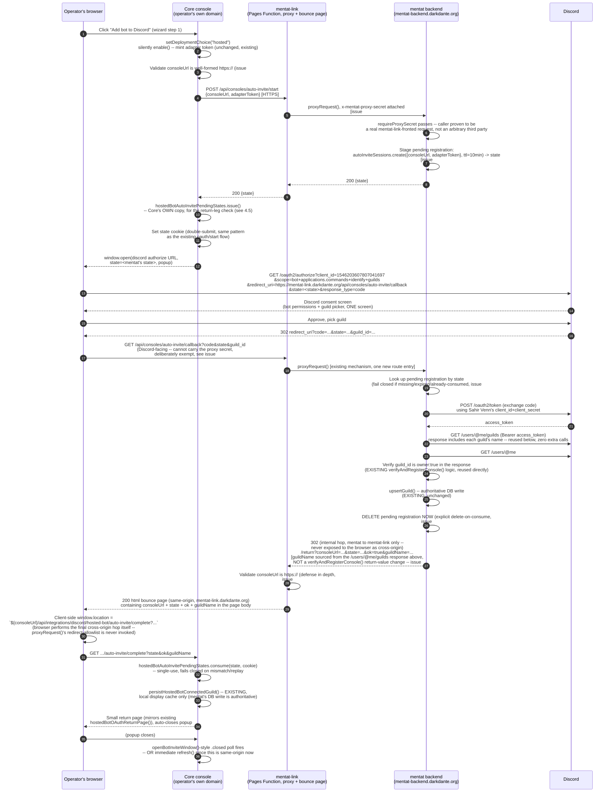
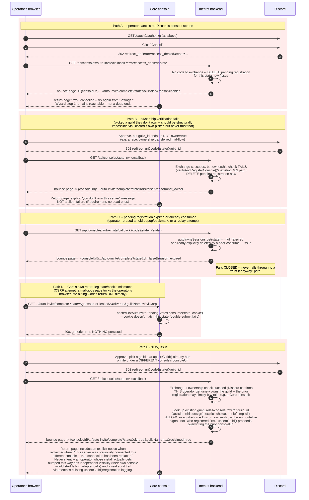
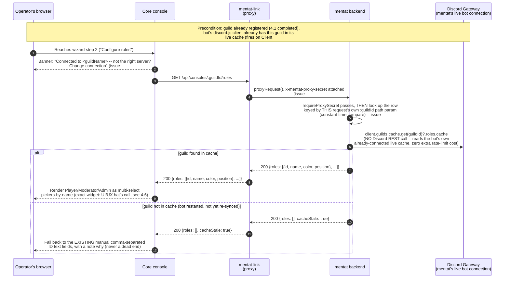

# Hosted Bot Auto-Invite, Combined Registration & Role-Name Picker — L1 Design

**Status:** Draft — Layer 1 Eight-Hats audit **complete** (2026-09-10), all CRITICAL/HIGH findings resolved in this revision. Not yet implemented.
**Repos touched:** `dune-awakening-selfhost-docker` (Core), `mentat`, `mentat-link`
**Tracking issue:** `dune-awakening-selfhost-docker#832`. Findings filed as issues #833-#843 — see §12 for the full register and STRIDE table.
**Supersedes/extends:** `docs/design/discord-bot-adapter-settings-automation-l1-design-2026-09-09.md` (this doc does not change that one's scope — self-hosted path, role-ID text fields for self-hosted, the independent OAuth-app mechanism — it extends the **hosted** path specifically)
**Author's note:** Ground-truthed against the real, current implementation of all three repos (see §2, every claim cited to file:line) before any architecture was proposed. Not written from memory or assumption.

---

## 1. Problem statement

The operator's own words, verbatim, from live UAT of the already-shipped hosted-bot wizard (`feat/739-hosted-bot-oauth-registration-core`, PR #801):

> "why are we asking for Redirect URI during the Hosted Bot setup? We are hosting the bot, we know the redirect URL."

> "To be clear, the desired deliverable is 1) Fully Automated add the bot to a guild, then a manual form to fill out for optional roles."

> "If roles can be automated that would be a huge win, maybe list roles once bot has been added to guild? each ID field would be a drop down to select the role?"

The currently-shipped flow (as of PR #801, commit `7dbf8987`) requires, for the hosted path:

1. Operator creates their **own** Discord Application in the Discord Developer Portal (Discord provides no API to automate this — see §10).
2. Operator manually pastes that application's Client ID, Client Secret, and Redirect URI into Core's console (Redirect URI is now pre-filled from `window.location.origin`, per the immediately-preceding fix, but Client ID/Secret are still fully manual).
3. Operator clicks "Add to Discord" (a popup, invites the bot — `client_id=1546203607807041697`, Sahir Venn's shared, org-owned Discord Application).
4. Operator **separately** clicks "Connect to hosted bot" (a second, independent OAuth round trip, using the operator's own app from step 1-2, `scope=identify guilds`) — verifies guild ownership.
5. Operator picks a guild from a list and clicks "Register."
6. Operator manually types comma-separated Discord role snowflake IDs into three text fields (Player/Moderator/Admin), which requires them to separately go find those numeric IDs in Discord's own UI (Developer Mode → right-click role → Copy ID).

Steps 1-2 exist only because "Connect to hosted bot" (step 4) needs *some* Discord Application's OAuth credentials to run an `identify guilds` authorization — and per the operator's own prior, explicit direction ("we have OAuth without bot and bot without OAuth," addressed in commit `c47b5483`), it must not reuse Core's console-sign-in Discord Application. Steps 3 and 4 are two separate Discord consent screens for what is, from the operator's perspective, one action ("connect my server"). Step 6 requires manual, error-prone data entry for information Discord already has and the bot can already see once it's a guild member.

## 2. Current state (ground truth, cited)

### 2.1 Core (`dune-awakening-selfhost-docker`)

Already shipped this session (commits `c47b5483`, `da08f90c`, `5148a773`, `7dbf8987` on `feat/739-hosted-bot-oauth-registration-core`):

- `console/api/src/config.js` — `discordHostedBotOAuthClientId`/`discordHostedBotOAuthClientSecret`/`discordHostedBotOAuthRedirectUri`, fully independent of the console-sign-in OAuth config.
- `console/api/src/server.js` — `POST /api/settings/discord-bot/oauth-config`, `POST /api/settings/discord-bot/oauth-secret` (operator-supplied app credentials); `GET /api/integrations/discord/hosted-bot/oauth/start` and `GET .../oauth/callback` (the operator's own app's `identify guilds` round trip); `POST /api/integrations/discord/hosted-bot/register` is **not** in Core at all — Core's `/register` handler forwards to mentat (see `console/api/src/integrations/discord/hostedBotOAuth.js`, `discordHostedBotApi.register()` in the frontend calling `POST /api/integrations/discord/hosted-bot/register`, which Core's `server.js` proxies server-to-server to `config.mentatBackendRegisterUrl` = `https://mentat-backend.darkdante.org/api/consoles/register`).
- `console/web/src/features/settings/DiscordBotSection.tsx` — the 3-step wizard (Add bot to Discord / Configure roles / Restart), `openBotInviteWindow()` (popup + `.closed` polling, no postMessage), `renderHostedBotConnection()` (shared OAuth-config form + Add to Discord + Connect to hosted bot + guild picker).
- Existing CSRF/replay defense pattern already in this codebase for a redirect-based OAuth flow: `hostedBotOAuthPendingStates` (a `createPendingStateStore()` instance — capacity-capped, TTL-bound, single-use-on-read Map) + `hostedBotOAuthStateCookie()` (a double-submit cookie) + PKCE (`challenge`/`codeVerifier`). This is the pattern §4.5 below reuses for the new flow's own state correlation.

### 2.2 `mentat-link` (Cloudflare Pages Functions, `mentat-link.darkdante.org`)

**Confirmed: holds zero OAuth logic for any of Core's flows.** Every relevant route is a pure reverse proxy:

- `functions/oauth/callback.js:8-10` — `/oauth/callback` → `proxyRequest(context.request, context.env, "/oauth/callback")`, verbatim passthrough.
- `functions/setup/[[path]].js`, `functions/steam-link/[[path]].js` — same pattern via `createProxyHandler()` (`functions/_lib/reverseProxy.js:280-290`).
- `functions/_lib/reverseProxy.js:69-72` — `resolveBackendBase()` resolves to `https://mentat-backend.darkdante.org` (the bot VM's internal-only Tunnel hostname, never advertised to users directly).
- `functions/_lib/reverseProxy.js:92-104` — server-to-server calls **from mentat-link to mentat** carry a shared-secret header, `x-mentat-proxy-secret` (`env.MENTAT_PROXY_SHARED_SECRET`), deliberately a no-op when unset. **This header is irrelevant to the new flow** — it authenticates mentat-link's own proxy hop, not anything Discord-facing, and (per §2.3) `/api/consoles/register`-family routes are explicitly exempted from requiring it, since Core already calls mentat directly, server-to-server, bypassing mentat-link entirely for that specific call.
- `functions/atrium.js:20,38,45` — the **one** genuine precedent for mentat-link independently running a Discord OAuth code exchange in a Function (`DISCORD_CLIENT_SECRET`/`DISCORD_CLIENT_ID` env bindings, `scope=identify guilds`) — but this is a **separate, single-tenant Discord Application** for a fixed admin tool ("Atrium"), hardcoded to one allowed user ID and one allowed guild ID. It is not, and must not become, Sahir Venn's app's secret-holder. Cited only to confirm mentat-link *can* technically hold and use a Discord client secret in a Function if a future design ever needed it to — this design does not need it to, per §4.

**Conclusion for this design:** mentat-link needs exactly one new entry added to its existing reverse-proxy route table (§4.4) and nothing else. It gains no new secrets, no new logic.

### 2.3 `mentat` (bot backend, Express, `mentat-backend.darkdante.org`)

- `mentat/src/setupServer.js:1,151` — Express (`import express from "express"`, `const app = express()`). Middleware order: `requireProxySecret` (line 175, exempt paths include `/api/consoles/register`), then `express.json()`, then static, then a hardcoded CORS-origin allowlist.
- `mentat/src/index.js:139-140` — `createSetupServer(config)` receives `discordClientId: config.discord.clientId, discordClientSecret: config.discord.clientSecret` — **`mentat` already holds Sahir Venn's OAuth client credentials.** Traced to source (GRC hat finding H3, resolved): `mentat/src/config.js:184-199` — `discord.clientId` = `requiredEnv(env, "DISCORD_CLIENT_ID")`; `discord.clientSecret` = `readSecret(env, "DISCORD_CLIENT_SECRET", "DISCORD_CLIENT_SECRET_FILE")` (required) in multi-tenant mode, or the same env-var-or-file pair but optional in single-tenant mode (comment at `config.js:187-196` explains why: single-tenant only started needing this secret once the Steam-link feature shipped, and per `docs/steam-link-security-review.md`'s FINDING-STEAM-5, it must stay optional there — the bot must run fine with it unset). The new `/auto-invite/callback` handler reads the identical `config.discord.clientSecret` value already wired into `createSetupServer()` — no new secret-provisioning step, no new env var.
- `mentat/src/setupServer.js:711-742` — `POST /api/consoles/register` → `verifyAndRegisterConsole()`.
- `mentat/src/consoleRegistration.js:64-131` — `verifyAndRegisterConsole({guildId, discordAccessToken, consoleUrl, adapterToken})`:
  - `:38-48` — independently calls `GET https://discord.com/api/v10/users/@me/guilds` using the **forwarded** `discordAccessToken` (never trusts the caller's own claim about which guilds they own).
  - `:50-57` — independently calls `GET .../users/@me`.
  - `:108-112` — `ownedGuilds.find(g => g.id === guildId)` — the actual ownership check, against Discord's own live response, not the caller's assertion.
  - `:103-104,65-66` — global + per-user rate limiting (`consoleRegistrationRateLimit.js`), already in place.
  - On success: `upsertGuild()` — the authoritative registration write.
- `mentat/src/database.js:559-629` — `oauthSessions` (in-memory Map, 1000-entry cap, 30-minute TTL sweep, already Layer-3-audited per `mentat#277`, cited at `database.js:545-557`). **This is real, working precedent for exactly the kind of pending-state store this design needs (§4.5)** — but it currently backs a **different, older** flow (`setupServer.js:278-436`, the standalone `/setup` web portal) with a materially weaker token-custody posture: `setupServer.js:334` embeds the raw Discord access token in a hidden HTML form field, resubmitted via `POST /setup/register`. **This design must not replicate that pattern** — see §4.5 for why the new flow keeps the access token server-side only, never round-tripping it through the browser at all.
- **No role-list fetch exists anywhere in `mentat` today** (confirmed absent, not just unfound, via direct search). What exists is *member*-role extraction (`mentat/src/commands.js:870-877`, `extractRoleIds()`, reads `interaction.member.roles.cache` — a specific member's roles, not the guild's full role list) and a DB-backed `guild_roles` table (`database.js:41`, consumed by `setupServer.js`'s tier-conflict checks — **corrected 2026-09-10, Architect hat finding, issue #835:** an earlier draft of this document misattributed `findRoleTierConflict()` to `rbac.js`; it actually lives in `mentat/src/setupServer.js`, inside the old `/setup` portal's own registration handler. This matters directly for §4.7 below — the new role-picker's write path cannot "reuse existing shared logic" without first extracting that function into an importable module, since today it's private to that one handler).
- `mentat/src/rbac.js:94-98` — `resolveGuildOwnerId()`: `interaction.client.guilds.cache.get(guildId)?.ownerId` — **real, existing precedent for reading guild-level state from the bot's own live gateway cache (discord.js), not a REST call.** §4.6 uses the identical pattern for the role list.
- `mentat/src/index.js:137-143` vs `:159` — **`createSetupServer()` does not currently receive the live discord.js `client` object; `createSteamLinkServer()` does** (same file, one function call apart). This is the one concrete wiring gap the role-picker feature needs to close.

## 3. Goals / Non-goals

**Goals:**

- **G1 — One consent screen.** Inviting the bot and verifying guild ownership happen in a single Discord OAuth authorization (`scope=bot applications.commands identify guilds`), one popup, instead of today's two separate flows.
- **G2 — Zero manual Discord Application for the hosted path.** The operator never creates their own Discord Application, never sees Client ID/Secret/Redirect URI fields, for the *new* auto-invite flow. Sahir Venn's existing, shared, org-owned application (`client_id=1546203607807041697`) is reused — the same one "Add to Discord" already uses today.
- **G3 — Role-name picker.** Once the bot is confirmed in the guild, Core's console shows the guild's real Discord role names in a picker per tier, instead of asking the operator to hand-type snowflake IDs.

**Non-goals (explicitly out of scope for this design):**

- The **self-hosted** path is entirely unaffected. It structurally requires the operator's own Discord Application (it's *their* bot, not Sahir Venn) — the existing independent-OAuth-app UI and manual role-ID fields stay exactly as shipped for that path.
- Does not change `verifyAndRegisterConsole()`'s security model (independent server-side re-verification stays; this design *adds* a caller, it doesn't loosen the callee).
- Does not touch the `guild_roles` DB table's schema or the existing tier-conflict logic in `rbac.js`.
- Does not remove the already-shipped independent-OAuth-app mechanism from Core's codebase outright — see §9 for the deprecation-not-deletion recommendation and why.
- Does not attempt to also automate the **self-hosted** role-ID entry (that path has no bot-in-the-guild to query yet at setup time by construction — a self-hosted operator's own bot process isn't running until *after* they deploy it).

## 4. Proposed architecture

### 4.1 Sequence diagram — happy path (G1 + G2: auto-invite and registration)

**Revised 2026-09-10 after the Layer 1 Eight-Hats audit (§12).** Two structural changes from the original draft, both required to resolve CRITICAL findings:

1. **`/auto-invite/start` is now routed through mentat-link's proxy and requires the shared proxy secret** (issue #833 — Security Architect hat). The original draft called mentat directly, exempt from `requireProxySecret`, exactly like `/register`. That exemption is what made `/auto-invite/start` reachable by an unauthenticated third party — who could seed a pending registration binding an arbitrary victim's future guild-ownership proof to an attacker-chosen `consoleUrl`/`adapterToken` (a session-fixation / guild-hijack attack, walked through end-to-end in #833). Requiring the proxy secret closes this at the root: only a real mentat-link-fronted call from a legitimate Core install can create a pending session at all.
2. **The final redirect back to `consoleUrl` is now a same-origin mentat-link bounce page (`200 html` + client-side `window.location`), not a `302 Location:` header** (issue #834 — Network + Cloud Security hats, convergent). `mentat-link/functions/_lib/reverseProxy.js`'s `proxyRequest()` already enforces `TRUSTED_CROSS_ORIGIN_REDIRECTS = Set(["https://discord.com"])` (closing vulnerability #125) — a raw `302` to an arbitrary operator's `consoleUrl` would be silently rewritten to `/` by that existing control, or (before fix #1 above) could be abused as a live open-redirect. A `200` response never triggers the redirect-allowlist check at all.

### 4.2 Sequence diagram — failure paths

**Revised 2026-09-10:** every mentat→Core hop below now goes through the mentat-link bounce page from §4.1 (`200 html` + client-side navigation), not a raw `302`, for the same reason as the happy path. **Path E is new** (issue #838, UI/UX hat) — the original draft had no design for the realistic multi-tenant collision case of a guild already claimed by a different console.

### 4.3 Sequence diagram — role-name picker (G3)

**Revised 2026-09-10:** `/roles` auth changed from "the adapter token" to the mentat-link proxy secret, and scoped explicitly per-`:guildId` (issue #839, Security Architect hat H1/H2 — see rationale below the diagram). Step 2 now opens with an explicit guild-confirmation banner (issue #838 point 2, UI/UX hat — mitigates an operator mis-clicking the wrong guild in Discord's own picker during §4.1).

**Why `/roles`' auth changed from "the adapter token" to the proxy secret (issue #839):** the original draft claimed this reused "the SAME adapter token `/register` already validated this console owns" — that claim was false (`verifyAndRegisterConsole()` never validates the token's legitimacy, only that it's non-empty) and, even if it had been true, `adapterToken`'s one established security role in this codebase is the opposite direction (the secret mentat presents *to* Core, not the reverse). Reusing it here would have doubled the blast radius of a single credential leak. Routing through the already-proven mentat-link-proxy-secret pattern (§4.1) avoids inventing new credential material for this read entirely.

### 4.4 New / modified API contracts

**Revised 2026-09-10 (issues #833, #834, #835, #839, #842).** Every row's Auth column now states *why*, not just what — per issue #842 (Network hat), an unstated auth requirement is how #833's original exemption bug happened in the first place.

**Core (`console/api/src/server.js`):**

| Method | Path | Purpose | Request | Response | Auth |
|---|---|---|---|---|---|
| POST | `/api/integrations/discord/hosted-bot/auto-invite/start` | Kick off the combined flow: validate `consoleUrl` (https-only, issue #843 M1), stage the pending registration on mentat via the proxy, return the Discord authorize URL to open in a popup | none (uses the already-authenticated console session) | `200 {authorizeUrl}` | existing console session, `updates:apply` — this is Core's own operator-facing endpoint, standard console auth applies |
| GET | `/api/integrations/discord/hosted-bot/auto-invite/complete` | Return leg from mentat-link's bounce page. Single-use state consumption, persists the local display cache, surfaces `reclaimed=true` explicitly (§4.2 Path E) | query: `state, ok, guildName?, reason?, reclaimed?` | `200 html` (return page, mirrors `hostedBotOAuthReturnPage()`) | state+cookie double-submit (no console session required — this is a top-level browser navigation arriving from the mentat-link bounce page, not an XHR from the SPA) |

**mentat (`mentat/src/setupServer.js` or a new sibling module, e.g. `mentat/src/autoInvite.js` matching the existing `consoleRegistration.js` file-per-concern convention):**

| Method | Path | Purpose | Request | Response | Auth |
|---|---|---|---|---|---|
| POST | `/api/consoles/auto-invite/start` | Stage a pending registration (10-minute TTL, issue #840), return an opaque state | `{consoleUrl, adapterToken}` | `200 {state}` | **requires `requireProxySecret`** — issue #833's fix. Reachable ONLY via mentat-link's proxy, which attaches `x-mentat-proxy-secret` server-side; a browser or an unauthenticated third party cannot call this directly. This is the change that closes the session-fixation/guild-hijack attack in #833 — `/api/consoles/register`'s own exemption was a false precedent to follow here, since `/register` is atomic (consoleUrl+adapterToken+Discord-ownership-proof submitted together, by Core, after Core's own operator already completed OAuth) while this two-phase flow is not. Rate-limited (reuse `consoleRegistrationRateLimit.js`) as defense in depth. |
| GET | `/api/consoles/auto-invite/callback` | Discord's redirect target (reached via mentat-link's proxy) | query: `code?, state, guild_id?, error?` | `302` to mentat-link's own bounce-page route (internal hop, same trust domain — not a cross-origin redirect to an operator's `consoleUrl`) | **deliberately exempt** from `requireProxySecret` — Discord's own browser-mediated redirect lands here and cannot carry the shared secret. Safe specifically because (post-#833 fix) `state` values can only ever have been minted by an authenticated `/auto-invite/start` call — this route's own security rests entirely on that upstream guarantee, not on anything checked here. |
| GET | `/api/consoles/:guildId/roles` | Role-name list for a registered guild, scoped per-guild | none | `200 {roles: [{id, name, color, position}], cacheStale?: boolean}` | **requires `requireProxySecret`** (issue #839 H1 fix — no longer the adapter token) **and** an explicit compare against the row keyed by the path's own `:guildId` (issue #839 H2 fix — prevents cross-guild enumeration via a validly-authenticated caller) |
| POST | `/api/consoles/:guildId/roles` | **New, issue #835.** Persist an operator's tier→role-id selections into the real, authoritative `guild_roles` table, through the same conflict-checked write path the old `/setup` portal already uses | `{playerRoleIds: [...], moderatorRoleIds: [...], adminRoleIds: [...]}` | `200 {applied: [...]}` or `409 {conflict: {...}}` on a tier conflict | same as the GET above — proxy secret + per-`:guildId` scoping |

**mentat-link (`functions/_lib/reverseProxy.js` route table, plus a new non-proxying bounce-page function):**

- `POST /api/consoles/auto-invite/start` → **proxied**, `requireProxySecret`-carrying hop to mentat (issue #833). Same mechanism as the three routes already proxied today (§2.2), now including the shared secret for this specific route.
- `GET /api/consoles/auto-invite/callback` → **proxied** through to mentat unchanged (Discord's redirect target).
- **New: `functions/api/consoles/auto-invite/return.js`** (not a proxy — a real, small Function with its own logic, the first of its kind in mentat-link for this feature). Receives mentat's internal `302` from the callback handler (§4.1), validates the carried `consoleUrl` is well-formed `https://` (issue #834/#843 M1, defense in depth even though Core already validated it at `/start` time), and renders a minimal `200 html` page whose only script performs `window.location = "${consoleUrl}/api/integrations/discord/hosted-bot/auto-invite/complete?" + params`. This is the fix for issue #834 — it exists specifically so the final cross-origin hop is a browser-driven navigation, never a `Location:` header `proxyRequest()`'s `TRUSTED_CROSS_ORIGIN_REDIRECTS` allowlist would rewrite.
- `GET /api/consoles/:guildId/roles` (both GET and the new POST) → **proxied**, `requireProxySecret`-carrying hop to mentat, same pattern as `/auto-invite/start`.

### 4.5 State management and CSRF/replay defense

**Revised 2026-09-10 (issues #836, #839, #840, #841).**

Two independent pending-state stores, mirroring existing, already-audited precedent in each repo rather than inventing a new pattern — but no longer claiming a property the model store doesn't actually have:

- **mentat side:** a new `autoInviteSessions` store, structurally similar to the existing `oauthSessions` (`database.js:559-629` — capacity-capped, TTL-bound). **Correction (issue #836):** an earlier draft of this document described `oauthSessions` as "single-use-on-read" — that is false. Only TTL expiry ever removes an entry from that store on its own; single-use semantics come entirely from the *caller* explicitly deleting the entry after a successful consume, which the existing `/setup` portal handler happens to do but the store itself does not enforce. `autoInviteSessions` must therefore implement its own **explicit delete-on-consume**: the `/auto-invite/callback` handler deletes the session synchronously on every terminal path — success (§4.1 step: "DELETE pending registration NOW"), operator-cancelled (§4.2 Path A), and ownership-check-failed (§4.2 Path B) — not just on success. This is a real, testable requirement (§11 adds a replay-after-consume integration test asserting a second callback hit with the same `state` gets the expired/consumed response, not a second successful registration).
  - **TTL: 10 minutes**, deliberately shorter than `oauthSessions`' 30 minutes (issue #840, #841) — `autoInviteSessions` holds `adapterToken` in plaintext in memory (see the Information Disclosure entry in §5), a credential that, unlike the Discord access token `oauthSessions` protects, *does* have a real encrypted-at-rest state elsewhere in the system (`encryptColumn()` precedent). A shorter window bounds this in-memory exposure while remaining generous for a real operator completing a Discord consent screen (typically well under a minute). This is a deliberate difference from `oauthSessions`, not an unexamined mismatch.
  - Holds `{consoleUrl, adapterToken}` keyed by the opaque `state`. **Deliberately does not hold the Discord access token at any point after the callback handler's own synchronous verification completes** — unlike the older `/setup` portal flow's `oauthSessions` usage (§2.3), which embeds the raw access token in a hidden HTML form field. This design's access token exists only as a local variable inside the callback handler's own request lifetime; it is never serialized to storage, a cookie, or the browser at all.
- **Core side:** a new `hostedBotAutoInvitePendingStates` store, structurally identical to the existing `hostedBotOAuthPendingStates` (`createPendingStateStore()`). Holds a marker for "this state was issued by this console, still pending" — consumed exactly once by the `/auto-invite/complete` return leg. Paired with a double-submit cookie set at the same time the popup is opened, matching `hostedBotOAuthStateCookie()`'s existing pattern exactly.

**Why two stores instead of one shared one:** mentat and Core are operated by different parties for different self-hosted installs — there is no shared session/database between an arbitrary operator's Core install and mentat's backend beyond this one opaque `state` value passed through the URL/redirect chain. Each side independently tracking "is this state mine, and still valid" is the only trust boundary that makes sense here; it also means a compromise or bug in one repo's store can't silently authorize actions in the other. **This is no longer, by itself, the only thing standing between an attacker and a forged registration (see the correction below) — but it remains the right pattern for what it does defend.**

**Correction (issue #833):** an earlier draft of this section characterized "each side independently tracking is this state mine" as sufficient for the whole flow's CSRF/replay defense. It is not, on its own — nothing about two independent single-use/TTL stores verifies that the *same actor* performed both the `/auto-invite/start` call and the Discord-approval leg, which is exactly the gap the session-fixation/guild-hijack attack in #833 exploited. The actual fix (§4.1, §4.4) is authenticating `/auto-invite/start` itself via the mentat-link proxy secret, so a pending session can only ever be created by a real Core install in the first place — this section's stores still matter (they're what makes a *valid* state single-use and time-bound), but they were never the layer that could have stopped #833, and this document no longer implies otherwise.

**Why `state` alone (no PKCE) on the mentat leg:** PKCE defends against an authorization *code* being intercepted and replayed by a party other than whoever initiated the request — relevant when the code-exchange happens in a context that could leak the code (e.g., a public client). Here, the code is exchanged entirely server-side, inside mentat's own callback handler, using a client_secret only mentat holds — there is no point in the flow where an intercepted code is independently exploitable without also having mentat's own client_secret. Core's *existing* `oauth/start` flow (§2.1) does use PKCE, because in *that* flow Core itself (a distributed, self-hosted, lower-trust environment) is the one exchanging the code with credentials the *operator* controls — a meaningfully different trust level than mentat's own centrally-operated backend. This asymmetry is deliberate, not an oversight — it was explicitly re-examined by the Security Architect hat during the real Layer 1 audit (§12) and confirmed sound (the real gap the audit found was #833, not this).

**`consoleUrl` validation (issue #843 M1):** validated as well-formed `https://` at two points, independently: once by Core itself before ever sending it to `/auto-invite/start` (§4.1), and again by the new mentat-link bounce-page Function (§4.4) before rendering it into the page — defense in depth, since the bounce page is the component actually putting this value into a `window.location` assignment.

### 4.6 Role-picker frontend design (open question for the UI/UX hat)

Backend contract is fixed (§4.3, §4.4) regardless of the frontend widget chosen. Three real options, not yet decided — **explicitly deferred to a dispatched UI/UX hat pass**, matching the operator's own framing ("maybe UI/UX has a better solution"):

1. **Per-tier multi-select** (three `<select multiple>` or a checkbox-list-in-a-popover per tier) — closest to the current three-field layout, easy to reuse existing labels/validation.
2. **Single role-to-tier assignment table** — one row per Discord role the guild actually has, with a Player/Moderator/Admin/None selector per row. Prevents the *existing*, real conflict class `rbac.js`'s `findRoleTierConflict()` already guards against (a role manually typed into two tiers at once) by construction, rather than catching it after the fact.
3. **Autocomplete/typeahead free-text**, backed by the fetched role list, falling back to raw ID entry if the operator types something not in the list (handles the `cacheStale` fallback path from §4.3 gracefully, without a jarring UI switch between "picker" and "text field" modes).

Whichever is chosen, the manual comma-separated-ID fields must remain reachable as a fallback (self-hosted path still needs them structurally; the `cacheStale` case in §4.3 needs them too) — this is additive UI, not a replacement that removes a working path.

### 4.7 Role-picker write path (new, issue #835)

The original draft of this document specified only the **read** side of the role-picker (§4.3) and left the **write** side — what actually happens when the operator submits their Player/Moderator/Admin selections — unspecified. The Architect hat's Layer 1 finding (#835) is that the obvious default implementation (writing selections only into Core's own `.env`/role-ID config, the same mechanism the self-hosted path already uses) would be functionally disconnected from mentat's real authorization enforcement: mentat's actual RBAC decisions are driven by the `guild_roles` DB table and `findRoleTierConflict()` (`mentat/src/setupServer.js`, corrected citation per §2.3), neither of which Core's own `.env` write would ever touch.

**Design:**

1. `findRoleTierConflict()` and the DB-write logic currently private to the old `/setup` portal's registration handler (`setupServer.js`) are extracted into an importable module (e.g. `mentat/src/guildRoles.js`), with the `/setup` portal handler updated to call it rather than owning the logic inline. This is a refactor of existing, already-tested behavior — not new logic — and should ship as its own small PR ahead of the new endpoint, so the extraction itself can be verified (existing `/setup` portal tests must still pass unchanged) before anything new is built on top of it.
2. The new `POST /api/consoles/:guildId/roles` endpoint (§4.4) calls this extracted module directly: for each submitted tier→role-id mapping, it runs the same conflict check the old portal already runs, and on success writes to the same `guild_roles` table via the same write path. A tier conflict (a role assigned to two tiers at once) returns `409` with the conflict details, surfaced by Core's UI as an inline validation error — not a generic failure.
3. Core's own wizard step 2 ("Configure roles") calls this new endpoint on submit. Core's local `.env`/role-ID fields (if kept at all per §9's disposition of the old form) become a **display cache only**, written from the same response mentat returns — matching the exact "mentat's DB write is authoritative" principle §4.1 already establishes for guild registration itself. Core's own local copy is never the system of record for role/tier assignments in the hosted path, the same way it already isn't for guild registration.
4. Tier-name vocabulary (issue #841): the Player/Moderator/Admin strings the role-picker UI uses must match, verbatim, whatever tier-name strings `guild_roles`/`findRoleTierConflict()` use internally — confirmed as part of step 1's extraction, with an explicit mapping documented if they don't already match 1:1.

## 5. Security design (final — post-Layer-1-audit; STRIDE register in §12)

**Revised 2026-09-10** after the real, dispatched Layer 1 Eight-Hats audit (§12) — the preliminary self-check that previously stood here missed the flow's actual worst finding (#833) entirely, which is exactly why Requirement 20 treats a solo pass as insufficient on its own. Rewritten per-category below to reflect the architecture as fixed, not as originally drafted:

- **Spoofing:** Two distinct spoofing risks, both now closed:
  - Could an attacker seed a pending registration and get an unrelated victim's real, Discord-verified guild bound to the attacker's own `consoleUrl`/`adapterToken`? **This was the session-fixation/guild-hijack attack, issue #833 — CRITICAL, now closed** by requiring `/auto-invite/start` to go through mentat-link's proxy with the shared secret (§4.1, §4.4), so a pending session can only ever originate from a real, authenticated Core install.
  - Could a malicious site trigger Core's `/auto-invite/complete` directly, claiming a fake successful registration? Addressed by the state+cookie double-submit (§4.5, Path D in §4.2) — the attacker would need to both guess/leak a currently-pending, single-use state value *and* have it match a cookie already set in the victim's own browser for that specific pending flow. Confirmed sound by the audit; no change needed here.
- **Tampering:** `guildName` in the return-leg is cosmetic display text only (unchanged reasoning); the authoritative `guildId`-to-owner binding happens server-side in `verifyAndRegisterConsole()` before any redirect is issued. **New, resolved:** the return-leg mechanism itself no longer relies on a `302 Location:` header crossing mentat-link's `TRUSTED_CROSS_ORIGIN_REDIRECTS` allowlist (issue #834 — CRITICAL), which would have either silently broken the feature (redirect rewritten to `/`) or, combined with #833 pre-fix, been a live, unauthenticated open-redirect. Fixed via the same-origin bounce page (§4.1, §4.4).
- **Repudiation:** mentat's existing audit-relevant logging (rate-limit records, `upsertGuild()`) is unchanged/reused. Core's own `audit()` call convention gets a new `settings.discord-bot.auto-invite-*` entry set, matching the existing `hosted-bot.oauth.start`/`hosted-bot.oauth.callback` audit actions. §4.2 Path E's `reclaimed=true` case additionally gets its own explicit audit-log entry (mentat side, at the `upsertGuild()` overwrite) so a guild-reassignment event has a durable trail, not just an operator-visible notice.
- **Information disclosure:** The Discord access token never leaves mentat's own process (§4.5) — unchanged, confirmed sound. **New finding, resolved:** `adapterToken` held in `autoInviteSessions` in plaintext was a real regression from this codebase's encrypt-at-rest bar for that credential (issue #840 — HIGH), since (unlike the Discord access token) it has a genuine encrypted "rest" state elsewhere. Mitigated via a shortened 10-minute TTL (§4.5) plus explicit delete-on-consume (issue #836) rather than left to TTL sweep alone. **New finding, resolved:** `/roles`' reuse of `adapterToken` as a bidirectional secret (issue #839 H1) and its missing per-guild scoping (#839 H2) — both fixed in §4.3/§4.4 by routing through the proxy-secret pattern instead and requiring an explicit `:guildId`-keyed compare.
- **Denial of service:** Both new stores are capacity-capped + TTL-bound, mirroring existing precedent (`oauthSessions`, `hostedBotOAuthPendingStates`) that's already survived a Layer 3 audit (`mentat#277`) for the capped-Map pattern specifically. `/auto-invite/start` reuses `consoleRegistrationRateLimit.js` — and, post-#833 fix, is no longer reachable by an unauthenticated caller at all, further reducing this surface versus the original draft (issue #843 L1, adequately mitigated, no further action).
- **Elevation of privilege:** `verifyAndRegisterConsole()`'s reuse (§4.1) is unchanged — ownership verification is still independently re-checked server-side by mentat, this design only adds a new, now-authenticated caller. **New finding, resolved:** the role-picker's write path (§4.3 as originally drafted) had no design at all for reaching mentat's real RBAC enforcement (`guild_roles`/`findRoleTierConflict()`) — an operator's tier selections would have silently only affected Core's own local display config, never mentat's actual authorization decisions (issue #835 — CRITICAL). Fixed via §4.7's extraction-and-reuse design.

## 6. Failure modes & error handling

Covered structurally in §4.2's diagrams. Summary table:

| Failure | Where detected | Operator-visible outcome |
|---|---|---|
| Operator cancels Discord consent | mentat callback (`error=access_denied`) | Explicit "you cancelled" message on Core's return page, wizard step 1 remains reachable (not a dead end — same principle as the CRITICAL C1 fix already shipped for the current flow) |
| Guild ownership check fails | mentat callback (`verifyAndRegisterConsole()`'s existing 403 path) | Explicit "you don't own this server" message, never silent |
| Pending state expired/already consumed/replayed | mentat (`autoInviteSessions` miss) or Core (`hostedBotAutoInvitePendingStates` miss/cookie mismatch) | Explicit "this link expired, try again" message |
| Discord API unreachable during code exchange | mentat callback (network error) | `ok=false&reason=discord_unreachable`, explicit retry prompt |
| Role cache stale (bot not yet reconnected to this guild) | mentat's `/roles` endpoint (`cacheStale: true`) | Automatic, explained fallback to manual ID entry — never a blank/broken picker |
| Popup blocked by the browser | Core frontend (`window.open()` returns null) | Already-handled today (`openBotInviteWindow()`'s existing `if (!popup) return` — the plain link still works as click-through); same handling applies here |
| Operator closes the popup mid-flow, before Discord redirects back | Core frontend (`.closed` poll, existing mechanism) | Wizard step 1 remains on screen, nothing registered, no error (this is a normal abandonment, not a failure) |
| Guild already registered to a different console (issue #838) | mentat callback, `upsertGuild()` overwrite | Explicit "previously connected to a different console, that connection has been replaced" notice (§4.2 Path E) — never a silent reassignment |
| Operator picked the wrong guild in Discord's own picker (issue #838) | N/A — mitigated pre-emptively | Wizard step 2 opens with an explicit "Connected to `<guildName>` — not the right server? Change connection" confirmation banner (§4.3), so a mis-click is caught before role configuration proceeds, not discovered later |
| Role-tier conflict on save (issue #835) | mentat's new `POST /roles` (`findRoleTierConflict()`) | `409` with conflict details, surfaced as an inline validation error on the role-picker UI, matching the existing self-hosted-path conflict UX |

## 7. Requirement 0 / blast radius

- **Existing operators who already completed the old flow** (own Discord Application already configured, guild already registered via the old two-popup path): entirely unaffected. `verifyAndRegisterConsole()`'s DB state and `hostedBotConnectedGuildId/Name` are untouched by this design — it's a new *path* to the same end state, not a migration of existing data.
- **Existing operators mid-setup on the old flow** when this ships: per §9's Option B decision, the old UI is removed, not kept as a permanent fallback — but not in the same release the new flow ships in. §8 phase 8 gates removal on the new flow being confirmed working, and the removal PR itself must call out the cutover explicitly in release notes (Requirement 14), giving anyone mid-setup on the old flow a real window to finish or restart under the new one before it's gone.
- **mentat's own existing `/setup` portal flow** (the older, separate web-portal-based registration path, §2.3): its routes, session store, and token-custody model remain untouched by this design's *new* endpoints. **Correction (issue #835):** its `findRoleTierConflict()`/DB-write logic is **not** zero-shared-code-path as an earlier draft claimed — §4.7 explicitly extracts and reuses that logic from a new, shared module, with the portal's own handler updated to call it too. This is a refactor of the *same* logic into a shared location, not a new dependency the portal didn't already have; its own behavior and tests are unaffected.
- **No schema changes** to `guild_roles`. `upsertGuild()`'s own contract is unchanged. **Correction (issue #837):** an earlier draft claimed "no changes to `verifyAndRegisterConsole()`'s signature (only a new caller)" — false, and directly contradicted by this same design's own need for `guildName` in the return-leg redirect. Resolved: `guildName` is sourced from the `ownedGuilds` array `verifyAndRegisterConsole()` (via its internal Discord `/users/@me/guilds` call) already fetches — a real, additive change to its return value, added in §4.1/§4.4, not "only a new caller." The function's *security-relevant* behavior (independent ownership re-verification) is genuinely unchanged; only its return shape gains a field.

## 8. Rollout plan

**Revised 2026-09-10 (issues #835, #840, #843 M2)** — one phase split into two (the `findRoleTierConflict()` extraction must land and be verified before anything is built on top of it), and an explicit rotation step added.

Phased, with explicit repo ownership per phase — each phase should land as its own PR, independently tested, per this org's Requirement 21 (branch-per-change discipline):

1. **`mentat`:** `autoInviteSessions` store (10-minute TTL, explicit delete-on-consume — issues #836, #840) + `POST /api/consoles/auto-invite/start` (now `requireProxySecret`-gated — issue #833) + `GET /api/consoles/auto-invite/callback` (reusing `verifyAndRegisterConsole()` directly, plus the additive `guildName` return-value change — issue #837). Independently testable: a real HTTP integration test spawning mentat's server, mirroring `consoleRegistration.js`'s own existing test conventions, **plus a replay-after-consume test** (issue #836) asserting a second callback hit with a consumed `state` is rejected.
2. **`mentat-link`:** the proxy route entry for `/auto-invite/start` (now carrying the shared secret, issue #833) and `/auto-invite/callback`, **plus the new non-proxying bounce-page Function** (`functions/api/consoles/auto-invite/return.js`, issue #834) — this last piece is new logic, not a trivial route-table entry like the other three, and needs its own `consoleUrl`-validation test coverage (issue #834/#843 M1).
3. **`mentat`:** extract `findRoleTierConflict()` and the DB-write logic out of the `/setup` portal handler into a shared module (issue #835 step 1) — ships alone, verified against the *existing* `/setup` portal's own test suite (must still pass unchanged) before phase 4 builds on it.
4. **`mentat`:** `client` object wiring into `createSetupServer()` (matching `createSteamLinkServer()`'s existing pattern) + `GET`/`POST /api/consoles/:guildId/roles` (proxy-secret-gated, per-`:guildId`-scoped — issue #839; write side calls phase 3's extracted module — issue #835 steps 2-4).
5. **Core:** `hostedBotAutoInvitePendingStates` + `/auto-invite/start` + `/auto-invite/complete` (including the `consoleUrl` https-scheme validation, issue #843 M1, and `reclaimed=true` handling, issue #838) + the new wizard step 1 UI, shipped **alongside** the existing OAuth-app-config form + two-button flow (not yet replacing it — removal is phase 8, gated) + the role-picker UI (widget TBD per §4.6, guild-confirmation banner per §4.3/issue #838).
6. **Operator action (blocking, cannot be automated — see §10):** register the new `redirect_uri` on Sahir Venn's Discord Application in the Developer Portal, *before* phase 5 can be tested end-to-end.
7. **Operator action, post-rollout (issue #843 M2):** rotate existing deployments' adapter tokens once this flow ships — `adapterToken`'s trust boundary materially expands with this design (§4.3/§4.4), and existing tokens were minted before that expansion existed. Not blocking for the rollout itself, but should be called out in the release notes as a recommended follow-up, per Requirement 27.
8. **Core — removal, gated on real confirmation the new flow works (§9, Option B).** Not in the same release as phase 5. Ships at least one release later, once the new auto-invite flow has been used successfully end-to-end against a real deployment — a genuine post-ship confirmation, not just this design's own test plan (§11), matching Requirement 0's "test the actual upgrade, not just the new state" discipline. Removes, **for the hosted path only**: the independent-OAuth-app config form (Client ID/Secret/Redirect URI fields), the two-separate-popup ("Add to Discord" / "Connect to hosted bot") flow, and the manual comma-separated role-ID text fields. The self-hosted path's identical-looking fields are untouched (§3 non-goals — self-hosted structurally still needs its own Discord Application). Release notes must call out the cutover explicitly per Requirement 14.

Phases 1-4 can be built and tested independently of Core; phase 5 is the only phase that depends on all prior phases plus the operator's own Discord Developer Portal action. Phase 8 depends on phase 5 having shipped and been confirmed working — it is not bundled into the same PR or release.

## 9. Decision: deprecate or keep the independent-OAuth-app path?

**Resolved 2026-09-10 — Option B, operator's explicit decision.** Three options were considered:

- **Option A — deprecate, keep as fallback.** New wizard step 1 defaults to the auto-invite flow; the old "configure your own Discord Application" form moves behind a collapsed "advanced / manual setup" disclosure.
- **Option B — remove outright** once the new flow ships and is confirmed working, simplifying the codebase (less surface, fewer states to test).
- **Option C — keep both, permanently, operator's explicit choice at step 1** ("Use the shared hosted bot" vs. "Use my own Discord Application").

**Decision: Option B.** The old independent-OAuth-app path (own Discord Application, manual Client ID/Secret/Redirect URI entry, the two-separate-popup flow, and the manual comma-separated role-ID fields — **for the hosted path only**; the self-hosted path's own identical-looking fields are untouched, §3) is removed once the new auto-invite + role-picker flow is confirmed working — not kept indefinitely behind a fallback disclosure, and not kept permanently as a parallel choice. This is a deliberate simplification: less surface area, fewer states to test, and no permanent maintenance burden for a path with no confirmed use case (white-labeling, a different Discord Application than Sahir Venn's). If such a need is ever identified later, it's a new, separately-scoped feature request against the then-current codebase, not a reason to keep unused code live now.

Removal is not bundled into the same release as the new flow — see §8 phase 8 for the explicit gating (new flow must be confirmed working end-to-end against a real deployment first) and §7 for the mid-setup-operator grace-window implication.

## 10. External dependencies (cannot be automated by an agent session)

- **Discord Developer Portal action, required before phase 4 (§8) can be tested end-to-end:** register `https://mentat-link.darkdante.org/api/consoles/auto-invite/callback` as an allowed OAuth2 redirect URI on Sahir Venn's existing Discord Application (`client_id=1546203607807041697`). This requires Developer Portal access to that specific application — not something achievable via any Discord API, and not something this session has credentials for.
- ~~Confirming exactly where `config.discord.clientSecret` is sourced from~~ — **resolved, see §2.3**: `mentat/src/config.js:184-199`, `DISCORD_CLIENT_SECRET`/`DISCORD_CLIENT_SECRET_FILE`, already required in multi-tenant mode. No new secret-provisioning step needed.
- **Discord itself provides no API to programmatically create a Discord Application** — this is why G2 is specifically "reuse Sahir Venn's existing shared application," not "eliminate the concept of a Discord Application entirely." There is no way to fully remove the *existence* of a Discord Application from this flow, only the need for the *operator* to create and manage their own.

## 11. Testing plan

- **mentat (`autoInviteSessions`, `/auto-invite/start`, `/auto-invite/callback`):** real HTTP integration tests spawning the server, mirroring `consoleRegistration.js`'s own existing test file's conventions (fake Discord API server, real rate-limiter, real TTL/capacity-cap assertions on the new session store — matching how `oauthSessions`/`hostedBotPendingRegistrations` are already tested elsewhere in this codebase).
- **mentat (`/consoles/:guildId/roles`):** unit test against a mocked discord.js `client.guilds.cache`, plus the `cacheStale` fallback path explicitly.
- **mentat-link:** the existing reverse-proxy test pattern (if one exists — verify during phase 2) extended to the one new route; otherwise a smoke test confirming the proxy forwards correctly.
- **Core:** real component tests (Vitest + Testing Library, matching every test already written for `DiscordBotSection.tsx` this session) for: the new `/auto-invite/start`+`/auto-invite/complete` handlers (state/cookie mismatch → 400, expired state → explicit error, success → `persistHostedBotConnectedGuild()` called, `reclaimed=true` → notice rendered — issue #838), and the role-picker UI once its widget is chosen (§4.6), including the guild-confirmation banner (§4.3) and the `409` tier-conflict inline error (§4.7).
- **`mentat` — new, added by the audit:** a replay-after-consume integration test (issue #836) — a second `/auto-invite/callback` hit with an already-consumed `state` must get the expired/consumed response, never a second successful registration. An unauthenticated-caller-rejected test for `/auto-invite/start` (issue #833) — a direct call without the proxy secret must `403`, not `200`. A cross-guild-enumeration-rejected test for `/roles` (issue #839 H2) — a validly-authenticated caller requesting a `:guildId` other than the one it registered must not receive that guild's role data.
- **`mentat-link` — new, added by the audit:** a `consoleUrl`-validation test for the new bounce-page Function (issue #834/#843 M1) — a non-`https://` or malformed `consoleUrl` must be rejected before the bounce page renders, not passed through into `window.location`.
- **End-to-end (operator-owned, cannot be automated):** the real Discord consent screen, the real redirect chain, against a real test guild — same category of gate this org's Requirement 19(e) already requires for any OAuth-involving upstream PR ("a mocked test that bypasses SameSite/Path/Secure behavior is insufficient"). Must include the full happy path (§4.1) AND at least Path A (cancel) and Path E (reclaim) from §4.2, since both involve real cross-origin redirect/cookie behavior a mocked test cannot substitute for.

## 12. Layer 1 Eight-Hats audit

**Complete, 2026-09-10.** All eight hats dispatched as genuinely independent agent workers (fresh context each, no shared assumptions), each reading this document plus the real, current code in `dune-awakening-selfhost-docker`, `mentat`, and `mentat-link` directly, per Requirement 20. Findings below; all CRITICAL and HIGH findings are resolved in this revision (§2-§9 above). MEDIUM/LOW findings are either fixed inline or explicitly deferred with justification, per issue #843.

### Findings register

| # | Hat | Severity | Finding | Status |
|---|---|---|---|---|
| [#833](https://github.com/Project-Arrakis/dune-awakening-selfhost-docker/issues/833) | Security Architect | CRITICAL | `/auto-invite/start` unauthenticated → session-fixation/guild-hijack attack | **Resolved** — §4.1/§4.4, now `requireProxySecret`-gated via mentat-link's proxy |
| [#834](https://github.com/Project-Arrakis/dune-awakening-selfhost-docker/issues/834) | Network + Cloud Security (convergent) | CRITICAL | mentat-link's `TRUSTED_CROSS_ORIGIN_REDIRECTS` allowlist breaks/defeats the return-leg redirect; live open-redirect before the #833 fix | **Resolved** — §4.1/§4.4, same-origin bounce page replaces the `302` |
| [#835](https://github.com/Project-Arrakis/dune-awakening-selfhost-docker/issues/835) | Architect | CRITICAL | Role-picker's write path never reaches mentat's real `guild_roles`/`findRoleTierConflict()` authorization | **Resolved** — new §4.7, extraction-and-reuse design |
| [#836](https://github.com/Project-Arrakis/dune-awakening-selfhost-docker/issues/836) | QA | CRITICAL | `oauthSessions`/`autoInviteSessions` mischaracterized as single-use-on-read | **Resolved** — §4.5, explicit delete-on-consume design + replay test added to §11 |
| [#837](https://github.com/Project-Arrakis/dune-awakening-selfhost-docker/issues/837) | QA | CRITICAL | §7's "no signature change" claim contradicts the design's own need for `guildName` | **Resolved** — §7 corrected, §4.1 sources `guildName` from `verifyAndRegisterConsole()`'s existing internal Discord call |
| [#838](https://github.com/Project-Arrakis/dune-awakening-selfhost-docker/issues/838) | UI/UX | CRITICAL | Failure-path hand-off (guild-already-registered-elsewhere, wrong-guild-picked) undesigned | **Resolved** — new §4.2 Path E, §4.3 confirmation banner, §6 table rows added |
| [#839](https://github.com/Project-Arrakis/dune-awakening-selfhost-docker/issues/839) | Security Architect | HIGH | `adapterToken` reused bidirectionally; `/roles` missing per-guild auth scoping | **Resolved** — §4.3/§4.4, proxy-secret + explicit `:guildId` compare |
| [#840](https://github.com/Project-Arrakis/dune-awakening-selfhost-docker/issues/840) | Cloud Security | HIGH | Plaintext `adapterToken` in-memory for up to 30 minutes | **Resolved** — §4.5, 10-minute TTL + explicit delete-on-consume |
| [#841](https://github.com/Project-Arrakis/dune-awakening-selfhost-docker/issues/841) | Architect | HIGH | Tier-naming mismatch; unresolved TTL mismatch between stores | **Resolved** — §4.5 (TTL rationale stated explicitly), §4.7 step 4 (tier-name vocabulary confirmed at extraction time) |
| [#842](https://github.com/Project-Arrakis/dune-awakening-selfhost-docker/issues/842) | Network | HIGH | `requireProxySecret` exemption status unspecified/ambiguous for 2 new routes | **Resolved** — §4.4 table now states explicit reasoning per route |
| [#843](https://github.com/Project-Arrakis/dune-awakening-selfhost-docker/issues/843) | DBA, GRC, UI/UX, Security Architect (consolidated) | MEDIUM/LOW | `consoleUrl` validation (M1, fixed); rotation cadence (M2, deferred to §8 phase 7); redeploy session loss (deferred, accepted); `upsertGuild()` race (deferred, no change needed); board tracking (action item); stale docs (deferred to implementation PR); 3 remaining UI/UX HIGH findings (deferred to §4.6 implementation); DoS surface (L1, adequately mitigated) | **Mixed — see issue for per-item disposition** |

### STRIDE report

| STRIDE category | Findings mapped | Severity | Resolution |
|---|---|---|---|
| Spoofing | #833, #839 | CRITICAL, HIGH | Resolved (§5) |
| Tampering | #834, #835, #836 | CRITICAL, CRITICAL, CRITICAL | Resolved (§5) |
| Repudiation | N/A this layer | — | No STRIDE-mappable Repudiation findings from this audit; existing audit-log conventions extended in §5 as a proactive addition, not a finding response |
| Information Disclosure | #834, #839, #840 | CRITICAL, HIGH, HIGH | Resolved (§5) |
| Denial of Service | #843 (L1) | LOW | Adequately mitigated as designed, no action required |
| Elevation of Privilege | #833, #835, #839 | CRITICAL, CRITICAL, HIGH | Resolved (§5) |

Findings #837, #838, #841, #842, and the GRC/DBA/remaining-UI/UX items in #843 do not map cleanly to a STRIDE category (contract-accuracy, UX-flow, and operational-hygiene findings respectively) — listed as N/A per Requirement 20's own guidance not to force a mapping that doesn't fit.

**Posted to the tracking issue:** this findings register and STRIDE table are also posted verbatim as a comment on [#832](https://github.com/Project-Arrakis/dune-awakening-selfhost-docker/issues/832), per Requirement 20's canonical-record rule.

**Next step:** implementation (Layer 2), following the rollout plan in §8. Per Requirement 20, a Layer 2 implementation audit is required per-feature (after tests pass, before marking complete) — this Layer 1 pass does not substitute for it.
