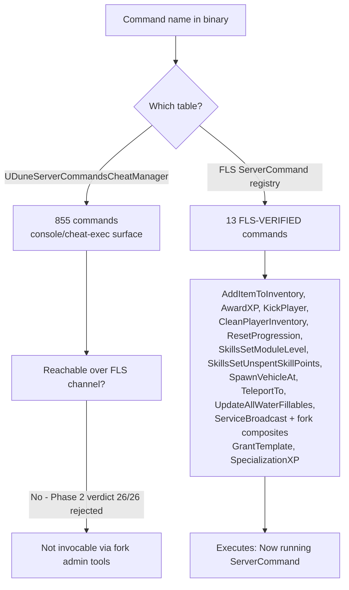

# Engine Command Catalog

Status: Phase 1 (binary string-table extraction, 2026-07-31), Phase 2 (FLS
allowlist verdict, 2026-08-04), Phase 3 (protocol map, 2026-08-04), Phase 4
(console-feature decisions, 2026-08-04). See issue #148. The "Catalog by
domain" section is generated by `docs/engine/generate-command-catalog.py`
(reproducible from the source extraction; see that file's docstring).

## What this is

A living catalog of the admin/console command surface of Funcom's closed-source
dedicated server (the `seabass-server` container image). Goal: know what the
engine natively supports instead of guessing. Direct motivation: find an
engine-native way to fill containers without a server restart
(INC-2026-07-31-001), and scope the fork's console admin features to what the
engine actually implements.

## Method and evidence (reproducible)

- Engine image: `registry.funcom.com/funcom/self-hosting/seabass-server:2051294-0-shipping`
  (Funcom's own published self-hosting image; the engine binary
  `DuneSandboxServer-Linux-Shipping`, 374 MB, is compiled into it).
- Extracted strings with `strings -t d -n 8` (GNU binutils) to
  /tmp/opencode/engine-strings-off.txt (966358 entries).
- Command names are literally compiled into the binary; e.g. verified at
  explicit byte offsets: `UpdateAllWaterFillables` @96410317, `AddItemToInventory`
  x9 occurrences, `AwardXP` x5, `TeleportTo` x36, `KickPlayer` x12.
- Sorted string tables (alphabetically contiguous runs) were identified
  programmatically; 117 runs found, of which 59 are Dune-specific command
  tables (the rest are UE engine/TIFF/ICU/PlayFab symbol tables).
- Command classes found in the binary's RTTI:
  - `UDuneServerCommandSubsystem` - the FLS (Funcom Live Services) ServerCommand
    channel handler (`DuneServerCommands/DuneServerCommandSubsystem.cpp`).
  - `UDuneServerCommandsCheatManager` - UE cheat/console exec surface
    (`DuneServerCommands/DuneServerCommandsCheatManager.cpp`).
  - Broadcast payload structs: FServerBroadcastPayload, FGenericBroadcastPayload,
    FLocalizedServerBroadcastPayload, FServerShutdownBroadcastPayload.
- FLS transport (observed live, read-only): Funcom's own RabbitMQ container
  (`seabass-server-rabbitmq`), exchange `heartbeats` (direct), routing key
  `notifications`, `app_id=fls_backend`, `user_id=fls`. The fork's scripts
  impersonate the FLS backend when publishing admin commands; the engine
  executes them and logs `Now running ServerCommand '<name>'` (Funcom's own
  logger in the server logs).

## Confidence levels

- **FLS-VERIFIED**: observed executing in the engine log on this server after
  being published over the FLS channel (and/or shipped in the fork's known-good
  `admin-tools.sh` set).
- **compiled-in**: string present in the engine binary as a command-name-shaped
  token in a sorted command table; NOT yet verified to execute over the FLS
  channel or console exec. The engine's cheat-manager surface may be gated
  (e.g. shipping builds may block some of these); verification is Phase 2.
- Internal/event-handler names (Get*/HandleOn*/On*/Client*/Multicast*/Server*)
  are almost certainly not directly invocable commands; they are listed for
  completeness but should be treated as noise unless a source path or adjacent
  table says otherwise.

## FLS-VERIFIED commands (this host, engine log)

Observed executing in the engine log on this server after being published over
the FLS channel (`Now running ServerCommand '<name>' ...`), and/or shipped in
the fork's known-good `admin-tools.sh` set:

- `AddItemToInventory`
- `AwardXP`
- `CleanPlayerInventory`
- `KickPlayer`
- `ResetProgression`
- `SkillsSetModuleLevel`
- `SkillsSetUnspentSkillPoints`
- `SpawnVehicleAt`
- `TeleportTo`
- `UpdateAllWaterFillables`
- `ServiceBroadcast` - published by the fork's restart-warning feature; engine
  literal verified in binary (`@94659509`), dispatch assumed identical to the
  other `fls_backend`-published commands.
- `GrantTemplate` - fork-specific composite; NO single engine literal (wraps
  AddItemToInventory, so engine-verified via that flow).
- `SpecializationXP` - fork-specific composite; targets the `specialization-xp`
  admin API (DB), not a single engine ServerCommand.

The first ten are compiled-in engine literals reachable over the FLS channel.
Only these (plus the two fork composites) dispatch on this fork. 7 of the 855
cheat-table names are themselves FLS-VERIFIED (`CleanPlayerInventory`,
`ResetProgression`, `SkillsSetModuleLevel`, `SkillsSetUnspentSkillPoints`,
`SpawnVehicleAt`, `TeleportTo`, `UpdateAllWaterFillables`); the other 848 sit
behind the `UDuneServerCommandsCheatManager` surface and are **not** reachable
over FLS (Phase 2 verdict, 26/26 probe rejections + positive `KickPlayer`
control).

## FLS protocol map (Phase 3, 2026-08-04)

This is the complete, observed transport contract for the FLS ServerCommand
channel on seabass-server 2051294-0-shipping, as used by the fork's
`runtime/scripts/admin-tools.sh` and independently confirmed live.

### Transport

- **Broker**: the game server's own RabbitMQ (`seabass-server-rabbitmq`,
  container `dune-rmq-game` on this host). Called by RabbitMQ's management
  plugin interchangeably via `rabbitmqctl eval` in the fork, or `rabbitmqadmin`
  by Funcom's backend.
- **Exchange**: `heartbeats` (direct exchange, virtual host `/`).
- **Routing key**: `notifications`.
- **Publishing identity**: `app_id=fls_backend`, `user_id=fls` — i.e. messages
  MUST present as Funcom's own Live Services backend.
- **No explicit send-side queue binding**: the exchange's only consumer is the
  game server process itself (the engine's FLS client subscribes to the
  `notifications` binding). The engine does not ack/reply on this exchange; all
  outcomes are observable only in the server log.

### Message shape (two hops)

Outer envelope, base64 of a compact JSON object:

```json
{"Version": 2, "AuthToken": "<command-auth-token>", "MessageContent": "<inner json string>"}
```

- `AuthToken` is the fork's `DUNE_COMMAND_AUTH_TOKEN` (builtin
  `runtime/scripts/command-auth-token.sh` value, `Nu6VmPWUMvdPMeB7qErr`), the
  same secret the game's `.env` configures for the FLS backend relationship.
- `MessageContent` is a *serialized JSON string* (not an object) — the engine
  deserializes it with its JSON reader.

Inner payload (what the engine logs as "parameters"):

```json
{"ServerCommand": "<name>", "<Param1>": "<v1>", ...}
```

All parameter values are strings even when the engine treats them numerically
(e.g. a teleport logs `"X":"187780.000000"`). The engine's FLS reader parses
each `"<Key>":"<value>"` pair; numeric keys are converted per handler. Unknown
commands produce `Warning: Deserialized message has unknown Server Command
'<name>'` and are silently dropped — no error reply, no crash, no state change.

### Verified command parameter contracts

From engine-log observations on this host plus the fork's builders
(`admin-tools.sh`); PlayerId is always required unless noted.

| Command | Parameters | Notes |
|---|---|---|
| `AddItemToInventory` | `PlayerId`, `ItemName`, `Quantity`, `Durability`, `Quality`, `Grade`, `ItemQuality` | Durability float (1.0 = full); Quality/Grade/ItemQuality redundant ints. Engine log confirms the optional extras are ignored. |
| `KickPlayer` | `PlayerId` | Nonexistent player dispatches but no-ops (no error logged). |
| `TeleportTo` | `PlayerId`, `X`, `Y`, `Z`, `Yaw` | All float strings. |
| `CleanPlayerInventory` | `PlayerId` | Destructive (wipes inventory). |
| `ResetProgression` | `PlayerId` | Destructive. |
| `SkillsSetUnspentSkillPoints` | `PlayerId`, `SkillPoints` | Int. |
| `SkillsSetModuleLevel` | `PlayerId`, `Module`, `Level` | Module = skill-module id string; Level int. |
| `SpawnVehicleAt` | `PlayerId`, `ClassName`, `TemplateName`, `X`, `Y`, `Z`, `Rotation`, `Persistent` | Engine log format string: `SpawnVehicleAt %s %f %f %f %f %s %f %s`. Requires specific player (not `*`). `Persistent=1.0` float. |
| `UpdateAllWaterFillables` | `PlayerId`, `WaterAmount` | WaterAmount int (e.g. 1000000). |
| `AwardXP` | `PlayerId`, `Amount`, `Category` | Category defaults to `Combat` in the fork's builder. [Implied by fork builder; param contract from `build_passthrough_json` + fork docs.] |
| `ServiceBroadcast` | `BroadcastType`, `BroadcastPayload` | `BroadcastType=Generic`; payload `{BroadcastDuration, LocalizedText:[{Key,Title,Body}]}`. Used by the fork's restart-warning feature. |
| `GrantTemplate` | `PlayerId`, `Template` | Fork-specific convenience wrapping AddItemToInventory (engine-verified via that flow). |
| `SpecializationXP` | `Tracks`, `Level`, `XpAmount` | Fork-specific: implemented by the fork against `specialization-xp` admin API (DB), not a single engine ServerCommand. |

For the two fork-specific entries (`GrantTemplate`, `SpecializationXP`), the
engine-side command is a composite built by the fork; the authoritative
implementations are `admin-tools.sh`'s `grant_item_command` / build flows.

### Publish mechanics (fork, reusable)

1. `build_passthrough_json` builds the inner JSON.
2. `build_outer_b64` wraps with `{Version:2, AuthToken, MessageContent}` and
   base64-encodes the whole outer object.
3. `publish_inner_json` runs `rabbitmqctl eval` inside the RMQ container that
   decodes the outer base64, looks up the `heartbeats` exchange, and publishes
   with the `fls_backend`/`fls` identity to routing `notifications`, printing
   `publish=ok` on success.
4. Guardrails: `require_rmq_game_running` (exchange must exist), require-online
   for `AwardXP|UpdateAllWaterFillables|SpawnVehicleAt`, dry-run support, and
   `redact_sensitive_output` for auth tokens in any echoed output.

Phase 2 probe harness `fls-probe.sh` (invoked identically) confirmed both hops
collect, and the positive `KickPlayer` control confirmed authoritative dispatch.

### Diagrams

#### FLS publish and message flow (live-observed)

```mermaid
sequenceDiagram
    autonumber
    participant S as fork scripts<br/>(admin-tools.sh / fls-probe.sh)
    participant R as rabbitmqctl eval inside<br/>dune-rmq-game (seabass-server-rabbitmq)
    participant E as rabbitmq exchange<br/>heartbeats / routing notifications
    participant G as engine FLS client<br/>(game server process)

    S->>R: build_passthrough_json + build_outer_b64 ({"Version":2,<br/>"AuthToken","MessageContent"})
    R->>E: publish app_id=fls_backend, user_id=fls,<br/>routing notifications, exchange heartbeats
    E->>G: deliver"notifications" message (sole consumer)
    alt known ServerCommand
        G->>G: "Now running ServerCommand '<name>' ..."<br/>(logged by Funcom's logger)
    else unknown ServerCommand
        G->>G: Warning: Deserialized message has unknown<br/>Server Command '<name>' (dropped, no reply)
    end
    Note over G: no ack/reply on this exchange;<br/>outcomes observable only in server log
```

#### Dispatch surfaces: which command names actually run



## Catalog by domain (855 compiled-in candidates + 6 FLS-registry/fork entries)

### inventory_items (50)
- `AddAllVehicleModules`
- `AddBasicInventoryToCharacter`
- `AddItemToInventory` **FLS-VERIFIED**
- `AddItemToVehicleInventory`
- `AddItemsToInventory`
- `AddModuleToVehicle`
- `AddRequiredItemsToAllInventoryGeneratorsInClosestBase`
- `AddRequiredItemsToAllInventoryGeneratorsInServer`
- `AddWeaponBrokenTemporaryEffect`
- `AddWeaponToInventory`
- `AuditPlayerInventories`
- `AugmentItem`
- `CleanPlayerInventory` **FLS-VERIFIED**
- `CraftingRecipesUnlearnAll`
- `DisplayInventoryCircuitsFromNearbyTotem`
- `FillEquippedCatchPockets`
- `GrantTemplate` **FLS-VERIFIED**
- `ItemsPrintAllDeteriorationStats`
- `ItemsSetDurabilityAll`
- `ItemsSetDurabilityBackpack`
- `ItemsSetDurabilityEquipment`
- `ItemsSetDurabilityGadget`
- `ItemsSetDurabilityRadialShortcut`
- `MigrateMyVehicles`
- `PrintClosestPlaceableInfo`
- `PrintClosestPlaceableInventoryPointers`
- `PrintListMigratedVehicles`
- `PrintListMyVehicles`
- `PrintListRecoveredVehicles`
- `PrintListVehicles`
- `PrintListVehiclesMeshes`
- `PrintVehicleModules`
- `RecreatePlayerClothingActor`
- `RemoveItemAmountFromBackpackByTemplateId`
- `RemoveModuleFromVehicle`
- `RepairAllItems`
- `RestoreRecoveredVehicle`
- `SetBackpackSize`
- `SetPlaceableWaterGenerationRate`
- `SetPlaceableWaterStored`
- `SetUpItemList`
- `SetVehicleCruiseModeEnabled`
- `SetVehicleCustomization`
- `SetVehicleFaction`
- `SetVehicleFuelPercentage`
- `SetVehicleModuleRelativeDurability`
- `SpawnVehicle`
- `SpawnVehicleAt` **FLS-VERIFIED**
- `UpdateAllFillables`
- `UpdateAllWaterFillables` **FLS-VERIFIED**

### teleport_travel (23)
- `GoToDimensionByTravel`
- `LocalTeleportTo`
- `ReturnToHomeDimension`
- `SummonPlayer`
- `TeleportActorTo`
- `TeleportFlyingCameraTo`
- `TeleportTo` **FLS-VERIFIED**
- `TeleportToExact`
- `TeleportToFindSpot`
- `TeleportToLocation`
- `TeleportToMap`
- `TeleportToNearestNpc`
- `TeleportToPlayer`
- `TeleportToSandworm`
- `TeleportToVehicleSpawner`
- `TheresNoPlaceLikeHome`
- `TravelTo`
- `TravelToByDestination`
- `TravelToDimension`
- `TravelToDimensionByDestination`
- `Unstuck`
- `UnstuckDebugStart`
- `UnstuckDebugStop`

### player_state (25)
- `AddPlayerFlags`
- `AgePercentage`
- `DamageMe`
- `DealFatalDamage`
- `KickPlayer` **FLS-VERIFIED**
- `KillAllPlayers`
- `KillCharacter`
- `SetBodyType`
- `SetCharacterBlockMovement`
- `SetCharacterFloatStat`
- `SetCharacterRotationMode`
- `SetCharacterTemplate`
- `SetColdLevel`
- `SetColdProtectionValue`
- `SetDehydrationPenalty`
- `SetEyesOfIbad`
- `SetGodMode`
- `SetHasSpeedHax`
- `SetHydration`
- `SetPlayerHealth`
- `SetPlayerSkipSaving`
- `SetPlayerVisibility`
- `SetStaminaConsumption`
- `SetWalkKeyboardInputIntensity`
- `Suicide`

### loot (16)
- `GlobalDistributionPrintLootSettingsForCurrentLocation`
- `GlobalDistributionPrintTagsForCurrentLocation`
- `LootDestroyAllTreasure`
- `LootPrintLootInfo`
- `LootPrintTreasureCount`
- `LootResetTemporaryLootContainerLifetimeAfterInteraction`
- `LootResetTemporaryLootContainersRespawnTime`
- `LootSetTemporaryLootContainerLifetimeAfterInteraction`
- `LootSetTemporaryLootContainersRespawnTime`
- `LootSpawnTreasure`
- `RespawnPvEContentDescriptorLoot`
- `SetShipwrecksRevealStateInRange`
- `SetShouldNpcDropLootOnDeath`
- `SetShouldPlayersDropLootOnDeath`
- `SetShouldPlayersDropLootOnDefeat`
- `SetShouldPlayersLoseItemsOnDeath`

### npc_encounters (38)
- `ActivateNPCSpawning`
- `ClearNpcEntityLod`
- `DestroyAllNpcs`
- `DestroySingleNpc`
- `EncountersActivateNearest`
- `EncountersDestroy`
- `EncountersDestroyNearest`
- `EncountersGetStatus`
- `EncountersList`
- `EncountersPrintNearestResetTimeLeft`
- `EncountersPrintStats`
- `EncountersResetNearest`
- `EncountersSetMaxInstancesNumber`
- `EncountersSetNearestResetTimeLeft`
- `EncountersSpawn`
- `FindNPCsByHash`
- `ForceNpcEntityLod`
- `KillAllNpcs`
- `MoveToNPCWithEntityId`
- `NpcOverrideStat`
- `OverrideDungeonPlayerCount`
- `PatrolShipListSpawned`
- `PatrolShipPrintEnabled`
- `PatrolShipResetDetectionOnNearest`
- `PatrolShipSetEnabled`
- `PatrolShipSetMovementSpeedMultiplierOnNearest`
- `PatrolShipTeleportToNearest`
- `PatrolShipToggleSplineOfNearest`
- `PrintNarrowSightNPCs`
- `PrintNpcSpawnInfo`
- `PrintNumNpcs`
- `RespawnNPCs`
- `SetBossVulnerable`
- `ShowNPCDebugPanel`
- `ShowNpcControlPanel`
- `SpawnAi`
- `SpawnNPCWaveByName`
- `SpawnShipInFrontOfPlayer`

### coriolis (13)
- `CoriolisAutoSpawnCheckBoxChanged`
- `CoriolisDeath`
- `CoriolisPrintSeed`
- `CoriolisPrintStoredSeeds`
- `CoriolisRestartServer`
- `CoriolisSetFarmSeed`
- `CoriolisSetMapSeed`
- `CoriolisSetPartitionSeed`
- `SpawnCoriolis`
- `SpawnCoriolisEnd`
- `SpawnCoriolisSpinBoxCommitted`
- `SpawnCoriolisStage2`
- `SpawnCoriolisStage3`

### landsraad_faction (23)
- `DebugLandsraadActivateDecreeForFaction`
- `DebugLandsraadCastVote`
- `DebugLandsraadCompleteSysselraad`
- `DebugLandsraadDeactivateDecreeForFaction`
- `DebugLandsraadForceUpdateFromDatabase`
- `DebugLandsraadInsertRandomTaskProgress`
- `DebugLandsraadInsertTaskProgress`
- `DebugLandsraadInsertTaskProgressForFaction`
- `DebugLandsraadPrintGuildVote`
- `DebugLandsraadPrintHouseRewards`
- `DebugLandsraadRedeemHouseReward`
- `DebugLandsraadUpdateAllTasksRevealState`
- `DebugLandsraadUpdateTaskRevealState`
- `DebugLandsraadValidateBoard`
- `FactionAddReputationAmount`
- `FactionPrintAlignment`
- `FactionPrintLogs`
- `FactionPromoteToTier`
- `FactionResetFactionAlignment`
- `FactionSetPlayerAlignment`
- `FactionSetReputationAmount`
- `PayAllTaxesForNearbyTotem`
- `SpawnLandsraadControlPoint`

### sandworm_storm_spice (71)
- `ApplySpiceAddictionStatusChange`
- `DestroyAllSandStorms`
- `DestroyAllSandStormsOnThisMapAndDimension`
- `DestroySandStorm`
- `DisableShiftingSandsPhysics`
- `DisableShiftingSandsStormInteractions`
- `GiantWormEatMe`
- `GiantWormForceSpawnSequence`
- `GiantWormResetCooldown`
- `HaltAllSandStorms`
- `RemoveSpiceVision`
- `SandBuildupPrint`
- `SandBuildupSetEnabled`
- `SandBuildupSetOnAllObjects`
- `SandStormAutoSpawnNow`
- `SandStormAutoSpawnNowOnThisMapAndDimension`
- `SandStormSetOpacity`
- `SandwormActivateAttackAnimation`
- `SandwormActivateBreachAnimation`
- `SandwormActivateIdleAnimation`
- `SandwormActivateVerticalAttackAnimation`
- `SandwormCheckInsideSafezone`
- `SandwormClearTarget`
- `SandwormClearTargetAndThreatScore`
- `SandwormClientRegenerateSafezones`
- `SandwormDeactivateLoopingAnimation`
- `SandwormDeleteAllThreatBlobs`
- `SandwormEnableDebugWidget`
- `SandwormEnableDrawingThreatBlobs`
- `SandwormPrintLocations`
- `SandwormPrintSafeZoneStats`
- `SandwormPrintTerritories`
- `SandwormPrintThreatBlobs`
- `SandwormServerRegenerateSafezones`
- `SandwormSetCanBeTargeted`
- `SandwormSetIsDebugElevationActive`
- `SandwormSetMyThreatGeneration`
- `SandwormSetMyThreatScore`
- `SandwormSetSpawnProtection`
- `SandwormTargetMe`
- `SandwormTargetPlayer`
- `SetAuroraProbability`
- `SetIsActivatingSpicePrescience`
- `SpawnSandStorm`
- `SpawnSandStormAngle`
- `SpawnSandStormPath`
- `SpiceAddictionConsumeSpice`
- `SpiceAddictionDecreaseSpiceAmount`
- `SpiceAddictionResetSpiceAddiction`
- `SpiceAddictionSetAddictionLevel`
- `SpiceAddictionSetConsumedSpice`
- `SpiceAddictionSetEnabledOnPlayer`
- `SpiceAddictionSetIsPlayerAddicted`
- `SpiceAddictionSetSpiceExposure`
- `SpiceAddictionSetSpiceTolerance`
- `SpiceFieldForceSpawnNearestField`
- `SpiceFieldPrimeNearestField`
- `SpiceFieldPrimeRandomField`
- `SpiceFieldPrintGlobalAvailability`
- `SpiceFieldPrintGlobalInformation`
- `SpiceFieldPrintNearestFieldInfo`
- `SpiceFieldReplenishNearestField`
- `SpiceFieldSetAgeForNearestField`
- `SpiceFieldSetFieldSpawnRate`
- `SpiceFieldSetSpawningEnabled`
- `SpiceFieldShowNearestFieldContents`
- `SpiceFieldTeleportToNearestField`
- `SpiceFieldUpdateGlobalRules`
- `SpiceVisionSetEnabledOnPlayer`
- `TriggerSpiceDream`
- `TriggerSpiceVision`

### print_info (67)
- `PrintAccessCodes`
- `PrintActiveGASEffects`
- `PrintAiBudgetingStats`
- `PrintAllCharacterFloatStats`
- `PrintAllGameplayAbilities`
- `PrintAllGameplayCues`
- `PrintAllNavGrids`
- `PrintAllOtherServersTravelDestinations`
- `PrintAllSpawnedProjectiles`
- `PrintAllTerrainBlocks`
- `PrintAllThisServerTravelDestinations`
- `PrintAllVehicleSpawner`
- `PrintBuildableListOnClient`
- `PrintBuildableListOnServer`
- `PrintCharacterData`
- `PrintCharacterFloatStat`
- `PrintCharacterGameplayTags`
- `PrintCharacterHomeworld`
- `PrintCharacterRotationInfo`
- `PrintCharacterState`
- `PrintCharacterSubstates`
- `PrintClientBuildingSystemStats`
- `PrintClosestTotemBuildables`
- `PrintClosestTotemInfo`
- `PrintCooldownStats`
- `PrintCurrentCameraValues`
- `PrintDamageImmunityState`
- `PrintDamageImmunityStateAllCharacters`
- `PrintDamageMitigationAttributes`
- `PrintEQSInfo`
- `PrintEnergyAttributes`
- `PrintEntityLods`
- `PrintEquippedAbilities`
- `PrintFOV`
- `PrintFarmDownTime`
- `PrintFarmStartTime`
- `PrintHUDUnlockLevel`
- `PrintHealthStats`
- `PrintHydrationStats`
- `PrintImmediatePhysicsStats`
- `PrintListPlayers`
- `PrintListPlayersInFarm`
- `PrintListVehicleProxies`
- `PrintLocalVehicleNetworkThresholds`
- `PrintLoreObjectsOnServer`
- `PrintMapSettings`
- `PrintMovementMode`
- `PrintNavGridInfo`
- `PrintNearestActiveVehicle`
- `PrintNearestVehicleLocation`
- `PrintNetStatus`
- `PrintNpcRespawnTimerHere`
- `PrintNumPlayers`
- `PrintNumPlayersInFarm`
- `PrintNumVehicles`
- `PrintOwnedIntelligencePoints`
- `PrintPlayerCap`
- `PrintPos`
- `PrintResourceLocationSystemInfo`
- `PrintSpecializationProgression`
- `PrintStaggerAttributes`
- `PrintSummarizedPos`
- `PrintSunExposureInfo`
- `PrintTimeOfDayInfo`
- `PrintUniverseTime`
- `PrintVehicleAbilities`
- `PrintXP`

### cheat_debug (26)
- `ApplyCheat`
- `CheatList`
- `CheckIgwArtificialBorder`
- `CraftingCostCheat`
- `CrashClient`
- `DemiGod`
- `EnableIGWDebug`
- `InfiniteDurability`
- `IsPlayerCheatEnabled`
- `NoFunAllowed`
- `ServerCheat`
- `SetBenchmarkName`
- `SetBypassBuildingPermissions`
- `SetDamageVisualizationEnabled`
- `SetIgnoreFactionRequirements`
- `SetNoBuildingCostsCheat`
- `TestIgwObjectFollowCurrentPlayer`
- `TestIgwObjectFollowRemotePlayer`
- `TestIgwObjectStopFollowingCurrentPlayer`
- `ToggleIGWDebug`
- `ToggleIncomingDamageNumbers`
- `ToggleSpeedHax`
- `TriggerHeapOutOfBoundsAccess`
- `TriggerHeapUseAfterFree`
- `WeaponInfiniteAmmo`
- `WeaponInfiniteAmmoReload`

### skills_progression (32)
- `AddAllAvailableSchematics`
- `AddXPToSpecializationTrack`
- `AwardXP` **FLS-VERIFIED**
- `BuyTechKnowledge`
- `LearnAllTechTreeItems`
- `LearnTechTreeItem`
- `OverrideIntelSpent`
- `PauseProgression`
- `PurchaseSpecializationKeystone`
- `ResetProgression` **FLS-VERIFIED**
- `ResetSpecializationKeystones`
- `ResetSpecializationTracks`
- `ResetUnstuckTimer`
- `SetSpecializationRefundId`
- `SetSpecializationTrackProgression`
- `SkillsPrintGeneralInfo`
- `SkillsPrintPerks`
- `SkillsResetRespecTimer`
- `SkillsRespec`
- `SkillsSetModuleLevel` **FLS-VERIFIED**
- `SkillsSetStartingData`
- `SkillsSetUnspentSkillPoints` **FLS-VERIFIED**
- `SkillsToggleCheatProgression`
- `SkillsUnlockAll`
- `SkillsUnlockAllPhase`
- `SpecializationXP` **FLS-VERIFIED**
- `SurveyingSetSkipProbeSequence`
- `UnblockTechKnowledge`
- `UnlearnAllTechTreeItems`
- `UnlearnTechTreeItem`
- `XPAmount`
- `XPSource`

### combat_abilities (28)
- `BeginDash`
- `BeginMeleeAttack`
- `CombatReady`
- `DebugOverrideDamage`
- `DisableRagdollFromImpact`
- `EndMeleeAttack`
- `EquipAbilityAtSlot`
- `EquipFavoriteWeapon`
- `HandleVFXOnShieldActivationToggled`
- `InfiniteAmmoCheckBoxChanged`
- `PlayerKnockDown`
- `PruneInvalidMeleeHits`
- `ReInitializeCombatAnimBP`
- `RemoveAllCooldownsNaive`
- `ReviveFromDownedStateByAbility`
- `SetCurrentMeleeActionMontage`
- `SetDashFXActive`
- `SetGASAttribute`
- `SetHyperArmor`
- `SetMoveIgnoreMaskFlags`
- `SetSelfCooldownsCostCharges`
- `SetServerWantsWeaponInHand`
- `ShieldCooldownEnded`
- `StopShootingLayerAnimMontage`
- `ToggleHyperArmor`
- `TriggerAttackPlayer`
- `TriggerReadyPose`
- `TryReviveFromDownedDirectly`

### survival_stats (12)
- `ActivateDamageImmunity`
- `ActivateDamageImmunityWithDamageTypeClasses`
- `ApplyStatusEffect`
- `ColdSurvivalEnabledChanged`
- `DeactivateDamageImmunity`
- `EnableColdSurvival`
- `EnableDehydration`
- `EnableDehydrationCheckBoxChanged`
- `SetHasFrostbite`
- `SetHasWarming`
- `SlowDamageApplication`
- `StatusFlag`

### building_totem_landclaim (21)
- `BuildingBlockoutVisualsToggle`
- `BuildingStabilizationUpdateTimeLeft`
- `DirtyAllBuildableShelterComponents`
- `DirtyTargetBuildableShelterComponent`
- `ExtendLandclaim`
- `ExtendLandclaimVertically`
- `ForceRefreshClosestTotemResourceCache`
- `ForceRefreshTotemResourceCache`
- `OverrideBuildableShelterThreshold`
- `SetBuildAndFillOverrideTimerInSeconds`
- `SetBuildableHealth`
- `SetBuildableHealthPercentage`
- `SetBuildingRestrictionLimitsEnabled`
- `SetShowBuildingTestSetsCheat`
- `SetTargetBuildableSandBuildUp`
- `SetTargetWholeBuildingSandBuildUp`
- `ShowObjectShelter`
- `ShowPossessedCharacterShelter`
- `ShowPossessedCharacterVehicleProtection`
- `SpawnBuildingBlueprint`
- `ValidateClosestTotemResourceCache`

### circuits_power_placeables (12)
- `AddNearbyPlaceableToInventoryCircuit`
- `AddNearbyPlaceableToPowerCircuit`
- `AddNearbyPlaceableToWaterCircuit`
- `DisplayPowerCircuitsFromNearbyTotem`
- `DisplayWaterCircuitsFromNearbyTotem`
- `RemoveNearbyPlaceableFromInventoryCircuit`
- `RemoveNearbyPlaceableFromPowerCircuit`
- `RemoveNearbyPlaceableFromWaterCircuit`
- `SetCurrentPowerToMaxPower`
- `SetNearbyPlaceablePowerActive`
- `SetPowerConsumption`
- `ShortCircuitAllTotems`

### vehicles_transport (17)
- `AttachHarnessedVehicle`
- `DestroyTargetVehicle`
- `DetachHarnessedVehicle`
- `ForceDespawnAtVehicleSpawner`
- `ForceSpawnAtVehicleSpawner`
- `SetCurrentOrnithopterMaxSpeed`
- `SetCurrentVehicleDisabled`
- `SetCurrentVehicleMaxPositionBadErrorToleranceSquared`
- `SetCurrentVehicleMaxPositionErrorToleranceSquared`
- `SetCurrentVehicleMaxRotationBadErrorTolerance`
- `SetCurrentVehicleMaxRotationErrorTolerance`
- `SetFuelBurningMultiplier`
- `SetFuelsBurningDuration`
- `SetVehicleClientResetCooldown`
- `SetVehicleClientResetEnabled`
- `SetVehicleSkipSaving`
- `VehicleOverrideInputAxisValues`

### world_environment_time (11)
- `BiomeConfigurationAtCurrentLocation`
- `BiomeConfigurationAtLocation`
- `DefaultWindDirectionCommitted`
- `EnableTimeOfDay`
- `SetAutoSandstormSpawnEnabled`
- `SetTimeOfDay`
- `SetTimeOfDayRegionBiomeWithName`
- `SetTimeOfDaySpeed`
- `SkyBiomeConsoleInfo`
- `SkySetSunRotation`
- `WindAtCurrentLocation`

### persistence_world_state (19)
- `CheckForGameTweaksUpdate`
- `DirtyStreamLevels`
- `FlagToRemove`
- `FlushActorPersistence`
- `LoadTerrainBlock`
- `OverrideGameTweak`
- `RemoveAllGameTweakOverrides`
- `RemoveGameTweakOverride`
- `RestartFarm`
- `SetIsTravelingFlagForced`
- `SetPOIPentashieldResetCodeVolumesVisibility`
- `SetPersistentName`
- `SetPersistentVoiceSetName`
- `SetResourceLocationSystemEnabled`
- `SetTargetSkipSaving`
- `SleepServer`
- `StopFarm`
- `UnloadTerrainBlock`
- `UpdateRotationMode`

### comms_channels (12)
- `AddClickableMessage`
- `AddCommChannel`
- `AddTestMapMarkerMessage`
- `ComMessage`
- `ComMessageGlobal`
- `ListActiveListenActions`
- `ListCommChannel`
- `RemoveCommChannel`
- `ServiceBroadcast` **FLS-VERIFIED**
- `SetCommuninetActiveState`
- `SetCommuninetRadioStation`
- `SetCommuninetRadioTestTime`

### mtx_shop_economy (11)
- `AddSolarisToAccount`
- `AddVirtualWalletBalance`
- `EndActiveMTXEvents`
- `EndAllMTXEvents`
- `EndMTXEventById`
- `EndPendingMTXEvents`
- `ListMTXEvents`
- `ResetVendorStockData`
- `ScheduleMTXEvent`
- `ScheduleMTXEventJson`
- `SetAccountAsTakeoverable`

### audio_sound_debug (8)
- `AudioEventName`
- `AudioFglSnapshotTest`
- `DisableDebugForAllAudio`
- `EnableDebugForAllAudio`
- `SetAudioMasteringMode`
- `SetSubtitlesEnabled`
- `ToggleDebugForAudio`
- `VoiceSetName`

### gamepad_ui_feedback (36)
- `AddGamePadColorConstant`
- `AddGamePadColorCurveColor`
- `AddGamePadColorCurveFloat`
- `ClearGamePadColor`
- `CloseLoadingScreen`
- `EISShowHideContextDebug`
- `EISToggleContext`
- `HideSequenceDebugInfo`
- `HideSubtitleDebugInfo`
- `ListGamePadColors`
- `MarketingClearHUDModes`
- `MarketingToggleHUDMode`
- `OpenLoadingScreen`
- `OpenUIScene`
- `RemoveGamePadColor`
- `SetAnimMode`
- `SetGamePadColorActive`
- `SetHUDUnlockLevel`
- `ShowBuildingStats`
- `ShowCharacterCreationScreen`
- `ShowCinematicCameraPanel`
- `ShowLandclaimCodeStats`
- `ShowSequenceDebugInfo`
- `ShowServerShelterLineTraceFrameBudget`
- `ShowSubtitleDebugInfo`
- `ToggleAdminPanel`
- `ToggleAlignmentDebugUI`
- `ToggleAllHUDVisibility`
- `ToggleAnimWeaponDebugUI`
- `ToggleCharacterMovementTypeDebugUI`
- `ToggleCharacterStateDebugUI`
- `ToggleMousePositionDebug`
- `ToggleShowLoadingScreen`
- `ToggleUIVisibility`
- `ToggleVehicleHUDOnly`
- `UIRadialWheelPrintInputSensitivityOverrides`

### camera_debug (13)
- `AddPostProcess`
- `CameraOverrideDisable`
- `CameraOverrideEnable`
- `CameraOverrideEnableUsingCurrentCamValues`
- `CameraSequence`
- `DisableCinematicCameraMode`
- `RemovePostProcess`
- `SimpleCameraSetSpringArmLength`
- `SimpleCameraSnapLocation`
- `SimpleCameraToggle`
- `SimpleCameraToggleAutoSnapLocation`
- `SimpleCameraToggleDetach`
- `UseFlyingCamera`

### debug_world_visualization (11)
- `DrawPlayerBounds`
- `DrawServerCollisionClient`
- `EnableAICombatVolumes`
- `SetAIDebuggerDebugTarget`
- `SetNavMeshDebugViewEnabled`
- `ShowAICombatVolumes`
- `ShowAttractorPoints`
- `ShowCoverPoints`
- `ToggleOverheadDebugInfoAndDamageNumbers`
- `ToggleSandStormDebug`
- `ToggleVisualPicker`

### character_customization (13)
- `AddCharacterGameplayTag`
- `AddCharacterLooseGameplayTag`
- `AddCharacterUnlockedCustomization`
- `AddCharacterUnlockedCustomizationAll`
- `MutableApplyParamAllAI`
- `MutableGetAvailableOptions`
- `MutableGetCurrentAllValues`
- `MutablePrintNpcStats`
- `RemoveCharacterGameplayTag`
- `RemoveCharacterLooseGameplayTag`
- `RemoveCharacterUnlockedCustomization`
- `RemoveCharacterUnlockedCustomizationAll`
- `SetWeaponCustomization`

### character_npe_lifecycle (34)
- `AddCachedPlayerRewardsTag`
- `AddCachedPlayerRewardsTags`
- `ApplyCheckpoints`
- `CheatCurrentDungeonCompletion`
- `ClearFlsCharacterData`
- `CompleteCurrentDungeon`
- `DeleteAllCompletionsForAllDungeonsByThisPlayer`
- `DeleteAllCompletionsForCurrentDungeon`
- `DeleteAllCompletionsForCurrentDungeonByThisPlayer`
- `DeleteCharacter`
- `DeleteCharacterDisconnect`
- `DeleteCharacterReconnect`
- `DeleteCharacterSkipNpeAndDisconnect`
- `DeleteCharacterSkipNpeAndReconnect`
- `DeleteCharacterSkipPbeAndDisconnect`
- `DeleteCharacterSkipPbeAndReconnect`
- `DeleteCharacterSkipPbeAndSkipNpeAndDisconnect`
- `DeleteCharacterSkipPbeAndSkipNpeAndReconnect`
- `EnforceNakedStart`
- `FlsGetPlayerCompletedNpeValue`
- `FlsSetPlayerCompletedNpe`
- `LoadCharacterCreationMap`
- `LoadCheckpoint`
- `NPESetCheckpointId`
- `NPESkipToArrakis`
- `RemoveCachedPlayerInfo`
- `RemoveCachedPlayerRewardsTag`
- `RemoveCachedPlayerRewardsTags`
- `ResetCurrentDungeon`
- `ResetCurrentDungeonRoom`
- `ResetStoryProgress`
- `SandstormTreasureTutorial`
- `SetHasDisplayedDemoIntroTutorial`
- `SetNPEProgressCompletion`

### tutorial_dialogue (9)
- `DialogueActor`
- `DialogueDebugFlag`
- `ResetDialogueState`
- `SkipCutscene`
- `TutorialCompleteByName`
- `TutorialDismissCurrentNotification`
- `TutorialEnqueueNotification`
- `TutorialRevealByName`
- `TutorialsResetAll`

### social_party (4)
- `PartyInvitePlayer`
- `PartyLeave`
- `PartyRemovePlayer`
- `RequestFakeGroupTravel`

### achievements (5)
- `AchievementTestCompleteAchievement`
- `AchievementTestPrintAllAchievements`
- `AchievementTestProgressFloatAchievement`
- `AchievementTestProgressIntAchievement`
- `AchievementTestResetAllAchievements`

### conditions_system (9)
- `ConditionsLogRegisteredConditions`
- `ConditionsLogRegisteredConditionsForCurrentPlayer`
- `ConditionsLogRegisteredConditionsForEvent`
- `ConditionsLogRegisteredConditionsForEventAndCurrentPlayer`
- `ConditionsLogRegisteredConditionsForEventAndPlayerId`
- `ConditionsLogRegisteredConditionsForPlayerId`
- `ConditionsLogRegistrationKeys`
- `ConditionsLogSummary`
- `ConditionsTestEvent`

### zones_world_events (2)
- `SecurityZoneSetEnabled`
- `SecurityZoneSpawn`

### database_netprobe (3)
- `RaiseDatabaseException`
- `TestDatabaseTransaction`
- `TestDatabaseTransactionDataChange`

### account_fls (7)
- `DisableNamedEvents`
- `DisplayFlsBattlegroupsServerBrowserInfo`
- `EnableNamedEvents`
- `ForceEnterGame`
- `LogInAs`
- `PlayNow`
- `SpamEventLogCharacterDeath`

### engine_internal_rpc (180)
- `BeginAsyncLoadAB`
- `BotsPrintList`
- `BotsPrintNum`
- `CanClimb`
- `CanPerformMeleeAttack`
- `CanSuspend`
- `ClientClearKnockbackTags`
- `ClientLogXPGained`
- `ClientOfflineDeathByCoriolis`
- `ClientOnContractCustomRewardsReceived`
- `ClientOnContractRewardItemsDistributed`
- `ClientOnContractsDistributed`
- `ClientOnCustomizationAdded`
- `ClientOnItemPickUp`
- `ClientOnPartialVehicleRefuelFinished`
- `ClientOnProgressionModuleLevelUp`
- `ClientOnTreasureTutorial`
- `ClientPostAudioEvent`
- `ClientPostAudioEventWithSource`
- `ClientPromptSetDefaultRespawnLocation`
- `ClientSendRiposteEventToActor`
- `DebugActionSystem`
- `DebugOverrideCMCSlideVectorFactor`
- `DebugOverrideCharacterStatComboBoxChanged`
- `EnsureTest`
- `FindCameraModifierById`
- `FindRemoveSpawnedMineFromClass`
- `FindSpawnedMineFromClass`
- `GetBaseLocomotionAnimInstance`
- `GetBoneLocation`
- `GetCachedCharacterTemplateRow`
- `GetCachedMeleeDataWithOutputParam`
- `GetCharacterCustomizableSkeletalMesh`
- `GetClimbingAnimInstance`
- `GetContractsCheatManager`
- `GetCurrentHealthRate`
- `GetCurrentKeyNPC`
- `GetCurrentMeleeActionMontage`
- `GetCurrentSandworm`
- `GetCurrentSeat`
- `GetCurrentStaminaRate`
- `GetDownedHealth`
- `GetDunePoiseAttributeSet`
- `GetDuneShieldAttributeSet`
- `GetEquippedFrameAnimWeaponType`
- `GetEquippedWeaponFrameType`
- `GetGASAttributeValue`
- `GetGASAttributeValues`
- `GetGender`
- `GetHalfShieldMeshComponent`
- `GetHealth`
- `GetIntelligencePoints`
- `GetIsInRagdollFromImpact`
- `GetIsNPC`
- `GetIsSheltered`
- `GetLastCoriolisTime`
- `GetLowEnergyThreshold`
- `GetLowShieldThreshold`
- `GetMainAnimInstance`
- `GetMaxGracePeriod`
- `GetMeleeActionMontageMetaData`
- `GetMeleeAttackTarget`
- `GetMeleeBlockCostFromWeaponCache`
- `GetMeleeWeaponSocketNameEnd`
- `GetMeleeWeaponSocketNameStart`
- `GetNumberOfItemsInAbilityInventory`
- `GetNumberOfItemsInBackpackInventory`
- `GetPlayerTeamId`
- `GetPosString`
- `GetPowerPackId`
- `GetRespecSpiceCost`
- `GetSandwormThreatSourceComponent`
- `GetShieldDepletionFactorBonus`
- `GetSpiceAddictionSystemStatus`
- `GetStoredBackupVehicleId`
- `GetTargetData`
- `GetTechKnowledgeComponent`
- `GetThirdPersonCamera`
- `GetTimeOfDay`
- `GetVeryLowHealthThreshold`
- `HandleOnBurrowDartDamage`
- `HandleOnBurrowDartStartPenetration`
- `HandleOnBurrowDartStopPenetration`
- `HandleOnMeleeActionAbilityEnded`
- `HandleOnShieldMeleed`
- `HandleOnShieldRechargingToggled`
- `HandleOnStartPenetration`
- `HandleOnStopPenetration`
- `HasAvailableMeleeWeapon`
- `HasHyperArmor`
- `HasIntactMeleeWeaponEquipped`
- `HasMoveIgnoreMaskFlags`
- `HasMovementCollisionFilterMaskFlags`
- `HasPassiveReductionSuspensorEquipped`
- `HasShield`
- `IgnoreMe`
- `IsCorpseCatchpocketsDrained`
- `IsDashing`
- `IsInDownedState`
- `IsInPvPZone`
- `IsInSandStorm`
- `IsInStormWall`
- `IsInSuspensorField`
- `IsOutOfStamina`
- `IsShelteredFromSandStorm`
- `IsStrafing`
- `LinkAnimInstance`
- `MulticastDBNOSurrender`
- `MulticastDisableVisualsAndCollision`
- `MulticastIgnoreActorWhenMoving`
- `MulticastMontageJumpToSection`
- `MulticastOnItemsPickedUp`
- `MulticastOnShieldActivateFail`
- `MulticastPlaySpawnBeaconPlacement`
- `MulticastReviveOtherCompleted`
- `MulticastReviveOtherStarted`
- `MulticastSfxAbilityStopInternal`
- `MulticastStopAnimMontage`
- `NotifyShieldPenetrationEndedOnTarget`
- `NotifyShieldPenetrationStartedOnTarget`
- `OnCameraOwnerIntersect`
- `OnGameplayEffectApplied`
- `OnHapticsGameplayEffectUpdate`
- `OnImpact`
- `OnNewAccountUserIdTextBoxCommitted`
- `OnPostLoadMap`
- `OnRadialShortcutDeleted`
- `OnSecurityZoneChanged`
- `OnSpiceAddictionStatusChanged`
- `OnTreasureSpawned`
- `OnUntargetedBySandworm`
- `OverrideNumBeams`
- `PerformMeleeHitTest`
- `PredictBlockMeleeAttack`
- `ReceiveDamageDealtOnServer`
- `ReceiveMulticastKill`
- `ReceiveReviveFromDownedStateUnreliable`
- `RespondToCharacterStateChange`
- `RespondToCharacterSubstateChange`
- `ServerActivateShield`
- `ServerAttemptEquipAbility`
- `ServerAttemptLevelUpSkillModule`
- `ServerAttemptUnequipAbility`
- `ServerAttemptUnequipAndEquipIfSucceeds`
- `ServerEndMeleeAttack`
- `ServerExecuteParry`
- `ServerInterruptReviveSelf`
- `ServerNotifyAttackersMeleeHasEnded`
- `ServerNotifyAttackersMeleeHasStarted`
- `ServerOnMenuOpened`
- `ServerPredictMeleeHits`
- `ServerRechargeShield`
- `ServerSetCharacterAppearance`
- `ServerSetCharacterRotationMode`
- `ServerSetDashDirection`
- `ServerSetMostRecentlyViewedSkillTree`
- `ServerSetProgressionPerkActive`
- `ServerSetSoftLockTarget`
- `ServerSkillsSawRespecInformation`
- `ServerStopPetting`
- `ServerStopSprinting`
- `ServerSuicideRespawn`
- `ServerSurrenderToDesert`
- `ServerToggleSprint`
- `SfxAbilityPlayLocalTransient`
- `SfxAbilityStopLocal`
- `SfxAbilityStopMulticast`
- `SfxBurrowDartDodged`
- `SfxBurrowDartPenetrated`
- `SfxBurrowDartPenetratingLoop`
- `SfxBurrowDartPenetratingLoopStop`
- `SfxPowerPackFail`
- `SfxSlidingStart`
- `SfxSlidingStop`
- `SfxSlowbladeDodged`
- `SfxSlowbladePenetrate`
- `SfxSlowbladePenetratingLoopStop`
- `TriggerUseVolatilePointer`
- `TryMeleeSoftLockSetTarget`
- `TryResumeReload`


## Phase 2 result (2026-08-04): FLS channel is a narrow allowlist

Live probes over the real FLS channel (exchange `heartbeats`, routing
`notifications`, `app_id=fls_backend`, builtin command-auth token) confirmed
the engine dispatches **only** the commands Funcom's cloud FLS backend actually
sends (the fork's 13 FLS-VERIFIED commands). 26 probed candidates, including
all of the below, were rejected with
`Warning: Deserialized message has unknown Server Command '<name>'` (no-op,
no state change, no log spam beyond the single warning):

- Print/introspection (13): `PrintFarmStartTime`, `PrintListRecoveredVehicles`,
  `ListCommChannel`, `LootPrintLootInfo`, `CoriolisPrintSeed`,
  `FactionPrintAlignment`, `BotsPrintList`, `EncountersPrintStats`,
  `SandwormPrintLocations`, `PrintListPlayers`, `PrintPlayerCap`,
  `SessionMonitor_PlayersAsJson`, `ClaimSystemPrintCharacterPacks_Server`.
- Print/introspection (10): `PrintAccessCodes`, `PrintAllCharacterFloatStats`,
  `GlobalDistributionPrintLootSettingsForCurrentLocation`,
  `GlobalDistributionPrintTagsForCurrentLocation`, `CoriolisPrintStoredSeeds`,
  `ItemsPrintAllDeteriorationStats`, `DebugLandsraadPrintGuildVote`,
  `LootPrintTreasureCount`, `PatrolShipListSpawned`, `GetLastCoriolisTime`.
- State-changing fill candidates (3, operator-approved): `UpdateAllFillables`,
  `AddItemToVehicleInventory`, `SetPlaceableWaterStored`.

Positive control: `KickPlayer` with a nonexistent PlayerId dispatched normally
(`Now running ServerCommand 'KickPlayer' ...`), proving the probe format is
valid and the rejections are real dispatch gates, not a malformed payload.

**Conclusion: no engine-native FLS command exists for filling storage
containers.** Only `UpdateAllWaterFillables` (officially self-host-able) works
over FLS. The 855-command table is the `UDuneServerCommandsCheatManager`
console/debug surface (`CHEAT-EXEC`, ServerExecRPC-gated and shipping-gated);
it is not reachable from the FLS ServerCommand channel. The
console fill-item != storage restart limitation (INC-2026-07-31-001) stands as
designed; a native fill feature is not feasible short of running the game
server with a server-side hook that writes through a command the engine will
honour at runtime, which the FLS dispatch gate does not provide for these
names.

## Immediate candidates for the container-fill problem (Phase 2 targets)

Phase 2 verdict above; the previously-listed candidates are recorded for
archive completeness:

- `UpdateAllFillables` - **REJECTED over FLS** (2026-08-04).
- `AddItemToVehicleInventory` - **REJECTED over FLS** (2026-08-04).
- `AddItemsToInventory` / `AddBasicInventoryToCharacter` - inventory mutation
  variants; unprobed (cheat-exec class, same gate).
- `SetPlaceableWaterStored` / `SetPlaceableWaterGenerationRate` - **on page:
  `SetPlaceableWaterStored` REJECTED over FLS** (2026-08-04); the rest of this
  class is unprobed and presumed same gate.
- `RepairAllItems` / `ItemsSetDurability*` / `ItemsPrintAllDeteriorationStats` -
  durability maintenance surface; unprobed, presumed same gate.
- `PrintClosestPlaceableInventoryPointers` / `AuditPlayerInventories` /
  `PrintClosestPlaceableInfo` - read-only introspection; unprobed, presumed
  same gate.
- `SetBackpackSize`, `SetPlayerVisibility`, `SummonPlayer`, `TeleportToPlayer`,
  `SetGodMode` - console-feature candidates (destructive/cheat-adjacent:
  gate behind explicit operator approval); unprobed, presumed same gate.

## Dangerous / clearly-not-for-prod commands (never probe on a live server)

`ToggleSpeedHax`, `SetHasSpeedHax`, `TriggerHeapUseAfterFree`,
`TriggerHeapOutOfBoundsAccess`, `CrashClient`, `KillAllPlayers`, `Suicide`,
`DeleteCharacter*`, `ResetProgression` (already exposed deliberately),
`SetGodMode`, `SetPlayerHealth`, `NoFunAllowed`, `WeaponInfiniteAmmo*`,
`EnforceNakedStart`, `SleepServer`.

## Phase outcomes and refresh method

1. Phase 2 (2026-08-04, DONE): FLS-channel verification completed. Verdict:
   FLS is a narrow allowlist; the cheat-exec class (`CHEAT-EXEC`) is not
   reachable over FLS. Native container-fill via FLS is not feasible.
2. Phase 3 (2026-08-04, DONE): full FLS protocol map
   (exchanges/queues/message shapes) and parameter-name discovery for each
   verified command, recorded above.
3. Phase 4 (2026-08-04, DONE): console features decided from the verified
   surface only. Of the 13 FLS-VERIFIED commands (10 engine literals +
   `ServiceBroadcast` + fork composites `GrantTemplate`/`SpecializationXP`),
   the console UI exposes 11 via `console/api/src/runner.js`; the two gaps are
   `ServiceBroadcast` (engine-native restart-warning broadcast, tracked as
   issue #149 since the CLI path `dune admin broadcast-restart-warning`
   already exists) and `SpecializationXP` (covered by the console's existing
   `specialization-max` action's DB path, not a ServerCommand dispatch). The
   container-fill feature remains restart-based (INC-2026-07-31-001), which
   is the correct documented behaviour, not a gap awaiting a native command.
4. Refresh method: re-run `strings` extraction after every engine image update,
   then `python3 docs/engine/generate-command-catalog.py` and diff the catalog
   section (engine may add/remove commands between builds). The generator
   asserts the full command set and fails loudly on any unclassified name so a
   stale taxonomy cannot silently ship.
